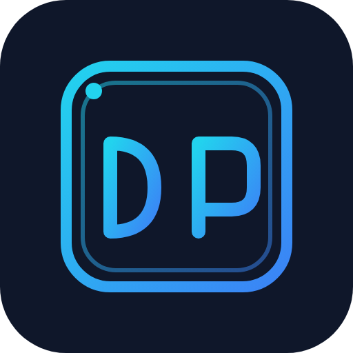
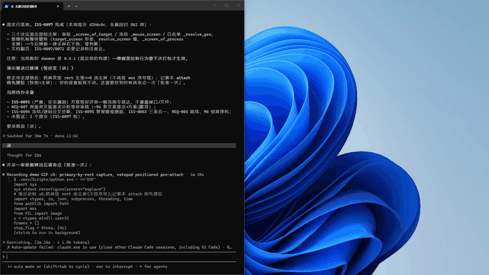
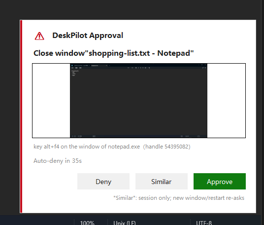
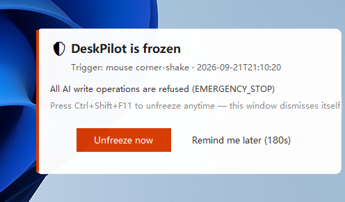

<p align="center">
  
</p>

<h1 align="center">DeskPilot</h1>

<p align="center">
  <strong>让 AI 安全地替你操作 Windows 桌面。</strong><br>
  微信、Excel、老式 ERP、内部系统……凡是没留 API 的软件，AI 都能直接上手。
</p>

<p align="center">
  <a href="https://github.com/Ddfang-sdf/deskpilot/releases"></a>
  <a href="LICENSE"></a>
  
  
  
</p>

<p align="center">
  <a href="#-30-秒上手">快速开始</a> ·
  <a href="docs/DESIGN.md">设计文档</a> ·
  <a href="https://github.com/Ddfang-sdf/deskpilot/releases">下载 Releases</a> ·
  <a href="README_EN.md">English</a>
</p>

<p align="center">
  <br>
  <em>实机演示：AI 通过 MCP 输入文字 → 发起"关闭窗口"危险操作 → 本地审批窗弹出（带目标实拍缩略图）→ 人类批准后才真正执行</em>
</p>

---

## 看得见的安心

危险操作必须经过你本人点头——AI 发起，程序弹窗，你批准才执行，AI 拿不到绕过审批的任何凭证：

<p align="center">
  <br>
  <em>关闭窗口等危险操作：本地审批窗带目标窗口实拍缩略图与倒计时，超时自动拒绝</em>
</p>

任何时候觉得不对劲，<code>Ctrl+Shift+F12</code> 一键熔断（或把鼠标甩到屏幕左上角按住），冻结事实会主动弹窗告知，而不是等你发现 AI 不动了：

<p align="center">
  <br>
  <em>冻结即时通知：立即解冻 / 稍后提醒，热键解冻后自动消失</em>
</p>

<!-- 演示 GIF：assets/demo.gif（实机录制：记事本输入 → alt+f4 触发审批 → 批准执行）。重录方法见 release/RELEASE_NOTES.md -->

## 为什么选择 DeskPilot

- 🛡️ **安全不靠 AI 自觉** —— 每一次点击、每一次按键都要过一道硬校验层（绑定校验 / 进程白名单 / 按键许可 / 危险操作本地审批，四道闸 fail-closed）；批准权只属于坐在电脑前的你
- 🔌 **即插即用** —— 标准 MCP 协议，Claude Code、Claude Desktop、Cursor 等客户端配上就能用
- 👁️ **不挑模型** —— 没有视觉能力的纯文本模型也能用：屏幕内容会被翻译成元素清单和文字（UIA 元素树 + OCR 双通道）
- 🛑 **急停有感知** —— 热键/甩角熔断一切写操作，冻结主动弹窗告知，一键解冻
- 📼 **全程留痕** —— 每步操作前后自动截图 + JSONL 审计，出了错能回放复盘

## 🚀 30 秒上手

**第一步：下载。** 到 [Releases](https://github.com/Ddfang-sdf/deskpilot/releases) 下载最新的 `deskpilot-vX.Y.Z-windows-x64.zip`，解压到一个固定目录，例如 `C:\tools\deskpilot\`。

> ⚠️ 解压后**保持 `policy.yml` 和 `deskpilot.exe` 在同一个文件夹**，不要分开。

**第二步：接入你的 AI 客户端。**

Claude Code（命令行）:

```powershell
claude mcp add deskpilot -- "C:\tools\deskpilot\deskpilot.exe"
```

Claude Desktop —— 编辑 `%APPDATA%\Claude\claude_desktop_config.json`:

```json
{
  "mcpServers": {
    "deskpilot": { "command": "C:\\tools\\deskpilot\\deskpilot.exe" }
  }
}
```

Cursor —— 编辑 `%USERPROFILE%\.cursor\mcp.json`（或 Settings → MCP 界面添加），内容与上面相同。其他客户端：凡支持 MCP（stdio 模式）的，把 `command` 指向 `deskpilot.exe` 即可。

**第三步：重启客户端，验证。** 对 AI 说一句:「**用 deskpilot 截个屏**」。能看到截图回来，就装好了。

## 工作原理

```
AI 客户端 ──MCP(stdio)──▶ deskpilot ──四道闸硬校验──▶ Windows 桌面
                              │
                              ├─ 危险操作 → 本地审批窗（你点头才执行）
                              ├─ 急停熔断 → 冻结通知弹窗（一键解冻）
                              └─ 全程审计 → 截图 + JSONL 留痕
```

23 个 MCP 工具（截图 / OCR / 元素树 / 点击 / 输入 / 窗口管理……）。安全模型、四道闸细节、协议设计的完整文档在 [docs/](docs/DESIGN.md)。

## 安全说明

- 默认只能操作白名单里的日常软件（记事本、画图、资源管理器、PowerPoint），其他程序 AI 碰不到；想加软件，编辑 exe 旁边的 `policy.yml`
- 危险操作（关窗口、删除等）一律弹本地审批窗，超时自动拒绝；审批令牌不经 AI 之手
- 任何时候觉得不对劲：**`Ctrl+Shift+F12` 立即熔断**一切操作，`Ctrl+Shift+F11` 恢复；或者把鼠标甩到屏幕左上角按住不放

## 客户端超时建议

危险操作的本地审批默认最长等待 60 秒。Claude Code 的默认工具执行超时可能短于该值，
建议在客户端环境中配置（毫秒）：

```powershell
$env:MCP_TOOL_TIMEOUT = "120000"   # 单次工具调用上限放宽到 120s
```

daemon 断链后无需任何手工恢复：状态（绑定/急停/SoM 缓存）全部保存在常驻进程里，
客户端进程重开会自动续接。

## 开发者：从源码运行

```powershell
git clone https://github.com/Ddfang-sdf/deskpilot.git
cd deskpilot
pip install -e .
python -m deskpilot
```

要求 Windows 10/11 + Python ≥ 3.12。运行测试：`python -m pytest tests/ -q`（209 条用例）。自行打包：`pip install pyinstaller && pyinstaller deskpilot.spec`。

## 路线图

- [x] M1 安全核心：四道闸强制层、审计留痕、急停熔断
- [x] M2 元素级操作：UIA 优先、零像素坐标的点击/输入
- [x] M3 SoM 标注截图 + 本地审批通道
- [x] 冻结人类感知：冻结通知弹窗、审批同步阻塞执行
- [ ] 多显示器支持
- [ ] 更多客户端的一键配置向导

## 贡献

Issue 和 PR 都欢迎。安全相关改动请连同 `docs/` 里的设计说明书一起更新——这个项目的设计文档与代码同库同评审。

## Star History

[](https://star-history.com/#Ddfang-sdf/deskpilot&Date)

## License

MIT
