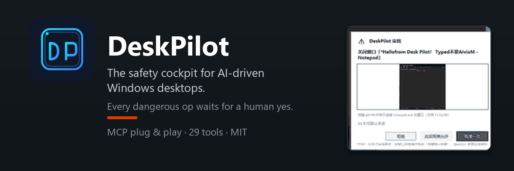
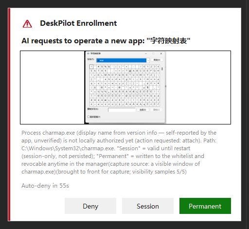
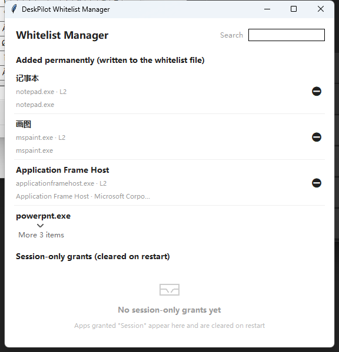

<p align="center">
  <strong>English</strong> · <a href="README.zh-CN.md">简体中文</a>
</p>

<p align="center">
  
</p>

<p align="center">
  <a href="https://github.com/Ddfang-sdf/deskpilot/releases"></a>
  <a href="LICENSE"></a>
  
  
  <a href="https://github.com/Ddfang-sdf/deskpilot/actions/workflows/release.yml"></a>
</p>

<p align="center">
  <a href="https://github.com/Ddfang-sdf/deskpilot/releases/latest"><strong>⬇️ Download the latest exe</strong></a> ·
  <a href="#-quick-start">Quick Start</a> ·
  <a href="docs/INSTALL.md">Install Guide</a> ·
  <a href="docs/DESIGN.md">Design Docs</a>
</p>

<p align="center">
  <br>
  <em>Live demo: AI types via MCP → requests a dangerous op (close window) → local approval toast with a live thumbnail of the target → executes only after the human approves</em>
</p>

---

## Safety you can see

Dangerous operations require your explicit approval — the AI requests, the program prompts, and nothing executes until you click. The AI never sees a token it could reuse to bypass you:

<p align="center">
  <br>
  <em>Dangerous ops (e.g. closing a window): local approval toast with a live thumbnail of the target window and a countdown — auto-denied on timeout</em>
</p>

AI wants to drive software outside the whitelist? It must first survive an **enrollment prompt** — deny, allow for this session only (expires on restart), or "add permanently" — and every prompt auto-denies on timeout:

<p align="center">
  <br>
  <em>Enrollment: pick one of three (deny / allow this session / add permanently) — auto-deny unless a human decides</em>
</p>

All grants stay visible: system tray → "Whitelist Manager" shows both ledgers (permanent + this-session) at a glance, with one-click removal (removal is a tombstone — the AI won't pester you again):

<p align="center">
  <br>
  <em>Whitelist manager: permanent entries (persisted on disk, survive upgrades) and session-only grants (cleared on restart)</em>
</p>

If anything feels wrong, hit <code>Ctrl+Shift+F12</code> to freeze all write operations instantly (or flick your mouse into the top-left corner of the primary screen and hold). The freeze tells you itself — no more discovering a silent AI hours later:

<p align="center">
  <br>
  <em>Freeze notification: unfreeze now / remind me later — and it dismisses itself when you unfreeze via hotkey</em>
</p>

During lock screen or UAC prompts (the secure desktop), every AI operation — **including screenshots and other read-only sensing** — is refused with a structured `SECURE_DESKTOP` error and resumes automatically when you're back. If a human can't see it, AI can't touch it.

<!-- Demo GIF: assets/demo.gif (live recording: typing into Notepad → alt+f4 triggers approval → approved → executed). See release/RELEASE_NOTES.md for how to re-record. -->

## Why DeskPilot

- 🛡️ **Safety by enforcement, not by prompt** — every click and keystroke passes a hard verification layer (binding check / process whitelist / key permit / local approval for dangerous ops — four fail-closed gates). Approval belongs to the human at the keyboard, period.
- 🗂️ **Whitelist self-service** — enroll new software with a three-way local prompt; permanent grants go to a separate user file (`policy.local.yml`) that upgrades never touch; removal is immediate and final.
- 🔌 **Plug & play** — standard MCP (stdio). Works with Claude Code, Claude Desktop, Cursor, and any MCP client.
- 👁️ **No vision model required** — screen content is translated into an element list plus text (UIA tree + OCR dual channel), so text-only models can drive the UI.
- 🛑 **Emergency stop with feedback** — hotkey or corner-flick freezes all writes; a toast confirms the freeze and offers one-click unfreeze. Unfreezing is a human-only action by design.
- 🖥️ **Multi-monitor native** — dialogs follow the screen you're working on; screenshots and UI trees are in virtual-desktop coordinates (negative values included); per-screen capture by deterministic screen number (0 = primary, rest left-to-right).
- 📼 **Full audit trail** — automatic before/after screenshots plus JSONL audit logs for every action.

## 🚀 Quick Start

**Step 1: Download.** Grab the latest `deskpilot-vX.Y.Z-windows-x64.zip` from [Releases](https://github.com/Ddfang-sdf/deskpilot/releases) (with `.sha256` for verification) and extract to a fixed folder, e.g. `C:\tools\deskpilot\`.

> ⚠️ Keep `policy.yml` and `deskpilot.exe` in the **same folder** — the security policy is loaded from beside the exe. (`policy.local.yml` holds your permanent grants and is created on your first "add permanently" click — pure usage never creates it; upgrades keep it.)

**Step 2: Hook up your AI client.**

Claude Code (CLI):

```powershell
claude mcp add deskpilot -- "C:\tools\deskpilot\deskpilot.exe"
```

Claude Desktop — edit `%APPDATA%\Claude\claude_desktop_config.json`:

```json
{
  "mcpServers": {
    "deskpilot": { "command": "C:\\tools\\deskpilot\\deskpilot.exe" }
  }
}
```

Cursor — edit `%USERPROFILE%\.cursor\mcp.json` (or Settings → MCP), same content. Any MCP client that supports stdio works: point `command` at `deskpilot.exe`.

**Step 3: Restart the client and verify.** Tell your AI: "**take a screenshot with deskpilot**". If a screenshot comes back, you're set.

> 📖 For production use, run the **resident daemon** (~1.2s per call, bindings survive across calls): startup, autostart, policy.yml customization, upgrades, intranet distribution and FAQ — all in the **[Install Guide](docs/INSTALL.md)**; one-click installer at `scripts/install.ps1`.

## How it works

```
AI client ──MCP(stdio)──▶ deskpilot ──4 fail-closed gates──▶ Windows desktop
                              │
                              ├─ dangerous op → local approval toast (executes only if you approve)
                              ├─ emergency stop → freeze notification card (human-only unfreeze)
                              └─ everything → screenshot + JSONL audit trail
```

29 MCP tools (screenshot / OCR / click-by-text / element tree / click / type / window management…). The full security model, gate internals, and protocol design live in [docs/](docs/DESIGN.md) (Chinese).

## Security notes

- By default only whitelisted everyday apps (Notepad, Paint, Explorer, PowerPoint) are operable; everything else is unreachable. When AI asks to drive new software, **you click "add permanently" in the enrollment prompt** — no file editing needed; the tray's Whitelist Manager lets you review and remove anytime.
- The whitelist keeps two ledgers: the bundled base list (`policy.yml`) and your permanent grants in a separate user file (`policy.local.yml`) — upgrades never lose them, removal is a tombstone (no re-prompting loops).
- Dangerous operations (closing windows, deletion, etc.) always require local approval and are auto-denied on timeout. Approval tokens never pass through the AI.
- Freeze everything anytime with **`Ctrl+Shift+F12`**; resume with `Ctrl+Shift+F11` — or flick the mouse into the top-left corner of the primary screen and hold to freeze.
- Lock screen / UAC prompt active → **all** AI operations (reads included) are refused as `SECURE_DESKTOP` until you're back — no action while you can't see.

## Client timeout tip

Local approval for dangerous ops waits up to 90 seconds by default. Claude Code's default tool timeout may be shorter — raise it if needed (milliseconds):

```powershell
$env:MCP_TOOL_TIMEOUT = "120000"   # allow up to 120s per tool call
```

After a daemon disconnect, no manual recovery is needed: state (bindings / estop / SoM cache) lives in the resident process, and a restarted client picks up right where it left off.

## Develop from source

```powershell
git clone https://github.com/Ddfang-sdf/deskpilot.git
cd deskpilot
pip install -e .
python -m deskpilot
```

Requires Windows 10/11 + Python ≥ 3.12. Run tests: `python -m pytest tests/ -q` (zero side effects by default: no real windows, no production directories). Real-machine integration cases (they open real Notepad windows) need an explicit `--run-integration`; CI runs them all. Build the exe yourself: `pip install pyinstaller && pyinstaller deskpilot.spec`.

## Roadmap

- [x] M1 security core: four-gate enforcement layer, audit trail, emergency stop
- [x] M2 element-level operations: UIA-first, zero pixel-coordinate clicking/typing
- [x] M3 SoM annotated screenshots + local approval channel
- [x] Human-aware freeze: notification card, synchronous approve-then-execute
- [x] Multi-monitor support (per-screen capture, dialogs follow the target screen)
- [ ] One-click setup wizards for more clients

## Contributing

Issues and PRs are welcome. For security-related changes, please update the design docs in `docs/` together with the code — in this project, design documents are reviewed in the same repo as the code.

## Star History

[](https://star-history.com/#Ddfang-sdf/deskpilot&Date)

## License

MIT
