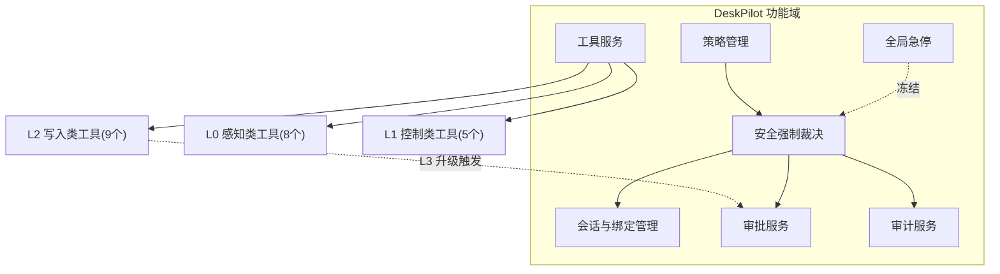
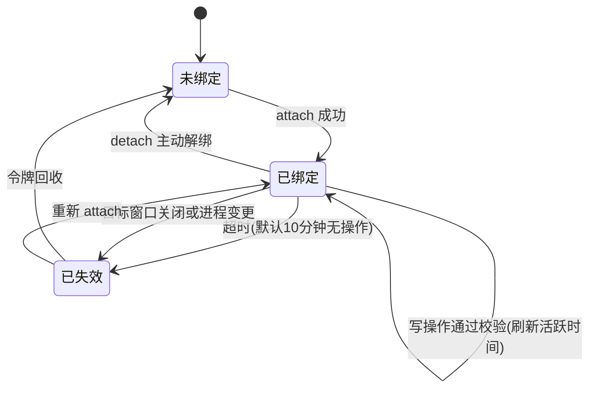
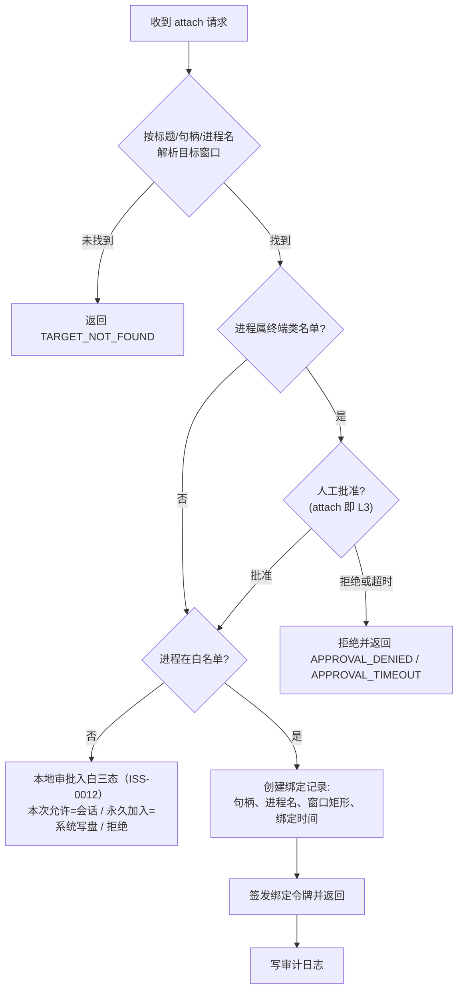
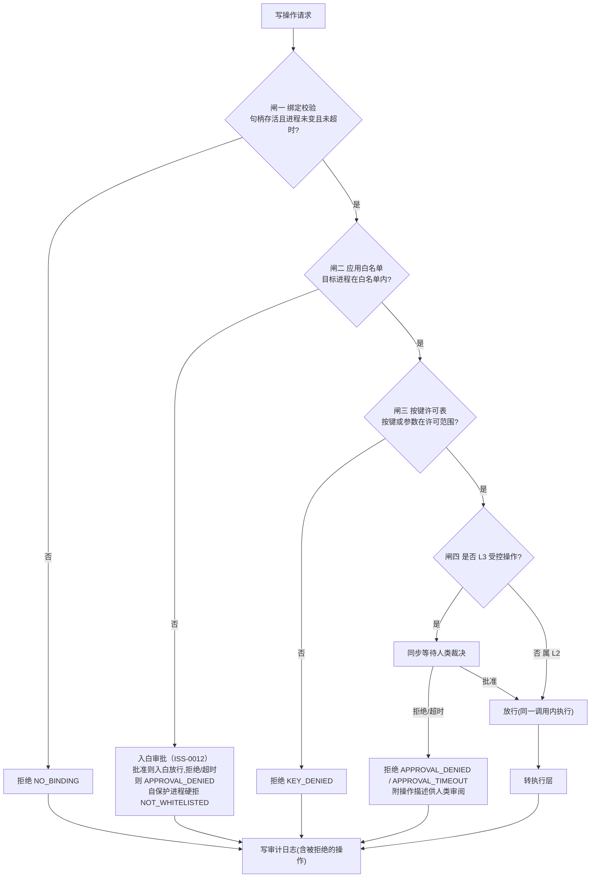
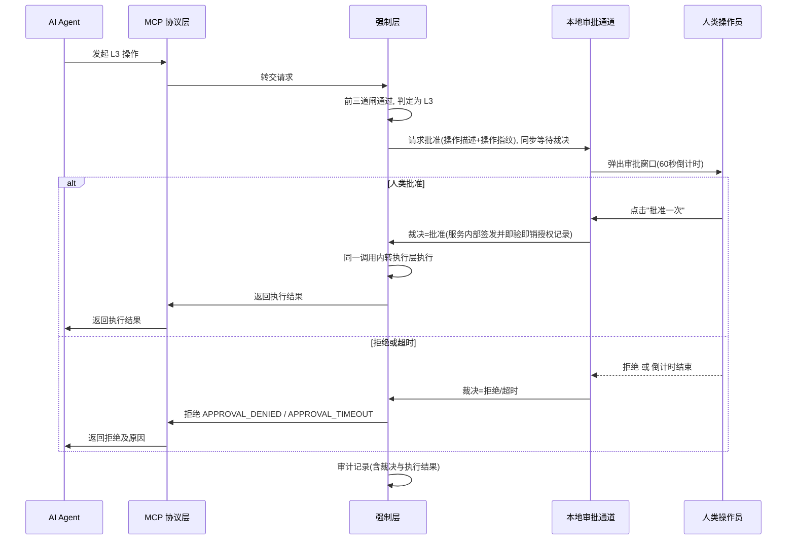
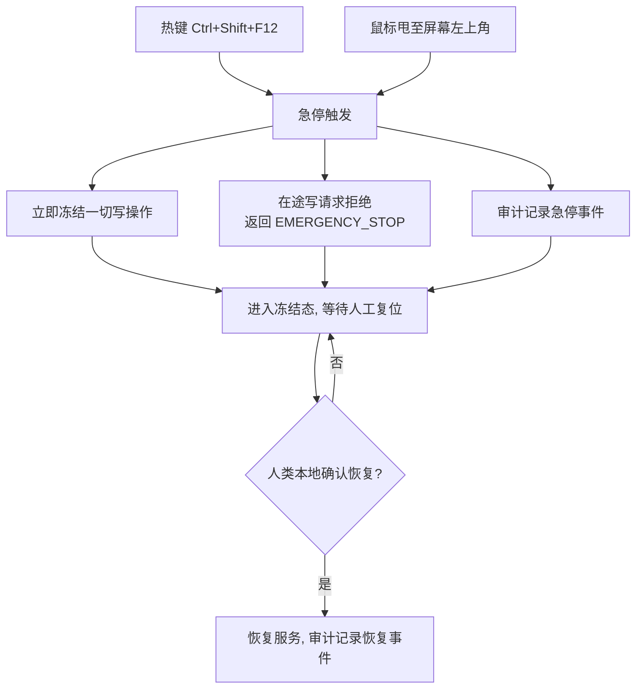
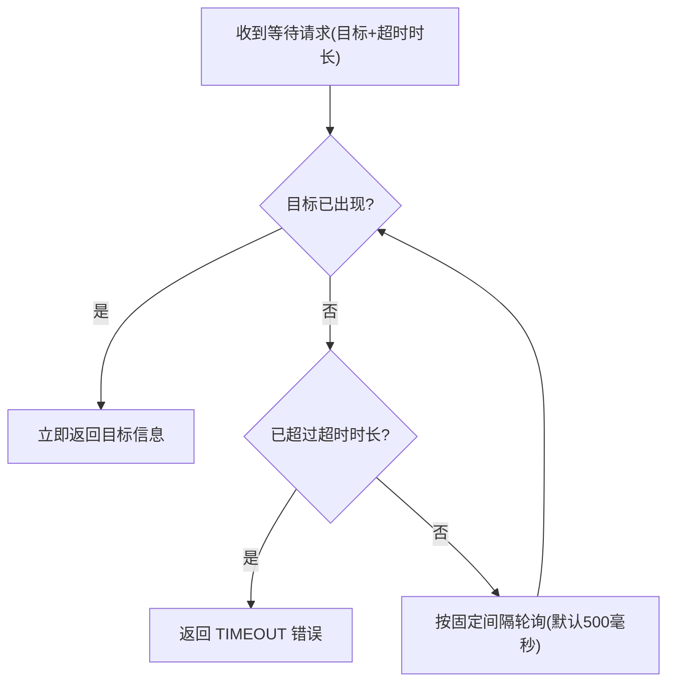
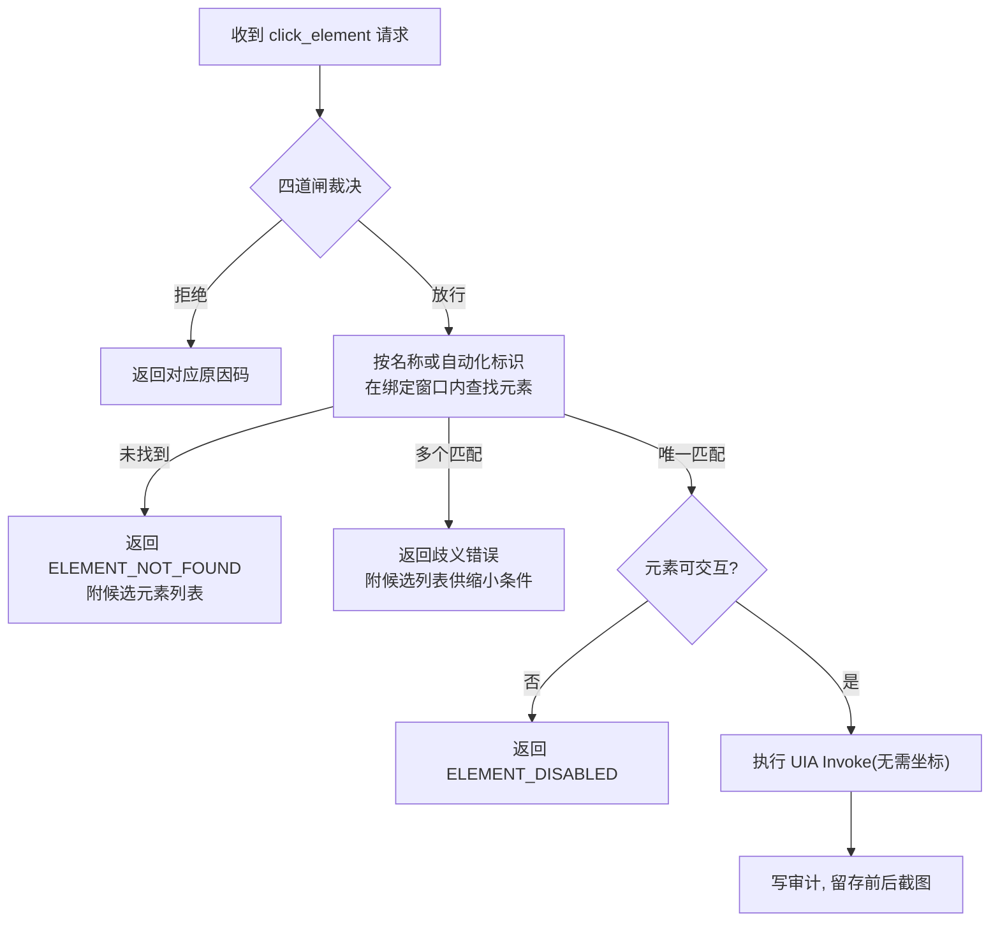
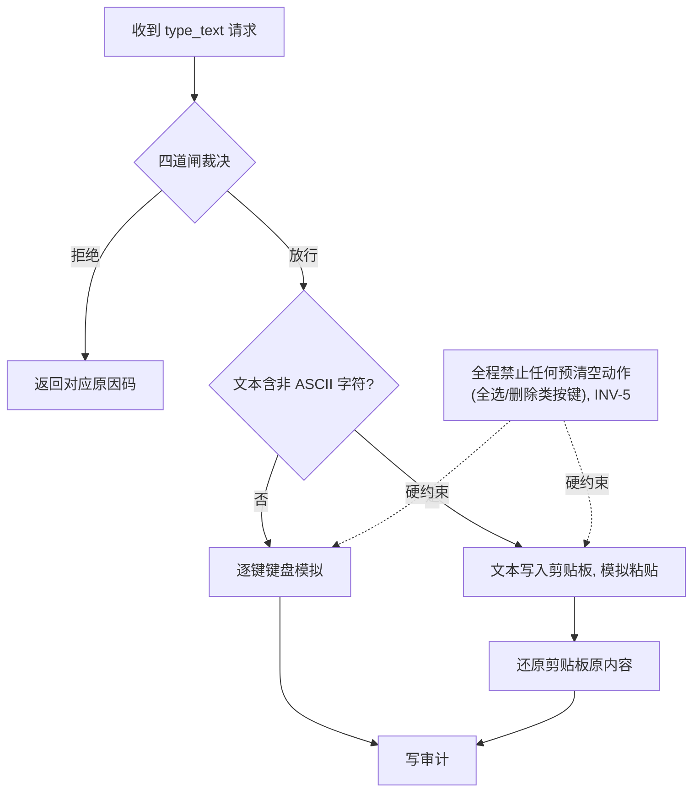

# DeskPilot 功能设计说明书

| 项 | 内容 |
|----|------|
| 文档编号 | DP-FDS-001 |
| 版本 | v0.2 |
| 日期 | 2026-08-16 |
| 状态 | 待评审 |
| 上游文档 | [总体设计文档](DESIGN.md) v0.1 |
| 适用里程碑 | M1（安全核心）/ M2（元素级操作）/ M3（SoM + 审批通道） |

> **文档约定**：本文不含任何代码与伪代码。所有算法与流程逻辑一律以 Mermaid 图 + 文字规则表表达；工具名、错误码等标识符沿用总体设计的契约表，仅作引用。

---

## 1. 引言

### 1.1 编写目的

本文将总体设计（DESIGN.md）中的架构分层、工具契约表与安全不变量，展开为**可实现、可测试、可验收**的功能规格，作为 M1–M3 开发与验收的直接依据。阅读对象为开发者、测试者与评审人员。

### 1.2 背景

DeskPilot 是让 AI agent 自主、安全地操作 Windows 桌面的服务。总体设计确立了"护栏在代码里、fail-closed、单一通道必经强制层"三条第一原则。本文回答的问题是：**每条原则落到功能上，具体长什么样、按什么流程运转、出错时返回什么、怎么算验收通过。**

### 1.3 术语与缩略语

| 术语 | 含义 |
|------|------|
| 绑定（Binding） | 写操作的前提凭据，记录目标窗口句柄、进程名、矩形与绑定时间 |
| 强制层 | 对每个写操作执行"四道闸"裁决的安全核心模块 |
| L0–L3 | 操作分级：L0 只读 / L1 低风险 / L2 写入 / L3 受控 |
| SoM | Set-of-Mark，对截图中所有可交互元素编号标注的定位方式 |
| UIA | Microsoft UI Automation，元素级自动化接口 |
| 审批令牌 | 人类批准后签发的一次性、有时效、绑定操作指纹的凭据 |
| 白名单 | policy.yml 中允许操作的应用进程清单 |
| Fail-closed | 默认拒绝，规则明确允许才放行；未覆盖情况一律拒绝 |
| INV-n | 总体设计 §5 定义的安全不变量编号 |

### 1.4 参考资料

- DeskPilot 总体设计文档（docs/DESIGN.md）v0.1
- GB/T 8567《计算机软件文档编制规范》
- ISO/IEC/IEEE 29148 需求工程标准（功能规格写法参照）
- MCP（Model Context Protocol）规范

---

## 2. 总体描述

### 2.1 功能总览



### 2.2 用户角色

| 角色 | 与系统的交互 | 权限边界 |
|------|--------------|----------|
| AI Agent | 通过 MCP 客户端调用全部工具 | 只能经 MCP 通道；对审计无协议级读写入口；无法签发审批令牌 |
| 人类操作员 | 本地审批弹窗、急停热键、恢复复位 | 持有批准权与急停/复位权，不调用工具 |
| 策略管理员 | 审批弹窗一键入白/托盘窗口管理（零命令）；亦可手编 policy.yml 重启生效 | 手编文件运行期不生效（INV-9）；审批写盘例外（ISS-0012） |

### 2.3 外部接口概述

| 接口 | 对端 | 说明 |
|------|------|------|
| MCP over stdio | AI Agent（任意 MCP 客户端） | 唯一对外接口，工具即接口；零直通后门（INV-8） |
| localhost HTTP | 进程内模块间 | 仅绑定 127.0.0.1，不对外监听 |
| 本地审批通道 | 人类操作员 | 桌面弹窗，独立于 AI 通道 |

### 2.4 约束

- 所有写操作必经强制层，无第二条路径；
- 默认拒绝（fail-closed），未在许可表中的按键、未在白名单中的进程一律拒绝；
- policy.yml 启动时加载并锁定，修改必须重启进程；
- 本文功能规格与总体设计的安全不变量 INV-1～INV-10 逐条可追溯（见第 8 章）。

---

## 3. 功能清单

| 功能编号 | 功能名称 | 级别 | 所属里程碑 |
|----------|----------|------|-----------|
| F-CORE-01 | 窗口绑定管理 | 机制 | M1 |
| F-CORE-02 | 安全强制裁决（四道闸） | 机制 | M1 |
| F-CORE-03 | 操作分级与审批 | 机制 | M1（令牌与拒绝路径）/ M3（审批弹窗） |
| F-CORE-04 | 审计记录 | 机制 | M1 |
| F-CORE-05 | 全局急停 | 机制 | M1 |
| F-CORE-06 | 策略加载与锁定 | 机制 | M1 |
| F-L0-01 | screenshot 截图 | L0 | M1 |
| F-L0-02 | ocr 文字识别 | L0 | M1 |
| F-L0-03 | find_window 窗口枚举 | L0 | M1 |
| F-L0-04 | get_ui_tree 元素树 | L0 | M1 |
| F-L0-05 | get_clickable_map SoM 标注 | L0 | M3 |
| F-L0-06 | template_match 模板匹配 | L0 | M1 |
| F-L0-07 | get_cursor 鼠标位置 | L0 | M1 |
| F-L0-08 | get_clipboard 读剪贴板 | L0 | M1 |
| F-L1-01 | wait_for_window 等窗口 | L1 | M2 |
| F-L1-02 | wait_for_element 等元素 | L1 | M2 |
| F-L1-03 | move 移动鼠标 | L1 | M1 |
| F-L1-04 | scroll 滚轮 | L1 | M1 |
| F-L1-05 | attach / detach 绑定管理 | L1 | M1 |
| F-L2-01 | launch_app 启动应用 | L2/L3 | M2 |
| F-L2-02 | activate_window 前置窗口 | L2 | M2 |
| F-L2-03 | click_element 元素点击 | L2 | M2 |
| F-L2-04 | type_element 元素输入 | L2 | M2 |
| F-L2-05 | click 像素点击（兜底） | L2 | M1 |
| F-L2-06 | type_text 文本输入 | L2 | M1 |
| F-L2-07 | key 按键 | L2/L3 | M1 |
| F-L2-08 | set_clipboard 写剪贴板 | L2 | M1 |
| F-L2-09 | drag 拖拽 | L2 | M2 |

---

## 4. 核心机制功能设计

### 4.1 F-CORE-01 窗口绑定管理

**功能目标**：为一切写操作提供"当前目标明确、状态新鲜、可验证"的绑定凭据，防止 AI 拿旧句柄误操作别的窗口。

**绑定生命周期**：



**attach 处理流程**：



**绑定有效性校验规则**（每次写操作前执行，任一不过即拒绝）：

| 校验项 | 通过条件 | 失败语义 |
|--------|----------|----------|
| 令牌存在 | 请求携带有效绑定令牌 | 返回 NO_BINDING |
| 句柄存活 | 记录的窗口句柄仍存在 | 绑定失效，返回 NO_BINDING |
| 进程未变 | 句柄当前所属进程名与绑定记录一致 | 绑定失效，返回 NO_BINDING |
| 未超时 | 距上次操作未超绑定超时时长（默认 10 分钟） | 绑定失效，返回 NO_BINDING |

**边界说明**：绑定不要求窗口在前台——元素级操作不需要前台；像素级操作由执行层先前置窗口再执行。目标窗口关闭时绑定自动失效。

### 4.2 F-CORE-02 安全强制裁决（四道闸）

**功能目标**：对每个写操作给出"放行/拒绝"裁决，判定依据全部来自程序可验证的事实，AI 只被告知结果。

**裁决总流程**：



**裁决规则**：

| 规则 | 内容 |
|------|------|
| 判定顺序 | 固定按闸一→闸四顺序，任一不过即短路拒绝，不再继续 |
| 依据 | 只采用程序可验证事实（句柄活性、进程名、按键许可表、令牌指纹），不采信 AI 陈述 |
| 结果结构 | 放行则转执行层；拒绝则返回结构化原因码与说明文本 |
| 全覆盖 | 放行与被拒的操作都必须写审计（INV-6） |

**强制层主要拒绝原因码**（仅列闸检常见码；全量 20 个错误码见详细设计说明书附录 A）：`NO_BINDING` / `NOT_WHITELISTED` / `KEY_DENIED` / `APPROVAL_DENIED` / `APPROVAL_TIMEOUT` / `TARGET_NOT_FOUND` / `EMERGENCY_STOP` / `POLICY_VIOLATION`。

### 4.3 F-CORE-03 操作分级与审批

**分级语义**（沿用总体设计 §4）：L0 只读、L1 低风险无条件放行；L2 写入需"有效绑定 ∧ 白名单 ∧ 按键许可"；L3 受控操作需人工批准令牌。

**L3 审批时序**（ISS-0003：同步阻塞审批，AI 发起后退出环路，无重试）：



**审批令牌规则**（INV-4 的功能化）：

| 规则 | 内容 |
|------|------|
| 一次性 | 授权记录被消费立即作废，不可复用 |
| 时效 | 签发后 60 秒内有效（同步模型下签发与消费在同一调用内完成，时效为内部兜底） |
| 指纹绑定 | 授权绑定"工具名+参数摘要"的操作指纹，换任何参数即不匹配 |
| 签发权 | 只能由本地审批通道的人类裁决触发；授权全程在服务内部流转（审批通道→强制层），不经 AI，AI 通道无法自行生成 |

### 4.4 F-CORE-04 审计记录

**功能目标**：全程留痕、可回放；审计不被被审计方（AI）篡改。

**每次记录内容**：

| 字段组 | 内容 |
|--------|------|
| 时间 | 操作发生时间 |
| 操作 | 工具名、参数摘要；type_text / set_clipboard 的输入文本另存全文字段 |
| 裁决 | 放行/拒绝及原因码 |
| 结果 | 执行结果或错误信息 |
| 证据 | 操作前后截图的存储路径 |

**写入规则**：

| 规则 | 内容 |
|------|------|
| 追加式 | 日志只可追加，禁止修改与删除已有记录 |
| 只读隔离 | 基线为协议级只读：AI 通道无任何读写审计的工具（INV-6）；OS 级目录隔离（独立账户部署）为可选加固 |
| 同步落盘 | 审计写入失败时，本次操作视为失败——审计不可缺失 |
| 含拒绝 | 被四道闸拒绝的操作同样完整记录 |

### 4.5 F-CORE-05 全局急停

**功能目标**（INV-10）：人类可在任何时刻一键冻结一切写操作，作为 fail-safe 兜底。



**规则**：急停只影响写操作；冻结期 L0 感知类工具默认可用（便于排查现场，可经 policy 的 estop.l0_during_freeze 关闭）；复位权仅属本地人类通道，复位形式为复位热键 Ctrl+Shift+F11 或本地 CLI 命令 `--reset`（经本机 HTTP 端点 POST /estop/reset）；常驻形态下热键由 daemon 独占注册，stdio 瘦代理探测到 daemon 在线则不注册热键、不启动甩角轮询（ISS-0002，见详细设计说明书 §11）。冻结置位时弹出人类通知弹窗（立即解冻 / 稍后提醒 180s，滑入滑出动画），任何来源复位成功弹窗自动滑出消失；热键解冻路径保留并在弹窗中提示（ISS-0004）。弹窗为警示风格圆角卡片（右下角、警示色条 + 图标 + 主次扁平按钮、滑动叠加淡入淡出），视觉规格见详细设计说明书 §11.6 与 ISS-0005。持有 shell 的 AI 属威胁模型之外（本设计防 AI 犯错、不防 AI 作恶）。

### 4.6 F-CORE-06 策略加载与锁定

| 规则 | 内容 |
|------|------|
| 加载时机 | 服务启动时读取 policy.yml（白名单、终端类名单、按键许可表、超时参数、输入上限、急停参数） |
| 运行期锁定 | 加载完成后手编文件不影响运行中的服务（INV-9）；外部修改由指纹守望写审计留痕；经审批的入白/移除由 daemon 原子写盘并热生效（ISS-0012） |
| 生效方式 | 修改策略必须重启服务进程，防止运行中被写入方篡改 |
| 启动校验 | 策略文件缺失或格式非法时服务拒绝启动（fail-closed 延伸到自身配置） |

---

## 5. 工具功能规格

### 5.1 L0 感知类工具

#### F-L0-01 screenshot 截图

| 项 | 内容 |
|----|------|
| 功能描述 | 对全屏、指定区域或指定窗口截图 |
| 前置条件 | 无；指定窗口时该窗口须存在 |
| 输入 | 范围类型（全屏/区域/窗口）及对应参数 |
| 输出 | 图像数据与元信息（尺寸、时间戳） |
| 失败语义 | 目标窗口已关闭 → 显式报错，禁止"静默成功"（INV-7） |
| 验收标准 | 三种范围均能返回有效图像；失效窗口返回明确错误 |

#### F-L0-02 ocr 文字识别

| 项 | 内容 |
|----|------|
| 功能描述 | 对指定截图区域做文字识别，输出文字及其位置 |
| 输入 | 图像或屏幕区域 |
| 输出 | 文字条目列表，每条含内容与所在位置 |
| 失败语义 | 区域过小 → 返回提示，建议放大区域 |
| 验收标准 | 中英文混排样例识别结果可用；过小区域返回引导性提示 |

#### F-L0-03 find_window 窗口枚举

| 项 | 内容 |
|----|------|
| 功能描述 | 枚举当前桌面窗口，按标题或进程名过滤 |
| 输出 | 窗口列表：句柄、标题、进程名、窗口矩形、可见性 |
| 验收标准 | 能列出真实窗口且过滤条件生效 |

#### F-L0-04 get_ui_tree 元素树

| 项 | 内容 |
|----|------|
| 功能描述 | 获取目标窗口的 UIA 元素树，可交互元素优先排列 |
| 输入 | 目标窗口（窗口标识） |
| 输出 | 树形结构：每个元素含名称、控件类型、自动化标识、屏幕矩形、可交互性 |
| 验收标准 | 对记事本等标准应用返回完整树；可交互元素带明确标记 |

#### F-L0-05 get_clickable_map SoM 标注（M3）

| 项 | 内容 |
|----|------|
| 功能描述 | 截图并对所有可交互元素叠加编号标注，输出标注图与"编号→元素"对照表 |
| 输入 | 目标窗口（窗口标识，只读操作，无需绑定） |
| 输出 | 标注图像 + 编号对照列表 |
| 失败语义 | 窗口无可交互元素 → 返回空图与空列表，不报错 |
| 验收标准 | 标注编号与对照表一一对应；AI 仅凭编号即可选定目标元素（按编号点击时再校验编号来源窗口与绑定窗口一致） |

#### F-L0-06 template_match 模板匹配

| 项 | 内容 |
|----|------|
| 功能描述 | 在指定屏幕范围内搜索与模板图相似的位置 |
| 输入 | 模板图像、搜索范围、置信度阈值 |
| 输出 | 匹配位置与置信度；未达阈值时返回最高置信度及"未找到"结论 |
| 验收标准 | 已知图标配对样例命中；无匹配时如实返回置信度而非伪造命中 |

#### F-L0-07 get_cursor 鼠标位置 / F-L0-08 get_clipboard 读剪贴板

| 项 | 内容 |
|----|------|
| 功能描述 | 分别返回当前鼠标坐标、当前剪贴板文本内容 |
| 验收标准 | 返回值与系统实际状态一致 |

### 5.2 L1 控制类工具

#### F-L1-01 wait_for_window 等窗口 / F-L1-02 wait_for_element 等元素

**功能描述**：等待目标窗口（或目标 UIA 元素）出现，带显式超时，禁止 sleep 盲等。



| 项 | 内容 |
|----|------|
| 失败语义 | 超时 → 显式返回 TIMEOUT，不得无限等待 |
| 验收标准 | 目标晚于调用时刻出现时能命中返回；超时路径返回明确错误且耗时符合预期 |

#### F-L1-03 move 移动鼠标

| 项 | 内容 |
|----|------|
| 功能描述 | 将鼠标移动到指定屏幕坐标，不产生点击 |
| 验收标准 | 移动后 get_cursor 返回值与目标坐标一致 |

#### F-L1-04 scroll 滚轮

| 项 | 内容 |
|----|------|
| 功能描述 | 在绑定窗口上执行滚轮滚动 |
| 前置条件 | 有效绑定（滚动会改变内容状态，故需绑定） |
| 验收标准 | 无绑定调用被拒并返回 NO_BINDING；有绑定时滚动生效 |

#### F-L1-05 attach / detach 绑定管理

功能流程见 §4.1。验收标准：对白名单应用 attach 成功并返回令牌；对非白名单进程触发入白审批三态（ISS-0012），批准即入白放行、拒绝/超时返回 APPROVAL_DENIED；deskpilot.exe 自保护硬拒 NOT_WHITELISTED；detach 后原令牌立即失效。

### 5.3 L2 写入类工具

#### F-L2-01 launch_app 启动应用

| 项 | 内容 |
|----|------|
| 功能描述 | 启动白名单内路径或系统注册的应用 |
| 失败语义 | 目标不在白名单 → 本地审批入白三态（ISS-0012）；无批准则拒绝（APPROVAL_DENIED） |
| 验收标准 | 白名单内应用可启动并被后续 find_window 发现；非白名单触发升级流程 |

#### F-L2-02 activate_window 前置窗口

| 项 | 内容 |
|----|------|
| 功能描述 | 将绑定窗口提到前台 |
| 失败语义 | 绑定失效 → 拒绝并返回 NO_BINDING |
| 验收标准 | 调用后目标窗口成为前台窗口 |

#### F-L2-03 click_element 元素点击（首选写入方式）



| 项 | 内容 |
|----|------|
| 验收标准 | 标准控件按名称命中并触发；元素缺失时返回候选列表；全程不使用像素坐标 |

#### F-L2-04 type_element 元素输入

| 项 | 内容 |
|----|------|
| 功能描述 | 向指定 UIA 元素直接设值（SetValue 语义），非键盘模拟 |
| 失败语义 | 元素不存在 → 列出候选；元素不支持设值 → 显式报错 |
| 验收标准 | 对文本框设值成功且内容可读回校验 |

#### F-L2-05 click 像素点击（兜底）

| 项 | 内容 |
|----|------|
| 功能描述 | 按屏幕像素坐标点击，仅在 UIA 失效时使用 |
| 前置条件 | 有效绑定；执行层先前置绑定窗口再点击 |
| 失败语义 | 绑定校验失败 → 拒绝；落点在绑定窗口矩形外 → 拒绝（OUT_OF_BOUNDS） |
| 验收标准 | 点击落点位于绑定窗口矩形内才执行；落点越界拒绝 |

#### F-L2-06 type_text 文本输入

**功能描述**：向绑定窗口输入文本；含中文等非 ASCII 内容时走剪贴板方案，避免输入法依赖。



| 项 | 内容 |
|----|------|
| 失败语义 | 绑定校验失败 → 拒绝；文本超长度上限（policy limits.input_max_chars，默认 65536）→ INVALID_PARAMS |
| 验收标准 | 中英文混合文本原样进入目标窗口；剪贴板原内容被还原；代码评审确认无任何预清空动作 |

#### F-L2-07 key 按键

```mermaid
flowchart TD
    A["收到 key 请求"] --> B{"按键在 L2 许可表?"}
    B -->|"是"| C["按 L2 流程放行"]
    B -->|"否"| D{"按键在 L3 危险表?"}
    D -->|"是"| E{有效批准?<br/>(按操作指纹查证令牌)}
    E -->|"有"| F["消费令牌后放行"]
    E -->|"无"| R1["拒绝 APPROVAL_DENIED / APPROVAL_TIMEOUT"]
    D -->|"否 未收录"| R2["拒绝 KEY_UNKNOWN<br/>(fail-closed)"]
```

| 项 | 内容 |
|----|------|
| 特殊规则 | Enter 在普通白名单应用属 L2；在终端类进程窗口属 L3（该类窗口 attach 本身即 L3）；场景受限键（Backspace 限输入场景）须先通过输入场景判定，判定失败按非许可场景拒绝（KEY_DENIED，fail-closed，见详细设计 §8.6） |
| 验收标准 | 许可表按键直通；危险键无批准被拒、经批准原样重试放行一次；未收录按键一律拒绝 |

#### F-L2-08 set_clipboard 写剪贴板 / F-L2-09 drag 拖拽

| 项 | 内容 |
|----|------|
| 功能描述 | 分别执行：写入剪贴板文本；在绑定窗口内完成拖拽 |
| 前置条件 | 有效绑定（两个工具均需要，经四道闸） |
| 验收标准 | 写剪贴板后可读回一致；无绑定调用返回 NO_BINDING；拖拽起止点均在绑定窗口矩形内才执行 |

---

## 6. 界面设计（M3，仅人类侧）

### 6.1 L3 审批弹窗

| 元素 | 内容 |
|------|------|
| 展示信息 | 操作名称、目标窗口标题与进程、参数摘要、操作指纹、60 秒倒计时 |
| 操作 | "批准一次" / "拒绝" 两个按钮，无"永久允许"选项 |
| 默认行为 | 倒计时结束未操作 = 拒绝（fail-closed） |
| 防误触 | 弹窗不响应 AI 通道的任何输入 |

### 6.2 审计查看

人类侧只读查看审计日志与前后截图；不提供删除/修改入口。AI 侧无任何界面。

---

## 7. 性能与可靠性需求（目标值，待评审）

| 项 | 目标值 |
|----|--------|
| 截图（L0） | 1 秒内返回 |
| UIA 元素树获取 | 普通窗口 1 秒内返回 |
| 四道闸裁决 | 50 毫秒内完成 |
| 等待类工具轮询间隔 | 默认 500 毫秒，可配置 |
| 绑定超时 | 默认 10 分钟无操作失效 |
| 审批令牌时效 | 60 秒 |
| 审计写入 | 同步落盘；写入失败则本次操作视为失败 |

---

## 8. 安全不变量追溯矩阵

| 不变量 | 对应功能 | 验证方式 |
|--------|----------|----------|
| INV-1 无绑定写入必拒 | F-CORE-02 闸一 | 单元测试：无绑定调用 L2 工具返回 NO_BINDING |
| INV-2 非白名单经审批入白，自保护硬拒 | F-CORE-01 / F-L1-05 | 单元测试：attach 非白名单触发入白审批三态；审批器拒绝返回 APPROVAL_DENIED；deskpilot.exe 硬拒 NOT_WHITELISTED（ISS-0012） |
| INV-3 危险键无批准必拒 | F-L2-07 / F-CORE-03 | 单元测试：危险键返回 APPROVAL_DENIED 且携操作描述 |
| INV-4 令牌一次性、时效、指纹绑定 | F-CORE-03 | 单元测试：复用、过期、改参数三种场景均拒绝 |
| INV-5 输入路径无预清空动作 | F-L2-06 | 代码评审 + 行为测试 |
| INV-6 全量审计、目录只读 | F-CORE-04 | 测试：放行与被拒操作均有记录；协议级基线——AI 通道无任何读写审计的接口；OS 级目录隔离为可选加固用例 |
| INV-7 禁止静默成功 | F-L0-01 等各工具失败语义 | 测试：窗口消失后调用返回显式错误 |
| INV-8 MCP 层无直通后门 | 结构约束（§2.3） | 代码评审逐条核对 MCP 层转发路径 |
| INV-9 策略运行期不可变（审批写盘例外） | F-CORE-06 | 测试：运行期手编 policy.yml 不影响服务行为且留痕；审批入白热生效（ISS-0012） |
| INV-10 全局急停 | F-CORE-05 | 测试：触发急停后在途写请求返回 EMERGENCY_STOP |

---

## 9. 里程碑验收对照

| 里程碑 | 覆盖功能 | 验收要点 |
|--------|----------|----------|
| M1 安全核心 | F-CORE-01/02/04/05/06、F-L0-01～04、F-L0-06～08、F-L1-03～05、F-L2-05～08 | INV-1～10 逐条有测试并通过；L2 工具只对测试专用记事本窗口（带 DESKPILOT_TEST_ 标记标题）测试 |
| M2 元素级操作 | F-L1-01/02、F-L2-01～04、F-L2-09 | 端到端脚本通过，全程零像素坐标 |
| M3 SoM + 审批通道 | F-L0-05、F-CORE-03 审批弹窗 | 纯文本模型仅看元素列表完成"记事本写文件并保存"任务 |

---

## 10. 附录

### 10.1 变更记录

| 版本 | 日期 | 变更内容 |
|------|------|----------|
| v0.1 | 2026-08-15 | 初版，依据总体设计 v0.1 编写 |
| v0.2 | 2026-08-16 | 按审核意见修订：§4.2 原因码改标题并指向详细设计全量表；§4.4 审计只读隔离改为"协议级基线 + OS 级可选加固"分级；§4.5 冻结期 L0 默认可用定案、复位形式具体化（复位热键/CLI）并补威胁模型措辞；§4.3 明确令牌不经 AI；§5 同步 get_clickable_map 窗口标识、type_text 长度上限、key 场景受限键规则；§8 INV-6 验证方式同步分级；§10.2 待评审问题两项关闭 |
| v0.3 | 2026-08-20 | 按 ISS-0002 整改：§4.5 复位形式落地为复位热键 + CLI `--reset`（经本机 HTTP POST /estop/reset），明确常驻形态热键由 daemon 独占注册、stdio 瘦代理不注册 |
| v0.4 | 2026-08-21 | 按 ISS-0003 整改：§4.3 L3 审批时序改同步阻塞模型（批准即同调用执行，AI 无重试）；§4.1/§4.2/§6 相关流程图与原因码同步（NEEDS_APPROVAL → APPROVAL_DENIED / APPROVAL_TIMEOUT，全量 20 码）；§8 INV-3 验证方式同步 |
| v0.5 | 2026-08-21 | 按 ISS-0004 整改：§4.5 增补冻结人类通知规则（置位弹窗：立即解冻/稍后提醒 180s，滑入滑出；复位自动消窗；热键提示保留） |
| v0.6 | 2026-08-21 | 按 ISS-0005 整改：§4.5 增补冻结弹窗视觉规格（警示圆角卡片、滑动+淡入淡出），指向详细设计 §11.6 |

### 10.2 待评审问题

1. ~~急停冻结态下 L0 感知类工具是否保持可用~~——**已解决**（v0.2 定案：默认可用，policy estop.l0_during_freeze 可关，§4.5）。
2. get_cursor、get_clipboard 是否可能泄露非目标窗口信息，是否需要脱敏规则——**仍开放**。
3. ~~审批弹窗在无人值守场景的超时时长是否允许按策略配置~~——**已解决**：approval_ttl 属 policy.timeouts（详细设计 §5.9）。
