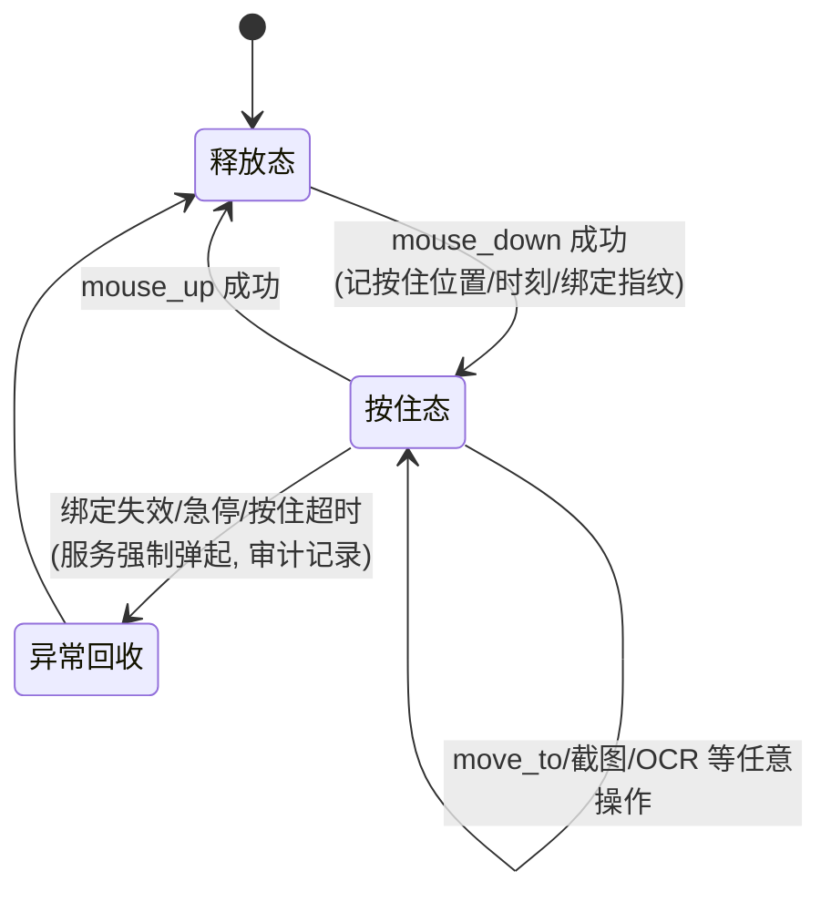
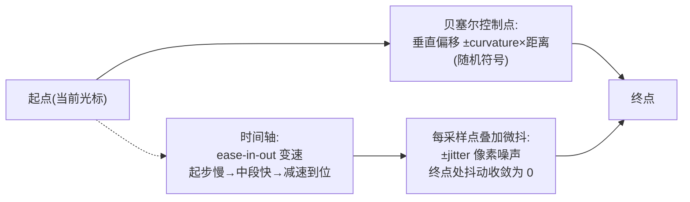
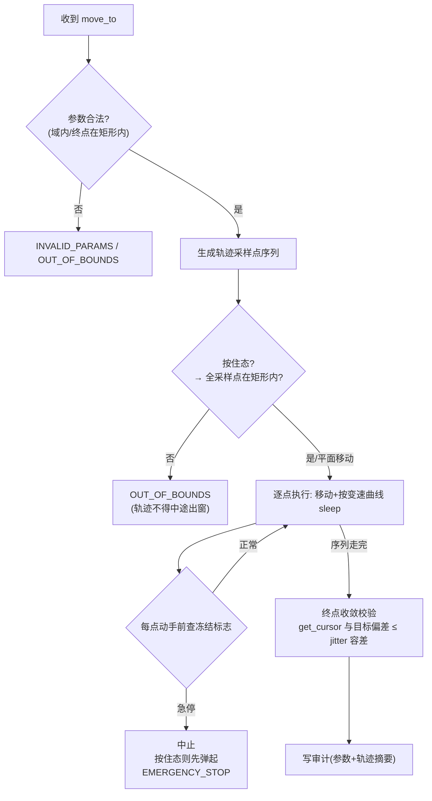
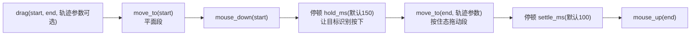
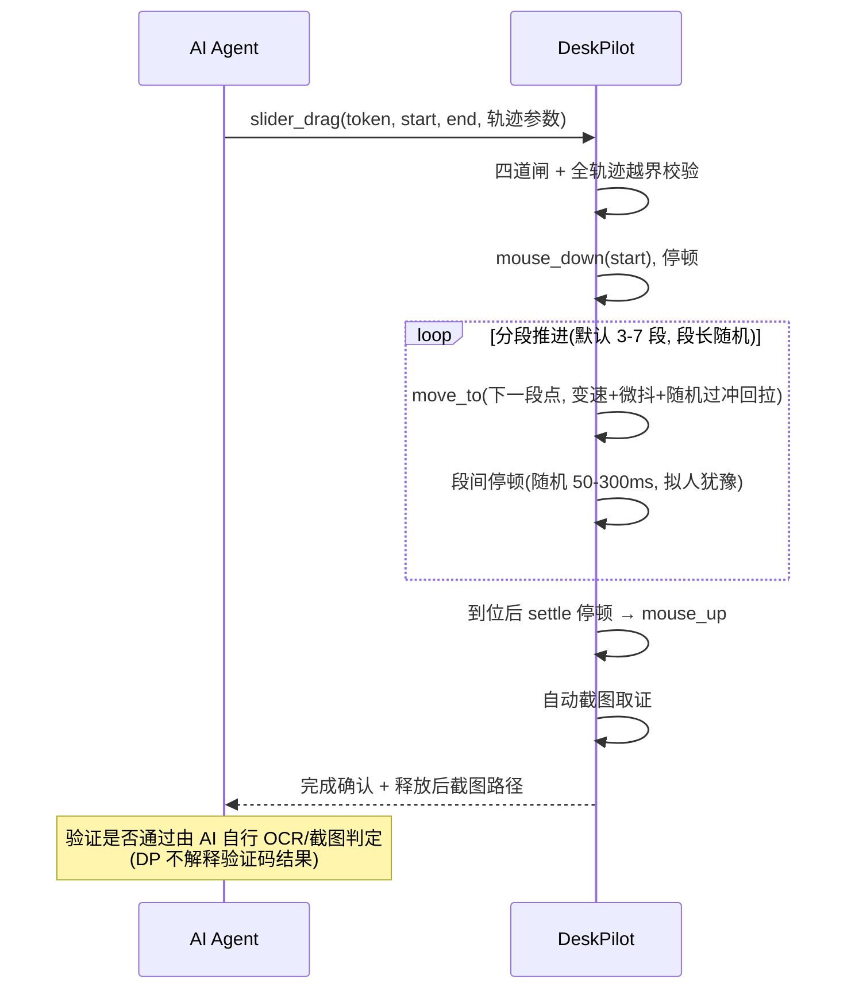

# DeskPilot 补充设计 —— 鼠标键盘操作面补全

| 项 | 内容 |
|----|------|
| 文档编号 | DP-SDS-001 |
| 版本 | v0.3 |
| 日期 | 2026-08-20 |
| 状态 | 待评审 |
| 上游文档 | [总体设计文档](DESIGN.md) v0.2、[功能设计说明书](功能设计说明书.md) v0.2、[详细设计说明书](详细设计说明书.md) v0.3 |
| 发起缘由 | 实战伤疤 C9（deskpilot-operator 契约，2026-08-19）：闲鱼滑块验证码"请按住滑块，拖动到最右"——既有 `drag` 一次性均速直线拖动被轨迹检测判失败；分段多次 `drag` 段间松开鼠标导致滑块回弹。结论：操作面缺"按住不放"原语与"拟人轨迹"能力 |

> **文档约定**：遵循上游文档约定——本文不含任何代码与伪代码；所有算法与流程逻辑一律以 Mermaid 图 + 文字规则表表达；工具签名只到参数级描述，不落实现。错误码正式收录以详细设计说明书附录 A 为权威，本文仅提出新增申请。

---

## 1. 设计目标与定位

### 1.1 设计目标（老板 2026-08-19 定调）

**MCP 的设计初衷就是让调用者可以操作鼠标和键盘，优化以这个目标为参考。**

现状盘点：键盘面基本完整（key 许可表 + type_text 中文方案）；鼠标面存在结构性缺口——

| 能力 | 现状 | 缺口 |
|------|------|------|
| 移动 | `move` 瞬移 | 无轨迹参数，瞬移轨迹一眼机器 |
| 点击 | `click`（左键单击） | 无右键、无双击 |
| 按住/松开 | **无原语** | 无法表达"按住不放的中途状态"，滑块/框选/长按全部不可达 |
| 拖拽 | `drag` 均速 24 步直线（executor 写死） | 无速度曲线、无路径扰动，过不了行为检测 |

### 1.2 与既有设计哲学的一致性声明

本文所有新增能力**不改变任何既有原则**，只做操作面的水平扩展：

| 既有原则 | 本文落实方式 |
|----------|--------------|
| 护栏在代码里，fail-closed | 新工具全部走既有四道闸，无一豁免；轨迹参数越界/非法一律 INVALID_PARAMS |
| L0–L3 分级 | 新工具全部 L2（写操作），须有效绑定令牌；无一降级为 L1 |
| 像素落点校验（OUT_OF_BOUNDS） | 一切像素级新原语沿用"执行时刻矩形 + 落点在窗口矩形内"；轨迹类操作**整条轨迹全部采样点**都在矩形内才执行 |
| 单一通道必经强制层（INV-8） | 新原语只在 executor.pixel 内实现，MCP 层零直通 |
| 全量审计（INV-6） | 按住/松开成对审计；轨迹类操作留存轨迹摘要（参数+采样点折线）入审计 |
| 急停（INV-10） | 轨迹执行全程可中断；**新增不变量：任何中止路径必须先松开已按住的鼠标键**（见 §6 INV-11 提案） |
| 防"静默成功"（INV-7） | 按住状态丢失（如焦点被抢导致弹起）必须显式报错，不得假装还按着 |

### 1.3 非目标

- ❌ 不追求"保证过某某验证码"——本设计只提供拟人操作原语；具体风控对抗参数（如滑块速度曲线取值）属于调参层，经 `slider_drag` 的封装参数暴露，默认值后续经 CDP 穿刺实验标定（见 §5.4）。
- ❌ 不引入键盘按住原语（key_down/key_up）——当前无实战需求，留待有伤疤再补（伤疤驱动原则）。
- ❌ 不开放任意鼠标键（中键、侧键）——无需求，fail-closed 精神：先不开。

---

## 2. 新增功能清单

| 功能编号 | 工具 | 级别 | 一句话说明 | 里程碑建议 |
|----------|------|------|-----------|-----------|
| F-L2-10 | `mouse_down` / `mouse_up` | L2 | 按住/松开原语，构成"按住态"状态机 | M4 |
| F-L2-11 | `move_to`（轨迹移动） | L1 平面 / L2 按住态 | 带轨迹参数的拟人移动：贝塞尔路径 + 变速 + 微抖 | M4 |
| F-L2-12 | `right_click` / `double_click` | L2 | 右键单击、左键双击 | M4 |
| F-L2-13 | `drag` 重构 | L2 | 语义不变，实现改为 down → 轨迹移动 → up 复合，新增轨迹参数（向后兼容） | M4 |
| F-L2-14 | `slider_drag` | L2 | 滑块验证码场景封装：按住 → 拟人轨迹 → 验证反馈轮询 → 到位释放 | M4（参数后补） |

**工具总数变化**：L2 由 9 个增至 13 个（mouse_down/mouse_up 计 1 个功能、2 个工具；move 保留不动，move_to 新增）。

---

## 3. F-L2-10 mouse_down / mouse_up —— 按住不放原语

### 3.1 功能描述

把"按下鼠标左键"与"松开"拆成两个独立工具，使调用者可以在按住期间执行任意其它操作（截图、OCR、轨迹移动、等待），表达"长按""框选""拖动中观察"等一切按住态交互。这是本补全设计的**地基原语**——F-L2-13/14 都是它的复合封装。

### 3.2 按住态状态机



**状态归属**：按住态绑定在**绑定令牌**上（谁按的谁松），不绑定在 MCP 会话上——与绑定模型同源。绑定失效（超时/窗口关闭/detach）⇒ 服务必须主动弹起鼠标键并写审计，**绝不允许服务侧认为"还按着"而实际已失控**。

### 3.3 规则表

| 规则 | 内容 |
|------|------|
| 按键范围 | 仅左键（v0.1 只开放左键按住；右键按住无场景，fail-closed 不开放） |
| 前置条件 | 有效绑定令牌；按下点在绑定窗口执行时刻矩形内（同 click 校验）；当前须为释放态（重复 mouse_down → 拒绝，返回状态冲突错误） |
| mouse_up 幂等 | 释放态收到 mouse_up → 返回完成确认并标注"本已是释放态"（不报错；容忍调用者兜底清理） |
| 按住超时 | policy 新增 `timeouts.mouse_hold_max`（默认 30 秒）：按住态超过此时长未收到 mouse_up ⇒ 服务强制弹起 + 审计 + 后续操作正常。**防 AI 忘记松开把鼠标卡死在按住态** |
| 跨工具可见性 | 按住态期间 `get_cursor` 等 L0 工具照常可用；`click`/`drag` 等自带按下语义的工具在按住态下调用 → 拒绝（状态冲突，防双击事故） |
| 审计 | down/up 各自一条记录；强制弹起单独一条事件记录（原因：绑定失效/急停/超时） |

### 3.4 失败语义

| 场景 | 返回 |
|------|------|
| 无绑定/绑定失效 | NO_BINDING（闸一） |
| 按下点越界 | OUT_OF_BOUNDS |
| 按住态中再 mouse_down / click / drag | STATE_CONFLICT（新增错误码申请） |
| 执行中急停触发 | EMERGENCY_STOP，且服务保证弹起已按住的键 |

---

## 4. F-L2-11 move_to —— 带轨迹参数的拟人移动

### 4.1 功能描述

既有 `move` 是瞬移（人眼可见的跳变，行为检测的最明显特征）。`move_to` 按**参数化轨迹**把鼠标从当前位置移动到目标位置：贝塞尔曲线路径（绕弯）、变速（起止慢中间快）、微抖（人手噪声）。释放态调用属 L1 平面移动语义；**按住态调用即"拖着走"**，是滑块/框选的核心动作，此时按写操作对待（L2 语义、轨迹全点越界校验、全量审计）。

> 级别定案：`move_to` 与 `move` 一样按 L1 注册（无绑定也可平面移动）；但**按住态下的每次 move_to 都过四道闸**（按住态本身由 L2 的 mouse_down 建立，闸检复用该绑定）。即"移动本身低风险，拖动是写入"。

### 4.2 轨迹模型



| 参数 | 含义 | 取值域 | 默认 |
|------|------|--------|------|
| `x`, `y` | 目标坐标 | int | 必填 |
| `duration_ms` | 全程耗时 | 100–5000 毫秒 | 按距离自适应（约 1 px/ms，clamp 到域内） |
| `curvature` | 贝塞尔弯曲度（控制点偏移比例） | 0.0–0.3；0 = 直线 | 0.1 |
| `jitter_px` | 微抖幅度（像素） | 0–3 | 1 |
| `steps` | 采样点数 | 8–200 | 按距离自适应（约每 10px 一点） |
| `overshoot` | 是否先冲过头再回拉（拟人纠正动作） | bool | false（滑块场景建议 true，见 §5） |

**确定性说明**：轨迹含随机成分（控制点符号、噪声），审计留存本次实际执行的参数与采样点折线摘要，保证可回放复盘（INV-6 精神延伸到"过程证据"）。

### 4.3 执行与中断



**与急停的关系**（INV-10 延伸）：轨迹执行是"一段时间内的连续写入"，必须每点复查冻结标志——这是既有"双检查原则"从单点操作到时序操作的自然推广。

---

## 5. F-L2-12/13/14 点击族扩展与拖拽重构

### 5.1 F-L2-12 right_click / double_click

| 项 | right_click | double_click |
|----|-------------|--------------|
| 语义 | 右键单击（上下文菜单） | 左键双击（打开/选中词） |
| 前置/校验 | 与 click 完全相同（绑定、矩形、前置窗口） | 同左 |
| 参数 | token、x、y | token、x、y；`interval_ms`（双击间隔，默认 120，域 50–500） |
| 说明 | 补全鼠标面最小完备集：移动/左键/右键/双击/滚轮/按住 | 双击两次按下间隔过大会被系统判为两次单击，故间隔参数化 |

既有 `click` 保持不变（不加 button 参数）——**一个工具一个语义**，与既有契约风格一致（click_element/type_element 分立）。

### 5.2 F-L2-13 drag 重构为复合原语

**对外契约不变**（`token, start, end` + 完成确认），实现重构为：



| 变化 | 说明 |
|------|------|
| 新增可选参数 | `duration_ms` / `curvature` / `jitter_px` / `overshoot` / `hold_ms` / `settle_ms`，全部有默认值；**不传参时行为 ≈ 现状但已是变速微抖轨迹**（默认参数拟人化，这是 C9 伤疤的直接修复） |
| 向后兼容 | 旧调用（仅 start/end）继续工作，语义不变、轨迹变拟人——属于实现质量提升，非契约变更 |
| 失败原子性 | 复合过程任一步失败 ⇒ 保证 mouse_up 已执行（弹起兜底）后返回错误；审计含完整步骤序列 |
| 越界校验 | start、end 及拖动段全部采样点均在执行时刻矩形内 |

### 5.3 F-L2-14 slider_drag —— 滑块验证场景封装

**功能目标**：把"按住滑块 → 拟人拖动 → 等待目标反馈 → 到位释放"封装为一个工具，面向滑块验证码与一切"拖到目标位置才松手"的 UI（进度条、调色板等）。它**不是**为某家验证码硬编码对抗逻辑，而是把 C9 暴露的三个能力缺口（按住不放、变速轨迹、中途观察）在一条时序里组装好。



| 参数 | 说明 |
|------|------|
| `start` / `end` | 滑块把手中心 → 目标位（通常轨道右端），必填 |
| 轨迹参数 | 同 §4.2 全集，默认值**待 CDP 穿刺调参后标定**（见下） |
| `segments` | 分段数域 2–10，默认随机 |
| 释放时机 | 默认"走完全程即释放"；如目标 UI 需要"停在目标上等反馈再松"，由 `release_delay_ms`（默认 300，域 0–2000）控制 |

**默认参数标定约定（显式挂起项）**：duration/curvature/jitter/分段停顿的默认值标注为 **TBD-CDP**——待闲鱼滑块场景经 CDP 通道穿刺实验（观测其轨迹检测阈值）后回填标定值；标定前 slider_drag 可用但不保证通过率，失败处置沿用 C9 纪律（两次失败即停手升级人类）。

### 5.4 职责边界（防越界声明）

slider_drag 只负责"拖得像人 + 按约定释放"；**不判断验证成败、不自动重试、不解题**（缺口位置识别、图案旋转等视觉推理全在调用方）。失败重试策略、风控升级判定属于调用方纪律（契约 C9 已载），不进本服务——服务对"被拖动对象是什么"零知识，这保持了 executor"只执行不判断"的纯净性。

---

## 6. 安全不变量增补提案

| 编号 | 提案内容 | 验证方式 |
|------|----------|----------|
| **INV-11（新增提案）** | 按住态兜底：任何导致按住态终止的路径（mouse_up / 绑定失效 / 急停 / 按住超时 / 复合原语中途失败），服务必须保证物理鼠标键已弹起；禁止"服务认为已弹起而实际按住"的静默分叉 | 单元测试逐路径注入故障，断言弹起调用被执行且状态机回到释放态 |
| INV-10 延伸 | 时序型写操作（轨迹移动/复合拖拽/滑块封装）每采样点复查冻结标志 | 测试：轨迹中途触发急停，断言中止 + 弹起 + EMERGENCY_STOP |
| INV-6 延伸 | 轨迹类操作审计含过程证据（参数 + 采样点折线摘要），可回放 | 审计记录结构测试 |

**新增错误码申请**（正式收录以详细设计附录 A 为权威）：

| 码 | 触发场景 |
|----|----------|
| STATE_CONFLICT | 按住态下调用自带按下语义的工具；释放态重复 mouse_down |
| HOLD_TIMEOUT | 按住超时被服务强制弹起（事件码，审计用） |

**policy.yml 新增项**（加载后锁定，INV-9 不变）：`timeouts.mouse_hold_max`（默认 30s）、`limits.trajectory_duration_max`（默认 5000ms）。

---

## 7. 对既有文档的影响面

| 文档 | 需同步位置 | 性质 |
|------|-----------|------|
| DESIGN.md | §4 工具契约表 +5 行；§5 不变量 +INV-11 | 增补，不改既有条目 |
| 功能设计说明书 | §3 功能清单 +F-L2-10~14；§5.3 +五节规格；§8 追溯矩阵 +INV-11 行 | 增补 |
| 详细设计说明书 | §9 executor.pixel 承担工具 +move_to/mouse_down/mouse_up/right_click/double_click；§14（tools_l2）+新工具节；附录 A +2 错误码；policy 加载项 +2 | 增补 |
| 测试设计说明书 | 新增用例：按住态状态机全路径、轨迹越界、急停中断轨迹、按住超时弹起、drag 兼容性回归、slider_drag 测试专用滑块固件（HTML 测试页或测试记事本内的自绘滑块） | 增补；全部 L2 用例只对 DESKPILOT_TEST_* 测试窗口执行 |
| policy.yml | +2 配置项 | 增补 |

**明确不改的**：四道闸结构、绑定模型、审批通道、按键许可表、既有 13+9 工具的对外契约（drag 仅增可选参数，向后兼容）。

---

## 8. 里程碑建议（M4：鼠标操作面补全）

| 阶段 | 内容 | 验收 |
|------|------|------|
| M4a 地基 | mouse_down/mouse_up + 按住态状态机 + INV-11 + move_to 轨迹引擎 | 按住态全路径测试绿；轨迹审计可回放；急停中断轨迹测试绿 |
| M4b 复合 | right_click/double_click + drag 重构 | drag 旧调用回归全绿；新轨迹参数生效证据（审计轨迹摘要非直线） |
| M4c 场景 | slider_drag + 测试滑块固件 | 测试固件滑块端到端通过；TBD-CDP 参数位留档待标定 |

---

## 9. 变更记录

| 版本 | 日期 | 变更内容 |
|------|------|----------|
| v0.1 | 2026-08-19 | 初版：依据 C9 伤疤（闲鱼滑块验证失败）与老板"鼠标键盘操作面补完整"指令编写；F-L2-10~14 五项 + INV-11 提案 + M4 里程碑；slider_drag 默认参数标 TBD-CDP 待穿刺调参 |
| v0.2 | 2026-08-20 | 补独立「§10 测试设计」章节：工具返回结构约定（断言锚点）+ TF-0/TF-1 测试固件 + M4a/b/c 全 30 用例表 + TBD-CDP 挂起项与覆盖率自评（39 规范点 100%）；原 §10 待评审问题顺延为 §11 |
| v0.3 | 2026-08-20 | §10 用例全面升级五要素格式（老板 2026-08-20 新规：场景/前提/步骤/预期结果/断言代码）；30 用例逐条补断言代码（pytest 风格）；新增前提简记 P1-P4 与坐标约定；本章豁免"不含代码"约定（仅限断言代码） |

---

## 10. 测试设计

本章为本补充设计的权威测试设计。**每个用例强制含五要素：测试场景、测试前提、测试步骤、预期结果、断言代码（老板 2026-08-20 新规，流程级标准，适用所有项目；本章因此豁免卷首"不含代码"约定，仅限断言代码）**。断言值一律由被调工具的返回值、审计记录或测试固件记录**直接产出**，无中间转换；只调本章 §10.1 定义的公开工具入口，不测内部私有实现；全部 L2 用例只对 `DESKPILOT_TEST_*` 测试窗口执行。

**前提简记**（用例表引用）：

| 简记 | 含义 |
|------|------|
| P1 | 已 attach TF-0 测试窗口并持有效绑定令牌；鼠标为释放态 |
| P2 | P1 + 已通过 mouse_down 建立按住态 |
| P3 | 测试 policy 档已加载（`mouse_hold_max=2s`） |
| P4 | 急停注入钩子可用（测试侧置冻结标志） |
| 坐标约定 | `P_IN=(100,100)` 界内点；`P_OUT=(99999,99999)` 界外点；`END_IN=(300,300)` 界内终点 |

### 10.1 测试入口与返回结构约定

新增工具的返回结构统一为两层（与既有工具同构）：

| 层 | 内容 |
|----|------|
| 成功 | `status=ok` + 工具级完成确认负载（下表） |
| 失败 | `status=error` + `error_code`（NO_BINDING / OUT_OF_BOUNDS / INVALID_PARAMS / STATE_CONFLICT / EMERGENCY_STOP 之一）+ 文字 detail |

| 工具 | 完成确认负载字段（断言锚点） |
|------|------------------------------|
| `mouse_down` | `hold_position`（按下坐标）、`hold_since`（时刻） |
| `mouse_up` | `released=true`、`already_released`（bool，幂等标注） |
| `move_to` | `final_position`（get_cursor 实测终点）、`steps_executed`（采样点数） |
| `right_click` / `double_click` | `clicked_at`（坐标）；double_click 另含 `interval_ms` 回显 |
| `drag` | `steps_log`（步骤序列：move_to/down/hold/drag/settle/up 各步成败） |
| `slider_drag` | `released=true`、`evidence_shot`（释放后截图路径）、`segments_used`（实际分段数） |

状态与审计作为第二类断言源：按住态当前值（绑定详情查询可见）、审计记录序列（down/up/强制弹起/轨迹摘要各一条）。

### 10.2 测试环境与固件

| 固件 | 说明 |
|------|------|
| **TF-0 测试记事本** | 既有 `DESKPILOT_TEST_*` 测试窗口，承载点击族/状态机用例 |
| **TF-1 自绘滑块测试页** | 本地 HTML：轨道 + 可拖把手；把手记录收到的鼠标事件序列（down/move/up 的时刻与坐标），拖到位显示"已到位"反馈文本。断言源 = 页面内事件记录区文本（OCR/截图可读） |
| **policy 测试档** | `timeouts.mouse_hold_max` 测试值 2 秒（验证超时弹起不耗 30 秒）；`limits.trajectory_duration_max` 保持默认 |
| **急停注入** | 测试钩子模拟冻结标志置位（不等价于真急停热键，验执行层复查逻辑） |

### 10.3 M4a 用例（按住态状态机 + 轨迹引擎 + INV-11/INV-10）

#### TC-A01 正常按下建立按住态
- 场景：释放态下界内按下，状态机进入按住态
- 前提：P1
- 步骤：调 `mouse_down(token, P_IN)` → 查绑定详情 → 读审计末条
- 预期结果：status=ok；hold_position=P_IN；状态=按住态；审计新增 down 一条
- 断言代码：
```python
r = mouse_down(token, *P_IN)
assert r.status == "ok" and r.hold_position == P_IN
assert binding_detail(token).hold_state == "holding"
assert audit_trail()[-1].action == "mouse_down"
```

#### TC-A02 按住态重复按下被拒
- 场景：按住态再调 mouse_down，状态冲突
- 前提：P2
- 步骤：再调 `mouse_down(token, P_IN)` → 查状态与审计长度
- 预期结果：error_code=STATE_CONFLICT；仍按住态；审计无新增
- 断言代码：
```python
r = mouse_down(token, *P_IN)
assert r.status == "error" and r.error_code == "STATE_CONFLICT"
assert binding_detail(token).hold_state == "holding"
```

#### TC-A03 正常松开
- 场景：按住态调 mouse_up，回到释放态
- 前提：P2
- 步骤：调 `mouse_up(token)` → 查状态与审计
- 预期结果：released=true、already_released=false；状态=释放态；审计 +up
- 断言代码：
```python
r = mouse_up(token)
assert r.released is True and r.already_released is False
assert binding_detail(token).hold_state == "released"
assert audit_trail()[-1].action == "mouse_up"
```

#### TC-A04 释放态 mouse_up 幂等
- 场景：释放态收到 up，不报错、标注本已释放
- 前提：P1（释放态）
- 步骤：调 `mouse_up(token)`
- 预期结果：released=true、already_released=true；无状态变化
- 断言代码：
```python
r = mouse_up(token)
assert r.released is True and r.already_released is True
assert binding_detail(token).hold_state == "released"
```

#### TC-A05 无绑定拒绝
- 场景：无有效绑定调 mouse_down
- 前提：无绑定（或已过期令牌）
- 步骤：调 `mouse_down(bad_token, P_IN)`
- 预期结果：error_code=NO_BINDING
- 断言代码：
```python
r = mouse_down(bad_token, *P_IN)
assert r.status == "error" and r.error_code == "NO_BINDING"
```

#### TC-A06 界外按下拒绝
- 场景：按下点越界
- 前提：P1
- 步骤：调 `mouse_down(token, P_OUT)` → 查状态
- 预期结果：error_code=OUT_OF_BOUNDS；仍为释放态
- 断言代码：
```python
r = mouse_down(token, *P_OUT)
assert r.error_code == "OUT_OF_BOUNDS"
assert binding_detail(token).hold_state == "released"
```

#### TC-A07 按住态下自带按下语义工具被拒
- 场景：按住态中调 click / drag，防双击事故
- 前提：P2
- 步骤：依次调 `click(token, P_IN)`、`drag(token, P_IN, END_IN)` → 查状态
- 预期结果：两者均 STATE_CONFLICT；按住态不受影响
- 断言代码：
```python
assert click(token, *P_IN).error_code == "STATE_CONFLICT"
assert drag(token, P_IN, END_IN).error_code == "STATE_CONFLICT"
assert binding_detail(token).hold_state == "holding"
```

#### TC-A08 按住超时强制弹起
- 场景：按住超 `mouse_hold_max` 未松开，服务兜底
- 前提：P2 + P3（hold_max=2s）
- 步骤：按住后静止等待 3 秒 → 查状态、审计、get_cursor
- 预期结果：服务强制弹起；审计含 HOLD_TIMEOUT（原因=超时）；状态=释放态；get_cursor 正常返回
- 断言代码：
```python
time.sleep(3)
assert binding_detail(token).hold_state == "released"
ev = [a for a in audit_trail() if a.event == "HOLD_TIMEOUT"]
assert len(ev) == 1 and ev[0].reason == "timeout"
assert get_cursor().status == "ok"
```

#### TC-A09 按住中绑定失效强制弹起
- 场景：按住态中 detach，服务主动弹起
- 前提：P2
- 步骤：调 `detach(token)` → 查审计
- 预期结果：强制弹起；审计含弹起事件（原因=绑定失效）
- 断言代码：
```python
detach(token)
ev = [a for a in audit_trail() if a.action == "force_release"]
assert len(ev) == 1 and ev[0].reason == "binding_lost"
```

#### TC-A10 平面轨迹移动正常
- 场景：释放态 move_to 按参数化轨迹到位
- 前提：P1
- 步骤：调 `move_to(token, END_IN)`（默认参数）→ 读审计末条
- 预期结果：final_position 与目标偏差 ≤ jitter 容差；steps_executed ∈ [8,200]；审计含参数+折线摘要
- 断言代码：
```python
r = move_to(token, *END_IN)
assert abs(r.final_position[0] - END_IN[0]) <= 3
assert abs(r.final_position[1] - END_IN[1]) <= 3
assert 8 <= r.steps_executed <= 200
assert audit_trail()[-1].trajectory_summary is not None
```

#### TC-A11 轨迹参数越界逐参拒绝
- 场景：duration/curvature/jitter/steps 各出域
- 前提：P1
- 步骤：分别以 duration_ms=5001、curvature=0.31、jitter_px=4、steps=7 调 move_to
- 预期结果：各返回 INVALID_PARAMS；光标未动
- 断言代码：
```python
before = get_cursor().position
for kw in [{"duration_ms": 5001}, {"curvature": 0.31}, {"jitter_px": 4}, {"steps": 7}]:
    assert move_to(token, *END_IN, **kw).error_code == "INVALID_PARAMS"
assert get_cursor().position == before
```

#### TC-A12 终点越界拒绝
- 场景：move_to 终点在窗口矩形外
- 前提：P1
- 步骤：调 `move_to(token, P_OUT)` → 查光标
- 预期结果：OUT_OF_BOUNDS；光标未动
- 断言代码：
```python
before = get_cursor().position
assert move_to(token, *P_OUT).error_code == "OUT_OF_BOUNDS"
assert get_cursor().position == before
```

#### TC-A13 按住态轨迹中途出窗拒绝
- 场景：按住态 move_to，终点界内但大曲率使采样点出窗
- 前提：P2（按住在靠近边界的点）
- 步骤：调 `move_to(token, END_IN, curvature=0.3)`（轨迹朝界外弯）→ 查状态
- 预期结果：OUT_OF_BOUNDS；未执行；按住态保持
- 断言代码：
```python
r = move_to(token, *END_IN, curvature=0.3)
assert r.error_code == "OUT_OF_BOUNDS"
assert binding_detail(token).hold_state == "holding"
```

#### TC-A14 轨迹中途急停中断
- 场景：长轨迹执行中冻结标志置位
- 前提：P2 + P4
- 步骤：起 `move_to(token, END_IN, duration_ms=5000)` → 执行中注入急停 → 收返回、查状态与审计
- 预期结果：EMERGENCY_STOP；按住键已弹起；状态=释放态；审计含中止记录
- 断言代码：
```python
r = move_to(token, *END_IN, duration_ms=5000)  # 注入钩子在中途置位
assert r.error_code == "EMERGENCY_STOP"
assert binding_detail(token).hold_state == "released"
assert any(a.event == "trajectory_aborted" for a in audit_trail())
```

#### TC-A15 INV-11 全终止路径弹起保证
- 场景：按住态每条终止路径都必须物理弹起（故障注入矩阵）
- 前提：P1 + 故障注入钩子（spy 物理弹起调用）
- 步骤：对每条路径（mouse_up / detach / 急停 / 超时 / drag 复合中途失败）分别建立按住态后触发终止
- 预期结果：每条路径 spy 均记录到物理弹起调用；状态机回到释放态
- 断言代码：
```python
for path in ["up", "detach", "estop", "timeout", "composite_fail"]:
    setup_holding(); spy.reset()
    trigger(path)
    assert spy.physical_release_called is True, path
    assert binding_detail(token).hold_state == "released", path
```

#### TC-A16 轨迹审计可回放
- 场景：轨迹类操作审计含过程证据（INV-6 延伸）
- 前提：P1
- 步骤：调 `move_to(token, END_IN, curvature=0.2, jitter_px=2)` → 读审计末条
- 预期结果：审计记录含本次参数全集（duration/curvature/jitter/steps/overshoot）与采样点折线摘要
- 断言代码：
```python
move_to(token, *END_IN, curvature=0.2, jitter_px=2)
rec = audit_trail()[-1]
assert rec.params["curvature"] == 0.2 and rec.params["jitter_px"] == 2
assert len(rec.trajectory_summary.points) >= 8
```

### 10.4 M4b 用例（点击族 + drag 重构）

#### TC-B01 右键单击正常
- 场景：TF-0 界内右键单击
- 前提：P1
- 步骤：调 `right_click(token, P_IN)` → 读 TF-0 事件记录区
- 预期结果：status=ok；clicked_at=P_IN；TF-0 记录到右键事件
- 断言代码：
```python
r = right_click(token, *P_IN)
assert r.status == "ok" and r.clicked_at == P_IN
assert "RBUTTON" in tf0.event_log()
```

#### TC-B02 右键越界/无绑定
- 场景：right_click 两道前置闸
- 前提：P1；另备无效令牌
- 步骤：分别调 `right_click(token, P_OUT)` 与 `right_click(bad_token, P_IN)`
- 预期结果：前者 OUT_OF_BOUNDS；后者 NO_BINDING
- 断言代码：
```python
assert right_click(token, *P_OUT).error_code == "OUT_OF_BOUNDS"
assert right_click(bad_token, *P_IN).error_code == "NO_BINDING"
```

#### TC-B03 双击正常（默认间隔）
- 场景：TF-0 界内双击，系统判为一次双击
- 前提：P1
- 步骤：调 `double_click(token, P_IN)` → 读 TF-0 事件记录区
- 预期结果：status=ok；interval_ms 回显=120；TF-0 判为一次双击（非两次单击）
- 断言代码：
```python
r = double_click(token, *P_IN)
assert r.status == "ok" and r.interval_ms == 120
assert tf0.event_log().count("DBLCLK") == 1
```

#### TC-B04 双击间隔越界
- 场景：interval_ms 出域（49 / 501）
- 前提：P1
- 步骤：分别以 49、501 调 double_click
- 预期结果：均 INVALID_PARAMS
- 断言代码：
```python
assert double_click(token, *P_IN, interval_ms=49).error_code == "INVALID_PARAMS"
assert double_click(token, *P_IN, interval_ms=501).error_code == "INVALID_PARAMS"
```

#### TC-B05 drag 旧调用回归
- 场景：仅 start/end 的旧调用形态，契约向后兼容
- 前提：P1
- 步骤：调 `drag(token, P_IN, END_IN)` → 读 steps_log
- 预期结果：status=ok；steps_log 六步（move_to/down/hold/drag/settle/up）全成
- 断言代码：
```python
r = drag(token, P_IN, END_IN)
assert r.status == "ok"
assert [s.name for s in r.steps_log] == ["move_to", "down", "hold", "drag", "settle", "up"]
assert all(s.ok for s in r.steps_log)
```

#### TC-B06 drag 轨迹拟人化证据
- 场景：传 curvature 后轨迹非直线（C9 修复证据）
- 前提：P1
- 步骤：调 `drag(token, P_IN, END_IN, curvature=0.2)` → 读审计轨迹摘要
- 预期结果：status=ok；审计折线摘要中存在偏离 start→end 弦的采样点
- 断言代码：
```python
r = drag(token, P_IN, END_IN, curvature=0.2)
assert r.status == "ok"
pts = audit_trail()[-1].trajectory_summary.points
assert any(distance_to_line(p, P_IN, END_IN) > 0 for p in pts)
```

#### TC-B07 drag 中途失败原子性
- 场景：拖动段注入故障，必须弹起兜底
- 前提：P1 + 故障注入钩子（拖动段第 3 个采样点失败）
- 步骤：调 `drag(token, P_IN, END_IN)` → 读 steps_log 与状态
- 预期结果：返回 error；steps_log 含失败步；mouse_up 已执行；状态=释放态
- 断言代码：
```python
r = drag(token, P_IN, END_IN)
assert r.status == "error"
assert any(not s.ok for s in r.steps_log)
assert r.steps_log[-1].name == "up" and r.steps_log[-1].ok
assert binding_detail(token).hold_state == "released"
```

#### TC-B08 drag 越界拒绝
- 场景：start/end/轨迹采样点任一出窗
- 前提：P1
- 步骤：分别以 start=P_OUT、end=P_OUT、大曲率出窗轨迹调 drag
- 预期结果：均 OUT_OF_BOUNDS；未动手（无 down 审计）
- 断言代码：
```python
before = len([a for a in audit_trail() if a.action == "mouse_down"])
assert drag(token, P_OUT, END_IN).error_code == "OUT_OF_BOUNDS"
assert drag(token, P_IN, P_OUT).error_code == "OUT_OF_BOUNDS"
after = len([a for a in audit_trail() if a.action == "mouse_down"])
assert after == before  # 未动手
```

### 10.5 M4c 用例（slider_drag + TF-1）

#### TC-C01 端到端拖到位
- 场景：TF-1 滑块从把手中心拖到轨道右端，反馈"已到位"
- 前提：P1；TF-1 测试页已在测试窗口打开；把手中心 HANDLE、轨道右端 RAIL_END 已量取
- 步骤：调 `slider_drag(token, HANDLE, RAIL_END)` → 读 TF-1 反馈区与返回值
- 预期结果：status=ok；released=true；evidence_shot 文件存在且非空；TF-1 反馈区显示"已到位"
- 断言代码：
```python
r = slider_drag(token, HANDLE, RAIL_END)
assert r.status == "ok" and r.released is True
assert os.path.getsize(r.evidence_shot) > 0
assert tf1.feedback_text() == "已到位"
```

#### TC-C02 轨迹拟人性质
- 场景：只断言轨迹性质，不断言第三方验证码通过率（TBD-CDP 纪律）
- 前提：同 TC-C01
- 步骤：调 `slider_drag(token, HANDLE, RAIL_END)` → 读返回值与 TF-1 事件记录
- 预期结果：segments_used ∈ [2,10]；TF-1 记录的相邻 move 间隔非恒定；存在横向微抖偏移
- 断言代码：
```python
r = slider_drag(token, HANDLE, RAIL_END)
assert 2 <= r.segments_used <= 10
gaps = [b.t - a.t for a, b in zip(tf1.events(), tf1.events()[1:]) if b.type == "move"]
assert len(set(gaps)) > 1  # 变速
assert any(e.y != tf1.events()[0].y for e in tf1.events() if e.type == "move")  # 微抖
```

#### TC-C03 释放延迟生效
- 场景：release_delay_ms 控制"到位后等反馈再松"
- 前提：同 TC-C01
- 步骤：调 `slider_drag(token, HANDLE, RAIL_END, release_delay_ms=800)` → 读 TF-1 事件记录
- 预期结果：TF-1 记录 up 时刻 − 到位时刻 ≥ 800ms
- 断言代码：
```python
slider_drag(token, HANDLE, RAIL_END, release_delay_ms=800)
ev = tf1.events()
assert ev[-1].type == "up" and ev[-1].t - tf1.arrived_at() >= 800
```

#### TC-C04 分段中途急停
- 场景：分段推进中冻结标志置位
- 前提：同 TC-C01 + P4
- 步骤：起 `slider_drag(token, HANDLE, RAIL_END)` → 第 2 段注入急停 → 收返回、查状态与审计
- 预期结果：EMERGENCY_STOP；已弹起；状态=释放态；审计含中止记录
- 断言代码：
```python
r = slider_drag(token, HANDLE, RAIL_END)  # 注入钩子在第 2 段置位
assert r.error_code == "EMERGENCY_STOP"
assert binding_detail(token).hold_state == "released"
assert any(a.event == "trajectory_aborted" for a in audit_trail())
```

#### TC-C05 分段数越界
- 场景：segments 出域（1 / 11）
- 前提：同 TC-C01
- 步骤：分别以 segments=1、11 调 slider_drag
- 预期结果：均 INVALID_PARAMS
- 断言代码：
```python
assert slider_drag(token, HANDLE, RAIL_END, segments=1).error_code == "INVALID_PARAMS"
assert slider_drag(token, HANDLE, RAIL_END, segments=11).error_code == "INVALID_PARAMS"
```

#### TC-C06 起点越界
- 场景：start 在窗口矩形外
- 前提：同 TC-C01
- 步骤：调 `slider_drag(token, P_OUT, RAIL_END)` → 查状态
- 预期结果：OUT_OF_BOUNDS；未按住（释放态）
- 断言代码：
```python
assert slider_drag(token, P_OUT, RAIL_END).error_code == "OUT_OF_BOUNDS"
assert binding_detail(token).hold_state == "released"
```

### 10.6 挂起项与覆盖率自评

**显式挂起（TBD-CDP，标定后回填）**：slider_drag 默认轨迹参数值、闲鱼真实滑块通过率断言、§5.3 参数标定实验。挂起项不计入覆盖率分母。

| 覆盖维度 | 规范点数 | 已覆盖 | 覆盖率 |
|----------|---------|--------|--------|
| 工具规则表条目（§3.3/§4.2/§5.1/§5.2/§5.3） | 21 | 21 | 100% |
| 按住态状态机迁移（§3.2，含异常回收） | 6 | 6 | 100% |
| 安全不变量（INV-11 / INV-10 延伸 / INV-6 延伸） | 3 | 3 | 100% |
| 错误码路径（NO_BINDING/OUT_OF_BOUNDS/INVALID_PARAMS/STATE_CONFLICT/EMERGENCY_STOP/HOLD_TIMEOUT） | 6 | 6 | 100% |
| 里程碑验收（M4a/b/c） | 3 | 3 | 100% |
| **总覆盖率（挂起项除外）** | **39** | **39** | **100%** |

## 11. 待评审问题

1. `move_to` 在**释放态**是否要求绑定（本文定案：不要求，与 `move` 同级 L1；若评审认为轨迹移动也属"内容可见状态改变"，可上调为需绑定，影响面仅限 move_to 一个工具）。
2. 按住超时 `mouse_hold_max` 默认 30 秒是否合适——滑块场景足够，长框选场景是否需按调用参数放宽（建议：不允许调用方传参放宽，防 AI 把鼠标长时间钉死；如需更长走 policy 调整）。
3. slider_drag 的 TBD-CDP 参数标定实验方案（穿刺通道、观测指标、标定流程）是否单独立项。
