# DeskPilot 详细设计说明书

| 项 | 内容 |
|----|------|
| 文档编号 | DP-DDS-001 |
| 版本 | v0.3 |
| 日期 | 2026-08-16 |
| 状态 | 待评审 |
| 模板依据 | GB/T 8567-2006《计算机软件文档编制规范》"详细设计说明书" |
| 上游文档 | 总体设计（docs/DESIGN.md）v0.1 · [功能设计说明书](功能设计说明书.md) v0.2 |
| 适用里程碑 | M1（安全核心）/ M2（元素级操作）/ M3（SoM + 审批通道） |

> **文档约定**：本文不含任何代码与伪代码。算法与流程逻辑一律以 Mermaid 图 + 文字规则表表达；文中模块名、字段名、工具名、错误码为设计标识符，仅作约定引用，不构成代码。

---

## 1. 引言

### 1.1 编写目的

本文将功能设计说明书确定的功能规格展开到程序级：先给出程序系统的整体结构，再对每个程序按"程序描述、功能、性能、输入项、输出项、算法、流程逻辑、接口、存储分配、注释设计、限制条件、测试计划、尚未解决的问题"逐项说明，作为编码实现的直接蓝图。预期读者为开发者、测试者与评审人员。

### 1.2 背景

- 软件名称：DeskPilot（自定义的安全桌面驾驶舱）。
- 任务来源：让 AI agent 自主、安全地操作 Windows 桌面应用；前身 `win-computer-use` demo 已验证可行性。
- 用户：AI Agent（经任意 MCP 客户端）、本地人类操作员（审批/急停）、策略管理员。
- 运行环境：Windows 桌面；Python + FastAPI（仅 127.0.0.1）；MCP over stdio；技术选型沿用总体设计 §8。
- 上游文档：总体设计 docs/DESIGN.md v0.1（确立"护栏在代码里、fail-closed、单一通道必经强制层"三原则与安全不变量 INV-1～INV-10）；功能设计说明书（功能编号 F-* 的来源）。

### 1.3 定义

| 术语 | 含义 |
|------|------|
| 程序 | 本文按 GB/T 8567 模板对"模块/子系统"的称呼 |
| 绑定（Binding） | 写操作的前提凭据，记录目标窗口句柄、进程名、矩形与绑定时间 |
| 强制层 | 对每个写操作执行"四道闸"裁决的程序 |
| L0–L3 | 操作分级：L0 只读 / L1 低风险 / L2 写入 / L3 受控 |
| 审批令牌 | 人类批准后签发的一次性、有时效、绑定操作指纹的凭据；全程在服务内部流转，不经 AI |
| 操作指纹 | 由工具名与规范化参数算出的摘要值，绑定令牌与具体操作 |
| 输入场景 | 焦点元素为文本编辑类控件（UIA Edit/Document 等）的窗口状态；场景受限键仅在此场景放行 |
| 写锁 | 保证写操作串行执行的全局互斥机制 |
| 冻结标志 | 急停触发后置位的全局原子状态 |
| SoM / 映射缓存 | 对截图可交互元素编号标注；编号→元素对照的短期保存 |
| Fail-closed | 默认拒绝，规则明确允许才放行 |
| INV-n | 总体设计 §5 的安全不变量编号 |
| F-* | 功能设计说明书 §3 的功能编号 |

### 1.4 参考资料

- GB/T 8567-2006《计算机软件文档编制规范》
- DeskPilot 总体设计（docs/DESIGN.md）v0.1
- DeskPilot 功能设计说明书 v0.2
- MCP（Model Context Protocol）规范

---

## 2. 程序系统的结构

### 2.1 模块结构图

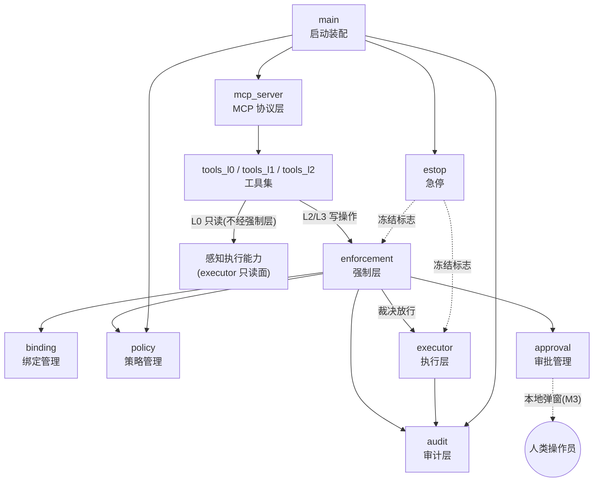

### 2.2 模块清单

| 程序标识符 | 名称 | 职责 | 对应功能编号 | 里程碑 |
|-----------|------|------|--------------|--------|
| main | 启动装配 | 启动流程编排、模块组装、退出清理 | F-CORE-06（部分） | M1 |
| mcp_server | MCP 协议层 | 协议翻译、参数规整、结果回传；零业务逻辑 | 全部 F-L0/L1/L2 | M1 |
| policy | 策略管理 | 加载、校验、锁定 policy.yml，提供只读策略视图 | F-CORE-06 | M1 |
| binding | 绑定管理 | 绑定记录的创建、校验、超时回收、解绑 | F-CORE-01 | M1 |
| approval | 审批管理 | 操作指纹、审批令牌全生命周期、审批通道对接 | F-CORE-03 | M1 / M3 |
| enforcement | 强制层 | 四道闸裁决，写操作唯一入口（安全核心） | F-CORE-02 | M1 |
| executor | 执行层 | uia / pixel / waiter 三子模块；只执行不判断 | 各 F-L2 工具 | M1 / M2 |
| audit | 审计层 | 审计记录组装落盘、截图证据、目录只读隔离 | F-CORE-04 | M1 |
| estop | 急停 | 热键与甩角监听、冻结标志、复位控制 | F-CORE-05 | M1 |
| tools_l0 | 感知类工具集 | 8 个 L0 只读工具 | F-L0-01～08 | M1 / M3 |
| tools_l1 | 控制类工具集 | 5 个 L1 工具 | F-L1-01～05 | M1 / M2 |
| tools_l2 | 写入类工具集 | 9 个 L2/L3 工具 | F-L2-01～09 | M1 / M2 |

### 2.3 模块调用关系

| 调用方 → 被调方 | 接口内容 | 说明 |
|----------------|----------|------|
| tools_l2 → enforcement | 提交裁决（操作请求 → 裁决结果） | 写操作唯一入口 |
| enforcement → binding | 校验绑定（令牌 → 结论+记录） | 通过即刷新活跃时间 |
| enforcement → approval | 请求批准 / 按指纹校验并消费令牌 | 令牌不经 AI；M1 恒拒绝；M3 接弹窗 |
| enforcement → executor | 执行指令（已放行指令 → 结果+截图）；只读查询（焦点元素判定） | 执行层唯一调用方（INV-8 结构落实）；只读查询供闸三输入场景判定 |
| enforcement / executor / estop / main → audit | 记录（审计记录或事件 → 落盘确认） | 写失败则操作失败 |
| 各模块 → policy | 读策略（配置节名 → 只读视图） | 运行期恒定 |
| enforcement / executor → estop | 冻结查询（→ 标志当前值） | 写路径双检查 |
| estop → enforcement / executor | 仅写冻结标志 | estop 不调用任何模块 |
| mcp_server → tools_* | 分发已规整请求 | 零直通后门 |

**结构约束**：执行层只对强制层暴露执行接口；policy、binding、approval 不反向依赖强制层；L0 感知工具读取桌面信息不经强制层，但写审计轻量记录。

### 2.4 并发与串行化结构

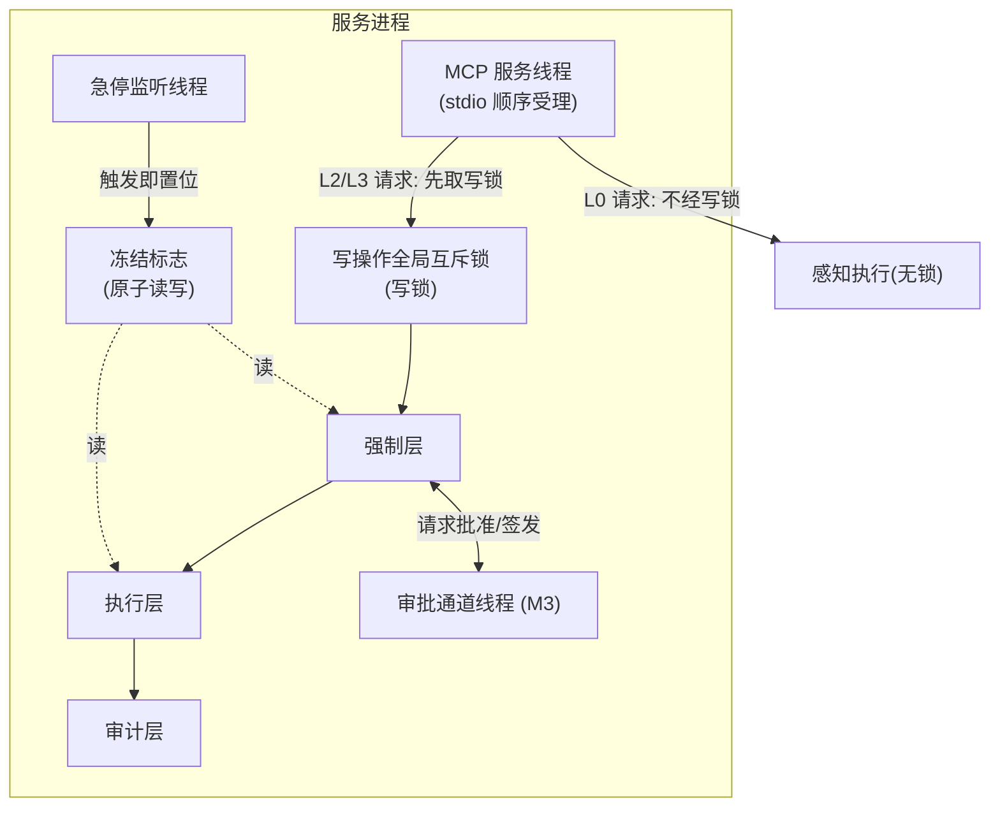

| 规则 | 说明 |
|------|------|
| 写操作串行 | 写锁持有范围 = 四道闸 + 执行 + 审计；拒绝路径同样持锁，保证审计顺序与操作顺序一致 |
| 读操作免锁 | L0 工具不改变系统状态，不取写锁 |
| 急停抢占 | 冻结标志为原子变量，监听线程随时可写；写锁持有期间触发急停，执行层动手前检查点生效中止 |
| 审批同步 | 闸四在写锁内同步等待人类裁决（≤ approval_ttl）：批准即在**同一调用内**继续转执行层，拒绝/超时以明确错误码返回；AI 自发起后退出环路、无重试（ISS-0003）。决策期间写锁持有，其他写操作排队——串行即 fail-closed（关闭 §7.13 待评审项） |
| 绑定表并发 | 绑定表增删查改由写锁或表级锁保护；回收线程与请求线程不并发改同一记录 |

---

## 3. 程序 main（启动装配）设计说明

### 3.1 程序描述

常驻主线程，负责进程启动的固定顺序编排与各模块组装。任何一步启动失败即拒绝启动（fail-closed 延伸到服务自身），不得在缺审计能力的情况下将就启动。

### 3.2 功能

| 序号 | 功能 | 说明 |
|------|------|------|
| 1 | 加载策略 | 调用 policy 加载并锁定 policy.yml |
| 2 | 初始化审计 | 创建/验证审计目录可写且权限正确 |
| 3 | 注册急停 | 启动 estop 监听线程（热键 + 甩角）；stdio 瘦代理探测到 daemon 在线则跳过（§11.6，ISS-0002） |
| 4 | 初始化内存表 | 创建空绑定表与审批令牌表 |
| 5 | 启动内部服务 | 内部 HTTP 仅绑 127.0.0.1；启动 MCP stdio 服务 |
| 6 | 记录事件 | 审计写入"服务启动/停止"事件 |
| 7 | 退出清理 | 停 MCP、释放热键、写停止事件后退出 |
| 8 | 本地复位入口 | `--reset`：经本机 HTTP POST /estop/reset 复位常驻服务后退出，daemon 离线显式报错（§11.8，ISS-0002） |

### 3.3 性能

启动总耗时目标 < 5 秒；启动失败须在输出原因后 1 秒内以非零退出码结束。

### 3.4 输入项

| 输入 | 来源 | 说明 |
|------|------|------|
| policy.yml | 文件 | 策略内容，结构见程序 policy 的存储分配（§5.9） |
| 策略路径参数 | 命令行（可选） | 指定非默认策略文件位置 |
| 运行模式参数 | 命令行（可选） | `--daemon` 常驻形态；`--reset` 本地复位命令（§11，ISS-0002） |
| 退出信号 | 操作系统 | 触发退出清理 |

### 3.5 输出项

| 输出 | 去向 | 说明 |
|------|------|------|
| 启动日志 | 控制台 | 各步骤成功/失败 |
| 启动/停止事件 | 审计层 | 特殊事件记录 |
| 进程退出码 | 操作系统 | 0 正常；非 0 启动失败 |

### 3.6 算法

无独立算法；启动编排见流程逻辑。

### 3.7 流程逻辑

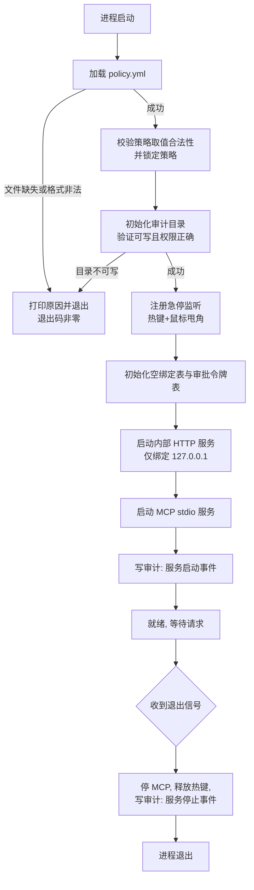

### 3.8 接口

| 接口 | 方向 | 说明 |
|------|------|------|
| 进程入口 | 被 OS/部署层调用 | 启动与退出 |
| 各模块初始化接口 | 调用 policy / audit / estop / binding / approval / mcp_server | 固定顺序调用 |

### 3.9 存储分配

本程序不持有数据。各内存表（绑定表、审批令牌表）的创建动作在此发生，结构分属程序 binding（§6.9）与 approval（§7.9）。

### 3.10 注释设计

- 启动每一步骤处注释步骤编号与失败后果；
- 每个"拒绝启动"分支必须注释对应的 fail-closed 依据；
- 模块头部注释启动顺序不可调整的原因（策略先于一切、审计先于服务）。

### 3.11 限制条件

- 策略缺失/非法、审计目录不可写、端口被占用：任一发生即不得启动；
- 启动顺序固定，禁止并行初始化。

### 3.12 测试计划

| 用例 | 预期 |
|------|------|
| 策略文件缺失 / 格式非法 | 拒绝启动，非零退出码，原因明确 |
| 审计目录不可写 | 拒绝启动 |
| 正常启动 | 审计日志含启动事件；MCP 可握手 |
| stdio 瘦代理启动 | daemon 在线时跳过热键/甩角注册；审计含"瘦代理跳过热键注册"（ISS-0002） |
| `--reset` 本地复位 | daemon 在线复位成功退出码 0；离线显式报错、退出码非 0（ISS-0002） |
| 收到退出信号 | 热键释放、停止事件落盘、退出码为 0 |

### 3.13 尚未解决的问题

无。

---

## 4. 程序 mcp_server（MCP 协议层）设计说明

### 4.1 程序描述

唯一对外协议端点，面向任意 MCP 客户端（MCP over stdio）。只做协议翻译与参数规整：零业务逻辑、零安全判断、零直通后门（INV-8，评审逐条核对）。

### 4.2 功能

| 序号 | 功能 |
|------|------|
| 1 | 协议握手与 22 个工具清单发布 |
| 2 | 请求参数规整为内部"操作请求" |
| 3 | 结果与错误的结构化回传 |

### 4.3 性能

参数规整耗时 < 10 毫秒，不侵占四道闸 50 毫秒的裁决预算。

### 4.4 输入项

MCP 协议消息：工具名 + 参数对象。各工具参数明细见程序 tools_l0（§12.4）、tools_l1（§13.4）、tools_l2（§14.4）的输入项。

### 4.5 输出项

| 情形 | 输出 |
|------|------|
| 成功 | 工具返回内容的协议包装 |
| 失败 | 结构化错误：原因码（附录 A）+ 说明文本，原样透传强制层/工具信息 |

### 4.6 算法

参数规整规则表：

| 规则 | 说明 |
|------|------|
| 必填校验 | 必填参数缺失 → INVALID_PARAMS，不进入后续模块 |
| 类型校验 | 类型不符 → INVALID_PARAMS |
| 枚举校验 | 枚举类参数（如范围类型、方向）取值越界 → INVALID_PARAMS |
| 长度校验 | 文本类参数超过 policy limits.input_max_chars → INVALID_PARAMS |

### 4.7 流程逻辑

无复杂流程：受理 → 规整 → 分发 → 回传。分发去向固定：L0 → tools_l0；L1 → tools_l1；L2/L3 → tools_l2（其内部必经强制层）。

### 4.8 接口

| 接口 | 方向 | 说明 |
|------|------|------|
| MCP over stdio | 对外（AI Agent） | 唯一对外接口 |
| 工具分发 | 对内 → tools_l0/l1/l2 | 不持有执行层引用 |

### 4.9 存储分配

无（不保存会话外状态）。

### 4.10 注释设计

- 文件头部注释 INV-8 禁令与"评审逐条核对"要求；
- 每个工具入口注释其级别与分发去向。

### 4.11 限制条件

- 不得持有执行层引用；不得新增任何不经强制层的写路径；
- 不得在协议层做缓存、重试等隐性行为。

### 4.12 测试计划

| 用例 | 预期 |
|------|------|
| 逐工具参数缺失/类型错误 | INVALID_PARAMS，后续模块无感知 |
| 文本参数超 input_max_chars | INVALID_PARAMS |
| 代码评审 | 逐条核对无任何直通接口（INV-8） |

### 4.13 尚未解决的问题

无。

---

## 5. 程序 policy（策略管理）设计说明

### 5.1 程序描述

启动时一次性加载 policy.yml，完成合法性校验并锁定，运行期向各模块提供只读策略视图。对应功能 F-CORE-06；直接落实 INV-9。

### 5.2 功能

| 序号 | 功能 |
|------|------|
| 1 | 加载与解析策略文件 |
| 2 | 合法性校验（缺节、类型错、非法值即失败） |
| 3 | 锁定并分发只读视图 |
| 4 | 缺省时生成最小白名单模板（仅辅助人类编写，不作为运行策略） |

### 5.3 性能

加载与校验 < 1 秒；运行期读取为纯内存访问。

### 5.4 输入项

policy.yml 文件内容（启动时刻一次性读取）。

### 5.5 输出项

| 输出 | 说明 |
|------|------|
| 只读策略视图 | 各配置节，供各模块订阅读取 |
| 启动失败原因 | 文件缺失或非法时，交 main 输出 |

### 5.6 算法

校验规则表：

| 校验项 | 规则 |
|--------|------|
| 必填节存在性 | whitelist、terminal_apps、keys、timeouts、audit_dir 五节齐全；limits、estop 为可选节（缺省用默认值） |
| 类型校验 | 名单为字符串列表；超时与上限参数为正数；开关为布尔 |
| 取值校验 | 白名单条目级别上限 ∈ {L0, L1, L2}；进程名非空且无路径分隔符 |

### 5.7 流程逻辑

无（一次性加载，无运行期流程）。

### 5.8 接口

读策略：输入配置节名，输出只读视图。调用方：enforcement、binding、approval、executor、estop、main。

### 5.9 存储分配

策略实体（加载后锁定，内存保存，运行期不可变）：

| 配置节 | 字段 | 说明 |
|--------|------|------|
| whitelist | 进程名 + 最高操作级别 | explorer.exe 上限 L1；其余默认 L2 |
| terminal_apps | 进程名列表 | attach 该类进程即升级 L3 |
| keys.l2_allow | 按键列表 | 字符、方向键、Tab、Backspace（限输入场景）、Home/End/PgUp/PgDn、F1–F12、Ctrl+C/V/X/Z/Y/S、Ctrl+Home/End |
| keys.l3_controlled | 按键列表 | Enter（终端窗口内）、Delete、Esc、Alt+F4、Ctrl+W、Win 系列、Ctrl+Shift+Esc、任何含 Alt 的组合 |
| keys.input_scenario_keys | 场景受限键列表 | 默认仅 Backspace；须先通过输入场景判定（§8.6） |
| keys.input_control_types | 输入场景控件类型表 | 默认 Edit、Document；判定焦点元素类型的依据 |
| timeouts | binding_ttl / approval_ttl / wait_poll_interval / wait_timeout_max | 默认 600 秒 / 60 秒 / 500 毫秒 / 300 秒 |
| limits | input_max_chars | 文本输入长度上限，默认 65536；超限 INVALID_PARAMS |
| estop | l0_during_freeze / corner_hold_ms / freeze_remind_interval | 冻结期 L0 工具是否可用（默认 true）；甩角停留阈值（默认 200 毫秒）；冻结弹窗"稍后提醒"重提醒间隔（默认 180 秒，ISS-0004） |
| audit_dir | 路径字符串 | 默认 ./audit |

### 5.10 注释设计

- 每个配置节注释语义与取值约束；
- 锁定逻辑处注释 INV-9 与"修改须重启生效"的依据。

### 5.11 限制条件

- 运行期不可变；不提供重载入口；不保存文件句柄；
- 生成的模板不得被当作运行策略加载；
- 复位组合键（Ctrl+Shift+F11）永不进入任何按键列表（见 §11.11）。

### 5.12 测试计划

| 用例 | 预期 |
|------|------|
| 文件缺失 / 各节非法值 | 拒绝启动且原因明确 |
| 运行期修改 policy.yml | 服务行为不受影响（INV-9） |
| 白名单级别上限 | explorer.exe 上发起 L2 操作 → POLICY_VIOLATION |
| limits/estop 节缺省 | 按默认值运行，启动正常 |

### 5.13 尚未解决的问题

无。

---

## 6. 程序 binding（绑定管理）设计说明

### 6.1 程序描述

管理绑定记录的全生命周期：创建、校验（强制层闸一的实际执行者）、超时回收、解绑。绑定表仅驻留内存。对应功能 F-CORE-01；直接落实 INV-1。

### 6.2 功能

| 序号 | 功能 | 说明 |
|------|------|------|
| 1 | 创建绑定 | attach 裁决通过后生成记录与令牌 |
| 2 | 校验绑定 | 每次写操作前执行四项校验（见 §6.7） |
| 3 | 超时回收 | 后台周期清理超时/失效绑定 |
| 4 | 解绑 | detach 或窗口关闭时立即失效 |

### 6.3 性能

单次校验 < 10 毫秒（句柄存活探测为系统调用级）；回收扫描周期 ≤ 1 分钟。

### 6.4 输入项

| 输入 | 说明 |
|------|------|
| attach 请求 | 标题 / 句柄 / 进程名，三者其一 |
| 校验请求 | 绑定令牌 |
| detach 请求 | 绑定令牌 |
| 回收时钟 | 周期触发 |

### 6.5 输出项

| 输出 | 说明 |
|------|------|
| 绑定令牌 + 记录摘要 | attach 成功 |
| 校验结论 | 通过（含绑定记录）/ 不通过（NO_BINDING） |
| 拒绝码 | TARGET_NOT_FOUND、AMBIGUOUS_TARGET |

### 6.6 算法

| 项 | 规则 |
|----|------|
| 令牌生成 | 密码学强度随机串，全局唯一 |
| 超时判定 | 当前时间 − last_active_at > binding_ttl 即失效 |
| 进程名归一 | 比较前统一小写 |

### 6.7 流程逻辑

绑定校验流程：

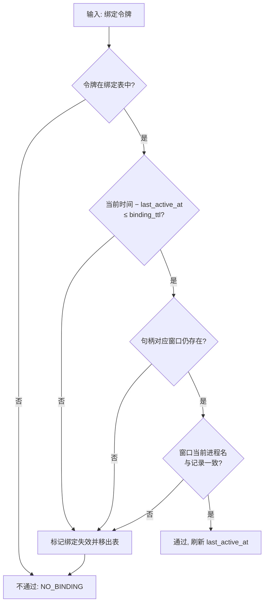

创建侧流程（标题解析、白名单判定、终端类升级）见功能设计说明书 §4.1，其中白名单与终端类判定由 enforcement 闸二、approval 协同完成。

### 6.8 接口

| 接口 | 调用方 | 说明 |
|------|--------|------|
| 创建 / 解绑 | tools_l1（attach/detach 工具） | 创建前须经强制层白名单与级别判定 |
| 校验 | enforcement（闸一） | 通过即刷新活跃时间 |
| 回收 | 内部时钟 | 周期执行 |

### 6.9 存储分配

绑定记录（内存表，不落盘）：

| 字段 | 类型 | 说明 | 约束 |
|------|------|------|------|
| token | 字符串 | 绑定令牌 | 随机、全局唯一 |
| hwnd | 整数 | 窗口句柄 | 创建时校验存在 |
| process_name | 字符串 | 进程名 | 小写归一化 |
| window_rect | 四元组整数 | 绑定时窗口矩形 | 供像素落点校验参考 |
| bound_at | 时间戳 | 创建时间 | — |
| last_active_at | 时间戳 | 最近通过校验时间 | 每次写操作通过即刷新 |

### 6.10 注释设计

- 校验函数逐分支注释校验项与 INV-1 对应关系；
- 令牌生成处注释随机强度要求；
- 回收线程处注释扫描周期来源（策略或默认值）。

### 6.11 限制条件

- 绑定表不落盘，进程退出即清空；
- 同名窗口歧义不得擅自选择，必须返回 AMBIGUOUS_TARGET。

### 6.12 测试计划

| 用例 | 预期 |
|------|------|
| 超时失效 | 超 binding_ttl 无操作后写请求 → NO_BINDING |
| 句柄失效 / 进程变更 | 同上，且绑定被移出表 |
| 同名窗口 | attach → AMBIGUOUS_TARGET 附窗口列表 |
| detach | 原令牌立即失效 |

### 6.13 尚未解决的问题

无。

---

## 7. 程序 approval（审批管理）设计说明

### 7.1 程序描述

负责操作指纹计算、审批令牌全生命周期（签发/校验/消费/过期）与审批通道对接（M3 弹窗；M1 阶段恒拒绝）。对应功能 F-CORE-03；直接落实 INV-3、INV-4。**核心约束：授权全程在服务内部流转（审批通道 → 强制层），不经 AI**。ISS-0003 起改为**同步阻塞审批**：闸四挂起调用并同步等待人类裁决（≤ approval_ttl）；批准即在服务内部签发授权记录、即验即销，并在**同一调用内**转执行层执行；拒绝/超时以明确错误码返回。AI 自发起后完全退出决策与执行环路，无重试路径。

### 7.2 功能

| 序号 | 功能 |
|------|------|
| 1 | 计算操作指纹（算法见 §7.6） |
| 2 | 受理强制层批准请求，对接审批通道，**同步等待人类裁决**（≤ approval_ttl） |
| 3 | 批准时在服务内部签发授权记录、即验即销；一次性、过期清理 |

### 7.3 性能

指纹计算与令牌校验 < 10 毫秒；同步等待人类裁决期间持有写锁（§2.4，ISS-0003 定案：串行即 fail-closed）。

### 7.4 输入项

| 输入 | 来源 | 说明 |
|------|------|------|
| 批准请求 | enforcement | 操作描述 + 操作指纹 + 目标实拍 |
| 人类审批动作 | 审批通道（M3） | 批准一次 / 拒绝 / 超时 |

### 7.5 输出项

| 输出 | 说明 |
|------|------|
| 裁决结论 | approve / deny / timeout，返回强制层（闸四据此执行或拒绝） |
| 授权记录（内部） | 批准时签发，仅存服务内部，同一调用内即验即销 |
| 拒绝结论 | 拒绝原因码 APPROVAL_DENIED；超时原因码 APPROVAL_TIMEOUT |

### 7.6 算法

**操作指纹计算**：

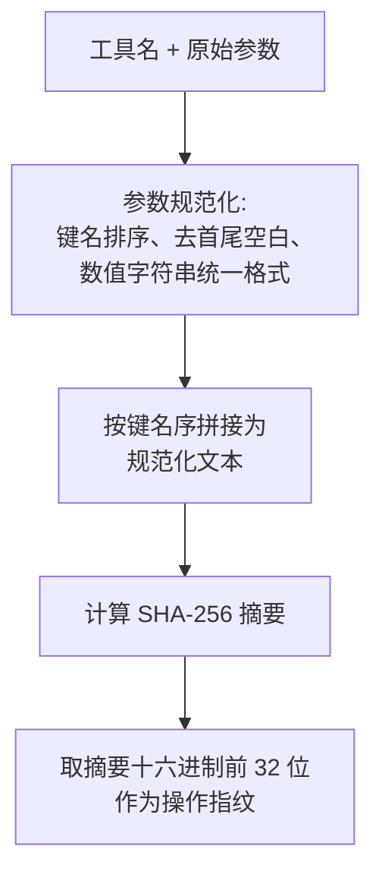

| 规则 | 说明 |
|------|------|
| 全覆盖 | 全部参数参与计算，一个字符不同即指纹不同 |
| 规范化前置 | 仅消除无意义差异（参数顺序、首尾空白），不消除语义差异 |
| 同一实现 | 签发侧与校验侧使用同一实现，禁止两份代码 |

### 7.7 流程逻辑

**令牌状态机**：

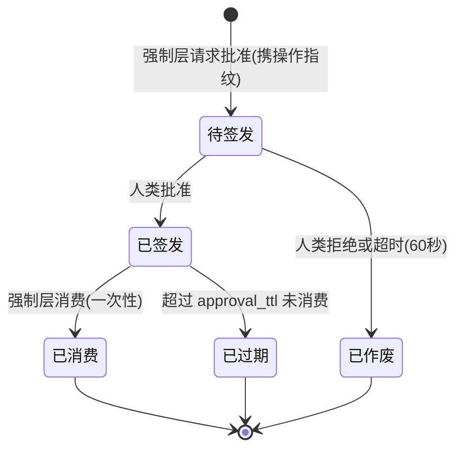

**校验与消费流程**（先校验全部条件，最后才标记消费——防止变形参数"烧掉"已批授权；同步模型下签发与消费在同一调用内闭环，查验不通过仅属内部防御，不对 AI 暴露重试语义）：

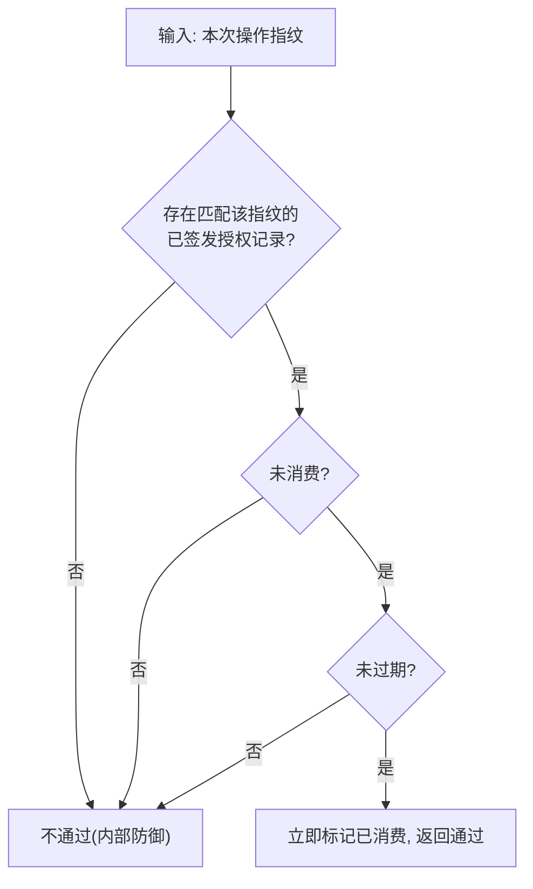

### 7.8 接口

| 接口 | 调用方 | 说明 |
|------|--------|------|
| 请求批准（同步） | enforcement | M1 恒拒绝（deny）；M3 接审批弹窗，阻塞至人类裁决或超时 |
| 校验并消费授权 | enforcement（闸四） | 按指纹查证；通过时一次性消费（同步模型下紧随签发） |
| 审批弹窗 | 人类操作员（M3） | 界面内容见功能设计说明书 §6.1 |

### 7.9 存储分配

审批令牌（仅内存，重启即失效）：

| 字段 | 类型 | 说明 | 约束 |
|------|------|------|------|
| token_id | 字符串 | 令牌标识 | 随机、全局唯一 |
| fingerprint | 字符串 | 操作指纹 | 签发时绑定 |
| issued_at | 时间戳 | 签发时间 | — |
| expires_at | 时间戳 | 失效时间 | issued_at + approval_ttl |
| consumed | 布尔 | 是否已消费 | 消费后不可复位 |

### 7.10 注释设计

- 指纹算法处注释"签发与校验同一实现"约束；
- 消费逻辑处注释 INV-4（一次性、时效、指纹绑定）与"先校验后消费"的顺序依据；
- 模块头部注释"令牌不经 AI"模型及理由（防自报授权）。

### 7.11 限制条件

- M1 阶段无弹窗，一切 L3 操作恒拒绝 APPROVAL_DENIED；
- 授权记录不落盘、不经 AI；签发权仅属本地审批通道的人类裁决，AI 通道无任何签发入口；
- 同步等待上限 = approval_ttl，超时即按 APPROVAL_TIMEOUT 拒绝，禁止无限挂起（ISS-0003）。

### 7.12 测试计划

| 用例 | 预期 |
|------|------|
| 指纹不一致 / 过期 / 重复消费 | 均不通过（INV-4） |
| 校验失败的请求 | 不消耗授权记录 |
| 批准即执行 | 模拟批准 → 同一调用内转执行层，执行参数与发起请求逐字段一致 |
| 拒绝 / 超时 | 分别返回 APPROVAL_DENIED / APPROVAL_TIMEOUT；执行层零调用 |
| M1 阶段 L3 请求 | 恒拒绝 APPROVAL_DENIED（INV-3） |

### 7.13 尚未解决的问题

无。（审批等待期写锁语义已定案：同步等待期间持有写锁，不插队，串行即 fail-closed——ISS-0003，§2.4。）

---

## 8. 程序 enforcement（强制层）设计说明

### 8.1 程序描述

写操作的唯一入口与安全核心：对每个写请求执行四道闸裁决，判定依据全部来自程序可验证的事实，AI 只被告知结果。对应功能 F-CORE-02；直接落实 INV-1、INV-2、INV-3。内部由受理器、闸检器组（一闸一部件）、级别判定器、结果组装器构成。

### 8.2 功能

| 序号 | 功能 |
|------|------|
| 1 | 受理写操作请求，检查冻结标志 |
| 2 | 计算有效级别（静态级别与动态升级取高） |
| 3 | 四道闸顺序裁决，短路拒绝 |
| 4 | 放行则转执行层并等待结果 |
| 5 | 组装裁决结果并触发审计（放行与被拒全覆盖） |

### 8.3 性能

四道闸裁决 ≤ 50 毫秒（功能设计说明书 §7 目标值）。

### 8.4 输入项

| 输入 | 来源 |
|------|------|
| 操作请求（工具名 + 参数 + 绑定令牌；审批令牌不经 AI，由闸四按操作指纹在内部查证） | tools_l2 / tools_l1 |
| 冻结标志 | estop |
| 策略视图 | policy |
| 绑定校验结论 | binding |
| 令牌校验结论 | approval |
| 焦点元素信息（仅场景受限键判定） | executor 只读面 |

### 8.5 输出项

裁决结果：

| 字段 | 说明 |
|------|------|
| allowed | 布尔，放行与否 |
| reason_code | 拒绝原因码（附录 A）；放行为空 |
| message | 面向 AI 的说明文本（含整改引导） |
| effective_level | 动态判定后的实际级别 |

### 8.6 算法

**按键规范化规则**（闸三前置）：修饰键按固定顺序排列（Ctrl、Alt、Shift、Win）；字母统一小写；别名按策略表归一（如 Return→Enter）；规范化后查表，未收录 → KEY_UNKNOWN（fail-closed）；许可表内但场景受限的按键（policy keys.input_scenario_keys，默认仅 Backspace）在非许可场景使用 → KEY_DENIED。

**输入场景判定**（场景受限键的前置判定）：经执行层只读感知面查询当前焦点元素，其 UIA 控件类型 ∈ policy keys.input_control_types（默认 Edit、Document）→ 输入场景；**判定失败或无法判定时一律按非许可场景处理（fail-closed）→ KEY_DENIED**。该探测仅在出现场景受限键时触发，不给主路径增加常态开销。

**有效级别计算**：有效级别 = max（工具静态级别，动态升级结果）。动态升级规则表：

| 规则 | 触发条件 | 结果 |
|------|----------|------|
| 终端窗口规则 | 绑定目标进程 ∈ terminal_apps | 该绑定下一切写操作升至 L3 |
| 白名单级别上限 | 工具级别 > 该进程白名单条目上限 | 不升级，直接拒绝 POLICY_VIOLATION |
| launch 非白名单 | launch_app 目标不在白名单 | 本次操作升至 L3 |

### 8.7 流程逻辑

四道闸裁决总流程：

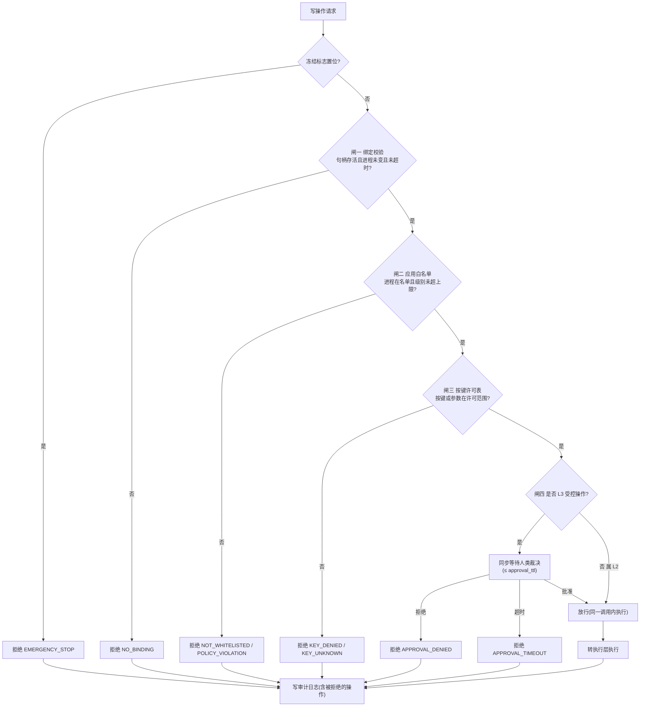

各闸判定数据表：

| 闸 | 判定依据来源 | 通过条件 | 拒绝码 |
|----|--------------|----------|--------|
| 一 绑定校验 | binding（§6.7） | 令牌存在 ∧ 未超时 ∧ 句柄存活 ∧ 进程一致 | NO_BINDING |
| 二 白名单 | policy.whitelist | 进程在名单 ∧ 有效级别 ≤ 条目上限 | NOT_WHITELISTED / POLICY_VIOLATION |
| 三 按键许可 | policy.keys（仅 key/type 类触发）；场景受限键加查焦点元素（§8.6 输入场景判定） | 规范化按键命中 L2 许可表；场景受限键还须处于输入场景 | KEY_DENIED / KEY_UNKNOWN |
| 四 L3 审批 | approval（§7.7） | 级别为 L2，或 L3 且人类在 approval_ttl 内批准 | APPROVAL_DENIED / APPROVAL_TIMEOUT |

**豁免规则**：launch_app 无目标窗口可绑定，豁免闸一；其闸二直接校验启动目标是否在白名单（不在则按 §8.6 动态升级规则升 L3）。其余写工具一律不豁免闸一。

### 8.8 接口

见 §2.3 模块调用关系表。要点：执行指令接口是执行层的唯一被调入口；闸三的焦点元素查询走执行层只读感知面，不改变系统状态。

### 8.9 存储分配

不持有持久数据；闸判定中间态随请求生命周期生灭。

### 8.10 注释设计

- 每道闸代码处注释闸编号与对应 INV（闸一 INV-1、闸二 INV-2、闸三/四 INV-3）；
- 短路分支处注释 fail-closed 依据；
- "批准后重过四道闸"处注释竞态依据（§2.4）；
- 输入场景判定处注释 fail-closed 默认（判定失败 = 非许可场景）。

### 8.11 限制条件

- 判定只采程序可验证事实（句柄活性、进程名、按键许可表、令牌指纹、焦点元素类型），不采信 AI 陈述（含任何自报标志位）；
- 判定顺序固定闸一→闸四，任一不过即短路；
- 放行与被拒都必须写审计（INV-6）。

### 8.12 测试计划

| 用例 | 预期 |
|------|------|
| 逐闸拒绝路径 | 原因码正确且短路（后续闸不执行） |
| 有效级别计算 | 静态/动态取高；白名单上限拒绝 |
| 批准后重过闸 | 前三闸按执行时刻现状重判 |
| 冻结中请求 | EMERGENCY_STOP |
| 输入场景判定 | 非输入场景 / 判定失败 → KEY_DENIED |

### 8.13 尚未解决的问题

无（审批让锁的插队语义见 approval 的 §7.13）。

---

## 9. 程序 executor（执行层）设计说明

### 9.1 程序描述

只执行、不判断：收到的是强制层已放行的指令。内部三子模块：uia（元素级）、pixel（像素级）、waiter（轮询等待）。同时为 tools_l0 与强制层闸三提供只读感知能力（元素树、焦点元素查询等）。

### 9.2 功能

| 子模块 | 承担工具 | 执行方式 |
|--------|----------|----------|
| uia | click_element、type_element、get_ui_tree、wait_for_element、get_clickable_map | 定位 → 唯一性校验 → Invoke/SetValue |
| pixel | click、type_text、key、move、scroll、drag、set_clipboard | 前置窗口 → 落点校验 → 模拟输入 |
| waiter | wait_for_window、wait_for_element | 轮询等待（算法见 §9.6） |

另有横切职责：写操作前后截图取证；向强制层提供焦点元素只读查询（供输入场景判定）。

### 9.3 性能

元素定位（普通窗口）< 1 秒；单张截图取证 < 1 秒；焦点元素查询 < 50 毫秒。

### 9.4 输入项

| 输入 | 说明 |
|------|------|
| 已放行指令 | 动作描述 + 目标 + 参数，来自强制层 |
| 冻结标志 | 动手前复查 |
| 感知请求 | tools_l0 的只读调用、强制层闸三的焦点元素查询 |

### 9.5 输出项

| 输出 | 说明 |
|------|------|
| 执行结果 | 成功确认或错误 |
| 前后截图路径 | 交审计层 |
| 执行期错误码 | ELEMENT_NOT_FOUND / ELEMENT_AMBIGUOUS / ELEMENT_DISABLED / ELEMENT_UNSUPPORTED / OUT_OF_BOUNDS / WINDOW_GONE / EMERGENCY_STOP |
| 只读查询结果 | 元素信息、焦点元素类型等 |

### 9.6 算法

**像素落点校验**（click / drag 前置）：

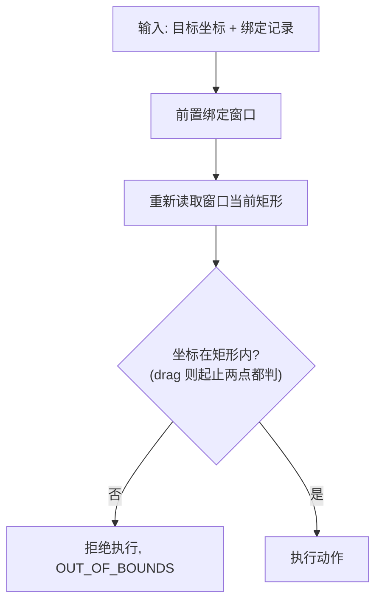

要点：矩形取执行时刻的当前值而非绑定记录值（窗口可能被人类移动过）；落点越界一律拒绝，不得"点出去再说"。

**等待轮询参数**：间隔取 policy.timeouts.wait_poll_interval（默认 500 毫秒）；超时上限取调用值与 wait_timeout_max（默认 300 秒）的较小者。

### 9.7 流程逻辑

执行通用步骤（写操作）：

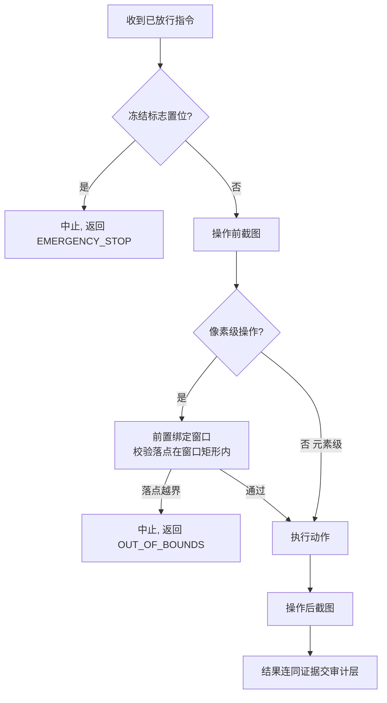

双检查原则：强制层转执行前查一次冻结标志，执行层动手前再查一次——急停可能落在两次检查之间。

### 9.8 接口

| 接口 | 调用方 | 说明 |
|------|--------|------|
| 执行指令 | enforcement（唯一） | 不暴露给 mcp_server / tools |
| 感知执行（只读面） | tools_l0、enforcement（闸三焦点查询） | 截图、OCR、UIA 读取、模板匹配、焦点元素查询 |

### 9.9 存储分配

SoM 映射缓存（内存，短期）：

| 字段 | 说明 |
|------|------|
| 编号 → 元素引用 | get_clickable_map 生成 |
| hwnd | 取图窗口的句柄；click_element 按编号操作时校验其与绑定句柄一致，不一致即拒绝 |
| 生成时间 / 窗口矩形快照 | 失效判定依据：超 60 秒或矩形变化即作废 |

### 9.10 注释设计

- 落点校验处注释"取执行时刻矩形"的理由；
- 中文输入路径注释 INV-5 禁令（见 tools_l2 §14.6 算法的落点）；
- 冻结双检查处注释竞态依据；
- SoM 缓存处注释句柄一致性校验的防重放依据。

### 9.11 限制条件

- 不做任何安全判断；不直接暴露给 MCP 层与工具集（只读面除外）；
- 元素级操作失败的候选列表不得省略（INV-7 的"显式"要求）。

### 9.12 测试计划

| 用例 | 预期 |
|------|------|
| 落点越界 | 拒绝执行，OUT_OF_BOUNDS |
| 元素歧义 / 不存在 | 返回候选列表 |
| 剪贴板还原 | 成功与失败路径均还原原内容 |
| 输入路径审查 | 行为测试 + 评审确认无预清空动作（INV-5） |
| 按编号点击跨窗口 | 缓存 hwnd ≠ 绑定 hwnd → 拒绝 |

### 9.13 尚未解决的问题

无。（SoM 缓存"窗口矩形变化即作废"的判定成本已经评审消化：判定为一次窗口矩形读取，开销可忽略。）

---

## 10. 程序 audit（审计层）设计说明

### 10.1 程序描述

负责审计记录的组装与同步落盘、截图证据管理、审计目录只读隔离。对应功能 F-CORE-04；直接落实 INV-6。

### 10.2 功能

| 序号 | 功能 |
|------|------|
| 1 | 写操作完整记录（裁决 + 执行结果 + 前后截图） |
| 2 | L0/L1 轻量记录（工具名、时间、结果，无截图） |
| 3 | 特殊事件记录（服务启停、急停触发/复位、策略加载结果） |
| 4 | 审计目录权限维护与人类侧只读查看支持 |

### 10.3 性能

单条记录同步落盘 < 100 毫秒（普通磁盘）；写失败立即上抛，不降级。

### 10.4 输入项

| 输入 | 来源 |
|------|------|
| 审计记录 | enforcement（裁决）、executor（结果与截图路径） |
| 事件记录 | estop、main、policy（加载结果） |

### 10.5 输出项

| 输出 | 说明 |
|------|------|
| 落盘确认 / AUDIT_FAILURE | 写失败则本次操作视为失败 |
| 审计目录内容 | JSONL 日志 + 截图证据 |

### 10.6 算法

| 项 | 规则 |
|----|------|
| 参数摘要 | params_digest 供展示与快速检索，超长截断（200 字符） |
| 文本全文 | type_text、set_clipboard 的输入文本**全文**记入 params_full（长度以 policy limits.input_max_chars 为上界），供事后追查；摘要截断不影响全文留存 |
| 截图命名 | 时间戳_序号_工具名_前或后.png |
| 日志滚动 | 按日期滚动，文件名含日期 |

### 10.7 流程逻辑

写序规则：组装记录 → 同步落盘 → 确认后放行结果返回；落盘失败 → 本次操作按失败处理，并尝试补记一条 AUDIT_FAILURE 事件。审计不可缺失，禁止"跳过审计继续"。

### 10.8 接口

| 接口 | 调用方 | 说明 |
|------|--------|------|
| 记录 | enforcement / executor / estop / main | 同步语义 |
| 只读查看 | 人类操作员 | 无修改/删除入口。AI 侧只读隔离分两级：**基线=协议级**（工具清单不含任何文件/审计读写入口，M1 强制，INV-6 的最低语义）；**加固=OS 级目录 ACL**（服务以独立账户部署，可选，属部署层） |

### 10.9 存储分配

审计记录（JSONL，每行一条）：

| 字段 | 类型 | 说明 |
|------|------|------|
| seq | 整数 | 单调递增序号 |
| timestamp | 字符串 | 操作时间（含时区） |
| tool | 字符串 | 工具名 |
| params_digest | 字符串 | 参数摘要（截断 200 字符，展示用） |
| params_full | 字符串 | 输入文本全文（仅 type_text / set_clipboard；其余工具为空） |
| level | 枚举 | 实际判定级别 L0/L1/L2/L3 |
| decision | 枚举 | 放行 / 拒绝 |
| reason_code | 字符串 | 拒绝原因码；放行为空 |
| result | 字符串 | 结果摘要或错误信息 |
| duration_ms | 整数 | 受理到完成耗时 |
| before_shot / after_shot | 字符串 | 前后截图相对路径（无则空） |
| binding_token | 字符串 | 本次绑定令牌（无绑定为空） |

目录布局：audit/logs/（按日期滚动的 JSONL）；audit/shots/按日期分目录/（截图证据）。

### 10.10 注释设计

- 写序逻辑处注释"审计缺失则操作失败"的依据（INV-6）；
- 目录权限设置处注释只读隔离的两级语义（协议级基线 / OS 级加固）；
- params_full 处注释"明文留存是可追责的设计选择"及部署注意事项。

### 10.11 限制条件

- 只追加，禁止修改与删除；
- 写失败不降级为"跳过审计"；
- 截图证据与日志记录同生命周期，不得单独清理；
- 审计记录含输入明文（params_full）是**可追责的设计选择**；部署侧须控制审计目录的访问范围；脱敏开关列为后续增强（见测试设计说明书附录 B）。

### 10.12 测试计划

| 用例 | 预期 |
|------|------|
| 放行与被拒操作 | 均有完整记录（INV-6） |
| 磁盘写失败注入 | 操作视为失败，返回 AUDIT_FAILURE |
| 协议级只读 | 工具清单无任何文件/审计读写入口（M1 基线） |
| OS 级隔离（可选加固） | 独立账户部署时，AI 账户写审计目录被 OS 拒绝 |
| 事件记录 | 启停、急停、策略加载结果齐全 |

### 10.13 尚未解决的问题

无。（只读隔离分级已定：协议级为 M1 强制基线，OS 级为可选加固，见 §10.8。）

---

## 11. 程序 estop（急停）设计说明

### 11.1 程序描述

独立线程监听全局热键与鼠标甩角，管理冻结标志的置位与复位。对应功能 F-CORE-05；直接落实 INV-10（fail-safe 兜底）。

### 11.2 功能

| 序号 | 功能 |
|------|------|
| 1 | 热键监听（Ctrl+Shift+F12） |
| 2 | 鼠标甩角监听（甩至屏幕左上角） |
| 3 | 触发后置位冻结标志、写审计、通知人类 |
| 4 | 本地人类复位控制：**复位热键 Ctrl+Shift+F11 或本地 CLI 复位命令（`--reset`，经本机 HTTP 端点 POST /estop/reset）** |
| 5 | 热键持有归属：常驻 daemon 独占注册；stdio 瘦代理探测到 daemon 在线则不注册热键、不启动甩角轮询（ISS-0002） |
| 6 | 热键注册失败按退避重试，逐次审计 + stderr 告警，禁止静默放弃（ISS-0002） |
| 7 | 冻结人类通知：置位时弹出冻结提示弹窗（立即解冻 / 稍后提醒 180s，滑入滑出）；任何来源复位后弹窗自动滑出消失（ISS-0004） |

### 11.3 性能

触发到冻结标志置位 < 100 毫秒；鼠标位置轮询间隔 ≤ 50 毫秒。

### 11.4 输入项

| 输入 | 来源 |
|------|------|
| 热键事件 | 操作系统 |
| 鼠标位置流 | 周期轮询 |
| 复位动作 | 复位热键 Ctrl+Shift+F11 / 本地 CLI `--reset`（经 POST /estop/reset） |

### 11.5 输出项

| 输出 | 说明 |
|------|------|
| 冻结标志 | 原子变量，供 enforcement / executor 读 |
| 急停/复位审计事件 | 交 audit |
| 人类通知 | 声音或弹窗（M3 前可为日志） |

### 11.6 算法

甩角防抖判定：光标进入左上角触发区域且持续停留 ≥ policy estop.corner_hold_ms（默认 200 毫秒）才判定触发——避免路过误触。

复位判定：仅两种来源——复位热键 Ctrl+Shift+F11、本地 CLI 复位命令（`--reset` 经 POST /estop/reset 触达持有冻结标志的进程）；二者均只在本地人类通道可达。复位动作写审计；复位不清空绑定表（已失效绑定仍失效）。

热键持有归属（ISS-0002）：RegisterHotKey 全系统单持有者。`--daemon` 形态必须持有热键；stdio 形态先探活 daemon（沿用 ISS-0001 探测逻辑），在线则跳过热键注册与甩角轮询（冻结标志归 daemon 所有，代理注册无意义且会抢占复位通道），审计记"瘦代理跳过热键注册"；daemon 离线回退本地直跑时照常注册（单进程形态复位能力不退化）。

注册失败重试：注册失败不得静默 return——按 1 秒起步、倍增至 60 秒上限的退避循环重试；每次失败写审计"急停热键注册失败"并向 stderr 打印告警；成功后记审计"急停热键注册"。

复位审计：复位请求无论是否改变状态均写审计——冻结态复位记"急停复位"；未冻结时的复位请求记"复位请求-未冻结"（detail 含来源），保证热键按没按、送到了谁永远可查（ISS-0002）。

**冻结通知机制（ISS-0004）**：

文件邮箱双向同步（弹窗为独立子进程，不引入新网络依赖，常驻/本地形态统一）：

- **状态文件 `<audit_dir>/estop-state.json`**：owner（estop 持有进程）在每次置位/复位时原子重写（临时文件 + rename），内容 `{"frozen": bool, "seq": n, "source": str, "ts": ...}`；seq 单调递增。owner 启动装配时先写一次 `frozen:false` 清残留。
- **解冻请求 `<audit_dir>/estop-reset.req`**：弹窗"立即解冻"写入 `{"seq": <其响应的状态 seq>}`；owner 由甩角轮询线程 50ms tick 兼任检查，消费条件为 `req.seq == 当前 state.seq 且当前 frozen=true`，满足则复位（来源"冻结提示弹窗"）并删除请求文件；陈旧或不满足条件的请求丢弃删除——防止旧弹窗误解冻新一轮冻结。
- **单例守卫 `<audit_dir>/estop-dialog.lock`**：弹窗进程写入 pid 并每秒刷新心跳；owner 置位时心跳龄 < 3s 则不重复 spawn。
- 弹窗进程状态机：SLIDE_IN(240ms) → SHOWN（250ms 轮询状态文件）→ [立即解冻：写 req，继续轮询] / [稍后提醒：SLIDE_OUT → SNOOZED（隐藏不退出，deadline = now + freeze_remind_interval，默认 180s，到点仍冻结重新 SLIDE_IN）]；任何来源复位使 frozen=false → SLIDE_OUT(240ms) → 退出。动画对称：同一缓动参数表，滑入滑出方向相反、时长一致（240ms，ease-out 三次方，约 60fps 由 `root.after(16)` 驱动）；落位主屏右下角（右边距 16px、下边距 48px 避开任务栏），`overrideredirect` + 置顶、不抢输入焦点。
- 弹窗内容：冻结事实（写操作全拒 EMERGENCY_STOP、L0 只读不受影响）、触发来源与时间、按钮 [立即解冻] [稍后提醒（180s）]、热键提示行（Ctrl+Shift+F11 直接解冻、本窗口自动消失）。"立即解冻"点击即时反馈：按钮置灰并显示"解冻请求已发送…"；下一拍（250ms）仍冻结说明请求未被消费，按钮自动恢复可重试——点没点中一眼可辨。
- 进程形态：onefile 经打包入口 `--freeze-notify <audit_dir>` 分发（与 --approval-dialog 同构，剥离 _MEIPASS2）；源码形态 `python -m deskpilot.freeze_dialog`。
- 装配：EstopMonitor 增 `on_state_change(frozen, source)` 回调；main 装配 FreezeNotifier（写状态文件 + 单例 spawn + 复位请求消费）。

### 11.7 流程逻辑

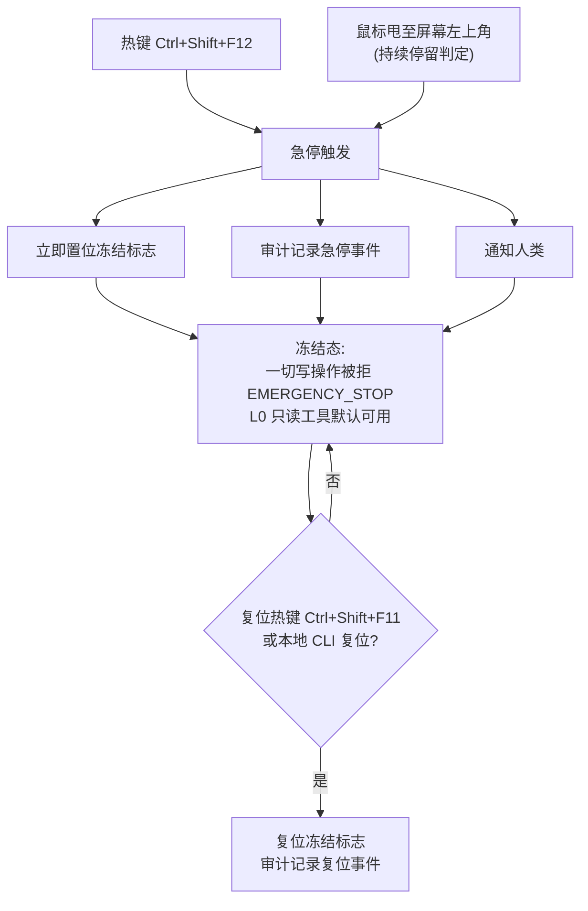

### 11.8 接口

| 接口 | 方向 | 说明 |
|------|------|------|
| 冻结查询 | enforcement / executor 读 | 写路径双检查（§9.7） |
| 复位 | 复位热键 / 本地 CLI | 均仅本地人类通道可达；AI 通道无复位入口 |
| POST /estop/reset | httpd → estop | 本机 HTTP 复位端点（仅 127.0.0.1，无参数）；调用 estop 复位，无论是否改变状态均返回 200 + `{"was_frozen": bool, "frozen": false}` 并记审计（ISS-0002） |
| 冻结状态/解冻请求文件 | FreezeNotifier ↔ 冻结提示弹窗 | `<audit_dir>/estop-state.json`（owner 写，弹窗轮询）与 `estop-reset.req`（弹窗写，owner 50ms tick 消费），协议见 §11.6（ISS-0004） |

### 11.9 存储分配

冻结标志（内存原子变量）；冻结通知文件邮箱（ISS-0004）：`<audit_dir>/estop-state.json`（状态）、`estop-reset.req`（解冻请求，消费即删）、`estop-dialog.lock`（弹窗单例心跳）。无其他存储。

### 11.10 注释设计

- 防抖参数处注释误触防护依据与策略键名（estop.corner_hold_ms）；
- 冻结语义处注释 INV-10；
- 复位热键处注释"该组合键永不进入任何按键许可表"的防自我复位依据；
- "复位不清绑定表"处注释依据（已失效绑定仍失效）。

### 11.11 限制条件

- estop 不调用任何业务模块，只写冻结标志与审计事件；
- 复位权仅属本地人类通道；
- **复位组合键（Ctrl+Shift+F11）永不进入任何按键许可表**——AI 经 key 工具发送即被闸三 fail-closed 拒绝（KEY_UNKNOWN），无法自我复位；
- CLI 复位供人类在本地终端使用；**持有 shell 的 AI 属威胁模型之外**（本设计防 AI 犯错、不防 AI 作恶，见总体设计 §0 威胁模型）；
- 复位不清空绑定表；
- 冻结期 L0 感知工具默认可用（policy estop.l0_during_freeze，默认 true），便于排查现场；
- stdio 瘦代理（daemon 在线）禁止注册急停/复位热键与甩角轮询——复位通道必须对准冻结标志持有者（ISS-0002）；
- 热键注册失败禁止静默 return：退避重试 + 逐次审计 + stderr 告警（ISS-0002）；
- 复位 no-op（未冻结时的复位请求）也写审计"复位请求-未冻结"，禁止无痕（ISS-0002）；
- 冻结提示弹窗是**通知层**而非安全闸：弹窗崩溃/被杀不影响冻结语义；复位权仍仅属本地人类通道既有路径；状态/请求文件只承载布尔与序号，不接受任何指令参数（ISS-0004）；
- 弹窗不抢输入焦点、置顶显示；多显示器只弹主屏（M3 前接受）（ISS-0004）。

### 11.12 测试计划

| 用例 | 预期 |
|------|------|
| 热键触发 | 在途写请求返回 EMERGENCY_STOP（INV-10） |
| 甩角防抖 | 路过不停留不触发 |
| 冻结期写操作 | 全部拒绝；L0 工具默认仍可用 |
| 复位热键复位 | 冻结态按 Ctrl+Shift+F11 后写操作恢复；审计含触发与复位两条事件 |
| AI 发送复位组合键 | key 工具发送 Ctrl+Shift+F11 → KEY_UNKNOWN，冻结状态不变 |
| 瘦代理跳过热键注册 | daemon 在线时 stdio 形态不注册热键、不起甩角线程；审计含"瘦代理跳过热键注册"（ISS-0002） |
| 注册失败重试告警 | 注册失败按退避重试、逐次审计、stderr 告警，不静默 return（ISS-0002） |
| HTTP 复位端点 | POST /estop/reset 复位成功并记"急停复位"；未冻结时返回 was_frozen=false 并记"复位请求-未冻结"（ISS-0002） |
| CLI --reset | daemon 在线经 HTTP 复位退出码 0；离线显式报错、退出码非 0（ISS-0002） |
| 复位 no-op 审计 | 未冻结时复位请求状态不变，审计记"复位请求-未冻结"（ISS-0002） |
| 冻结弹窗状态文件 | 置位/复位时 estop-state.json 原子翻转且 seq 递增、source 正确（ISS-0004） |
| 解冻请求守卫 | req.seq 匹配且冻结 → 复位并删文件；陈旧 seq / 未冻结 → 丢弃不执行（ISS-0004） |
| 弹窗单例 | lock 心跳存活时二次置位不重复 spawn；心跳陈旧允许 spawn（ISS-0004） |
| 稍后提醒 | 测试时钟：179s 不重弹，180s 且仍冻结重弹；期间复位不重弹（ISS-0004） |
| 热键复位弹窗收尾 | 状态文件翻转为未冻结 → 弹窗滑出并退出（ISS-0004） |
| 滑入滑出对称 | 同一参数表驱动，位移序列互为反向，时长一致（ISS-0004） |

### 11.13 尚未解决的问题

无。（冻结期 L0 可用已定案并写入 policy：estop.l0_during_freeze 默认 true，见 §11.11。）

---

## 12. 程序 tools_l0（感知类工具集）设计说明

### 12.1 程序描述

8 个 L0 只读工具的实现：screenshot、ocr、find_window、get_ui_tree、get_clickable_map、template_match、get_cursor、get_clipboard。不改变任何系统状态，无条件放行，不经强制层裁决，但写审计轻量记录。

### 12.2 功能

| 工具 | 功能 | 功能编号 |
|------|------|----------|
| screenshot | 全屏/区域/窗口截图 | F-L0-01 |
| ocr | 截图文字识别（文字+位置） | F-L0-02 |
| find_window | 窗口枚举与过滤 | F-L0-03 |
| get_ui_tree | UIA 元素树（可交互优先） | F-L0-04 |
| get_clickable_map | SoM 编号标注（M3） | F-L0-05 |
| template_match | 模板匹配定位 | F-L0-06 |
| get_cursor | 鼠标位置 | F-L0-07 |
| get_clipboard | 读剪贴板 | F-L0-08 |

### 12.3 性能

截图、UIA 元素树获取 ≤ 1 秒（功能设计说明书 §7 目标值）。

### 12.4 输入项

| 工具 | 参数（✱必填） | 说明 |
|------|--------------|------|
| screenshot | 范围类型✱；区域坐标或窗口标识（按类型必填） | 全屏/区域/窗口 |
| ocr | 图像来源✱ | 区域或截图引用 |
| find_window | 标题关键字、进程名（至少其一） | 过滤条件 |
| get_ui_tree | 窗口标识✱ | — |
| get_clickable_map | 窗口标识✱ | M3；只读操作，无需绑定 |
| template_match | 模板图像✱、搜索范围✱、置信度阈值（默认 0.8） | — |
| get_cursor / get_clipboard | 无 | — |

### 12.5 输出项

| 工具 | 返回 | 错误码 |
|------|------|--------|
| screenshot | 图像数据、宽高、时间戳 | WINDOW_GONE、INVALID_PARAMS |
| ocr | 文字条目列表（内容+位置） | INVALID_PARAMS（区域过小，附放大建议） |
| find_window | 窗口信息列表（句柄/标题/进程/矩形/可见性） | — |
| get_ui_tree | 元素信息树（名称/控件类型/自动化标识/矩形/可交互性/子元素） | WINDOW_GONE |
| get_clickable_map | 标注图 + 编号对照表（无元素返回空图，不报错） | WINDOW_GONE |
| template_match | 匹配位置列表（位置+置信度；未达阈值如实返回最高置信度） | INVALID_PARAMS |
| get_cursor | 当前坐标 | — |
| get_clipboard | 剪贴板文本 | — |

### 12.6 算法

**SoM 标注生成**（get_clickable_map，M3）：

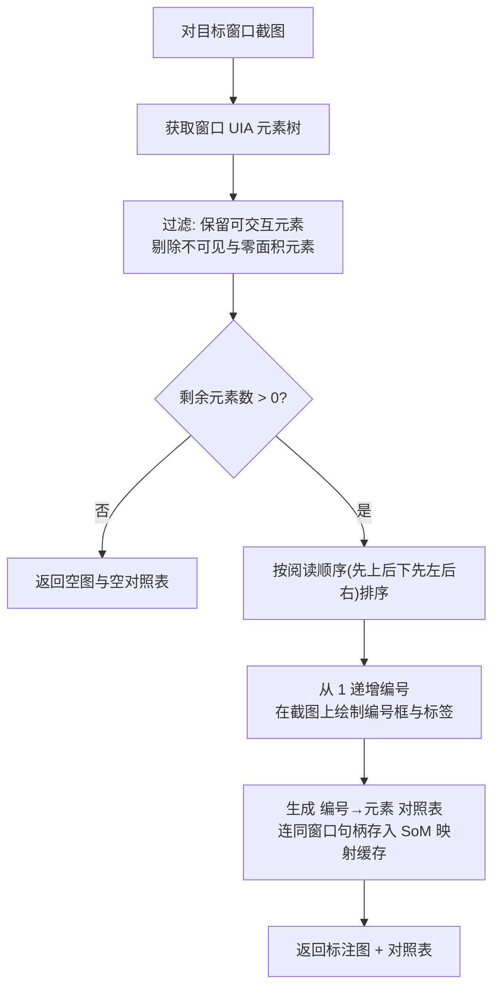

| 规则 | 说明 |
|------|------|
| 映射缓存时效 | 默认 60 秒；超时或窗口矩形变化即作废（缓存结构见 §9.9） |
| 按编号操作 | click_element 接受编号定位时，先查缓存（编号有效 ∧ 缓存 hwnd 与本次绑定句柄一致），再做可交互性复查；任一不过即拒绝并引导重新取图 |
| 遮挡处理 | 标注框重叠时编号标签做避让偏移，保证每个编号可读 |

### 12.7 流程逻辑

无复杂流程：各工具为"受理 → 感知执行（executor 只读面）→ 写轻量审计 → 返回"。

### 12.8 接口

| 接口 | 方向 |
|------|------|
| 8 个工具端点 | 被 mcp_server 分发调用 |
| 感知执行（只读面） | 调用 executor |
| 轻量记录 | 调用 audit |

### 12.9 存储分配

无持久存储；SoM 映射缓存由 executor 持有（§9.9）。

### 12.10 注释设计

每个工具入口注释其失败语义与 INV-7 对应关系（禁止静默成功）。

### 12.11 限制条件

- 不得改变任何系统状态（含剪贴板）；
- get_clickable_map 的编号仅在缓存有效期内、且缓存句柄与操作绑定一致时有效。

### 12.12 测试计划

| 用例 | 预期 |
|------|------|
| 真实桌面直测 | 无副作用（功能设计说明书 §6 测试策略） |
| 窗口消失后调用 | 显式报错 WINDOW_GONE（INV-7） |
| 模板无匹配 | 如实返回置信度，不伪造命中 |

### 12.13 尚未解决的问题

get_cursor、get_clipboard 可能泄露非目标窗口信息，是否需要脱敏规则，待评审。

---

## 13. 程序 tools_l1（控制类工具集）设计说明

### 13.1 程序描述

5 个 L1 工具的实现：wait_for_window、wait_for_element、move、scroll、attach/detach。低风险，无条件放行（scroll 需绑定）；attach/detach 的裁决由 enforcement 与 binding 协同完成。

### 13.2 功能

| 工具 | 功能 | 功能编号 |
|------|------|----------|
| wait_for_window | 等窗口出现，显式超时 | F-L1-01 |
| wait_for_element | 等 UIA 元素出现，显式超时 | F-L1-02 |
| move | 移动鼠标 | F-L1-03 |
| scroll | 滚轮（需绑定） | F-L1-04 |
| attach / detach | 建立/解除绑定 | F-L1-05 |

### 13.3 性能

等待类首次探测零延迟；move/scroll 即时生效；attach 全链路 < 1 秒。

### 13.4 输入项

| 工具 | 参数（✱必填） |
|------|--------------|
| wait_for_window | 目标条件✱（标题或进程）、超时时长（默认 10 秒，上限 300 秒） |
| wait_for_element | 绑定令牌✱、元素条件✱（名称或自动化标识）、超时时长 |
| move | 目标坐标✱ |
| scroll | 绑定令牌✱、方向✱、幅度✱ |
| attach | 目标（标题/句柄/进程名，其一✱） |
| detach | 绑定令牌✱ |

### 13.5 输出项

| 工具 | 返回 | 错误码 |
|------|------|--------|
| wait_for_window | 窗口信息、实际等待耗时 | TIMEOUT（附最后探测状态） |
| wait_for_element | 元素信息 | NO_BINDING、TIMEOUT |
| move | 完成确认 | INVALID_PARAMS |
| scroll | 完成确认 | NO_BINDING |
| attach | 绑定令牌、绑定记录摘要 | TARGET_NOT_FOUND、NOT_WHITELISTED、APPROVAL_DENIED / APPROVAL_TIMEOUT（终端类）、AMBIGUOUS_TARGET |
| detach | 完成确认 | NO_BINDING |

### 13.6 算法

**等待轮询**（wait_for_window / wait_for_element 共用，执行依托 executor 的 waiter 子模块）：

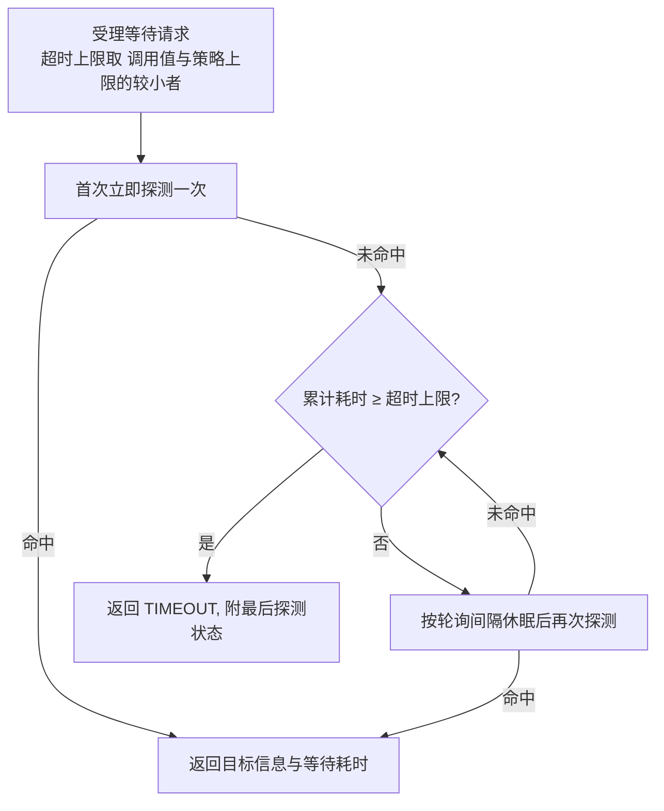

要点：首次探测不等待（目标已存在时零延迟返回）；超时返回必须附最后探测状态；禁止 sleep 盲等。

### 13.7 流程逻辑

attach 流程见功能设计说明书 §4.1（标题解析 → 终端类判定 → 白名单判定 → 创建绑定）；其中白名单/终端类判定由 enforcement 执行，绑定创建由 binding 执行。

### 13.8 接口

| 接口 | 方向 |
|------|------|
| 5 个工具端点 | 被 mcp_server 分发调用 |
| 绑定创建/解绑 | 调用 binding（经 enforcement 判定） |
| 等待执行 | 调用 executor 的 waiter |

### 13.9 存储分配

无（绑定记录由 binding 持有，§6.9）。

### 13.10 注释设计

- 等待类工具注释"禁止盲等"与参数来源（策略键名）；
- attach 注释终端类升级规则出处（策略 terminal_apps）。

### 13.11 限制条件

- scroll 与 wait_for_element 必须携带有效绑定；
- attach 对同名窗口不得擅自选择（交 binding 返回歧义）。

### 13.12 测试计划

| 用例 | 预期 |
|------|------|
| 目标晚于调用出现 | 命中返回且耗时符合预期 |
| 超时路径 | TIMEOUT + 最后探测状态 |
| 非白名单 attach | NOT_WHITELISTED + 申请说明（INV-2） |

### 13.13 尚未解决的问题

无。

---

## 14. 程序 tools_l2（写入类工具集）设计说明

### 14.1 程序描述

9 个写入类工具的实现：launch_app、activate_window、click_element、type_element、click、type_text、key、set_clipboard、drag。全部必经强制层四道闸；key 与 launch_app 存在 L3 升级路径。**审批令牌不经 AI**：L3 操作被人类批准后，AI 以完全相同参数原样重试即放行。

### 14.2 功能

| 工具 | 功能 | 功能编号 | 级别 |
|------|------|----------|------|
| launch_app | 启动白名单内应用 | F-L2-01 | L2/L3 |
| activate_window | 绑定窗口前置 | F-L2-02 | L2 |
| click_element | 元素点击（首选，无坐标） | F-L2-03 | L2 |
| type_element | 元素设值输入 | F-L2-04 | L2 |
| click | 像素点击（兜底） | F-L2-05 | L2 |
| type_text | 文本输入（含中文剪贴板方案） | F-L2-06 | L2 |
| key | 按键 | F-L2-07 | L2/L3 |
| set_clipboard | 写剪贴板 | F-L2-08 | L2 |
| drag | 拖拽 | F-L2-09 | L2 |

### 14.3 性能

单工具全链路（含四道闸 ≤ 50 毫秒与执行）目标 < 2 秒；type_text 中文路径含读回校验，目标 < 3 秒。

### 14.4 输入项

| 工具 | 参数（✱必填） |
|------|--------------|
| launch_app | 应用标识✱（白名单路径或系统注册名） |
| activate_window | 绑定令牌✱ |
| click_element | 绑定令牌✱、定位条件✱（名称/自动化标识/SoM 编号三选一） |
| type_element | 绑定令牌✱、定位条件✱、文本✱（≤ input_max_chars） |
| type_text | 绑定令牌✱、文本✱（≤ input_max_chars） |
| click | 绑定令牌✱、坐标✱ |
| key | 绑定令牌✱、按键✱（L3 键须经人工批准，批准后原样重试即可） |
| set_clipboard | 绑定令牌✱、文本✱（≤ input_max_chars） |
| drag | 绑定令牌✱、起点✱、终点✱ |

### 14.5 输出项

| 工具 | 返回 | 错误码 |
|------|------|--------|
| launch_app | 进程信息 | NOT_WHITELISTED、APPROVAL_DENIED / APPROVAL_TIMEOUT |
| activate_window | 完成确认 | NO_BINDING |
| click_element | 完成确认、被点元素摘要 | NO_BINDING、ELEMENT_NOT_FOUND（附候选）、ELEMENT_AMBIGUOUS（附候选）、ELEMENT_DISABLED |
| type_element | 完成确认 | 同 click_element + ELEMENT_UNSUPPORTED |
| click | 完成确认 | NO_BINDING、OUT_OF_BOUNDS |
| type_text | 完成确认 | NO_BINDING、INVALID_PARAMS（超长度上限） |
| key | 完成确认 | NO_BINDING、KEY_DENIED、KEY_UNKNOWN、APPROVAL_DENIED、APPROVAL_TIMEOUT |
| set_clipboard | 完成确认 | NO_BINDING、INVALID_PARAMS（超长度上限） |
| drag | 完成确认 | NO_BINDING、OUT_OF_BOUNDS |

各工具另有共有拒绝码：EMERGENCY_STOP（冻结中）、AUDIT_FAILURE（审计失败）、POLICY_VIOLATION（超白名单级别上限）。

### 14.6 算法

**中文输入（剪贴板桥，type_text 非 ASCII 分支）**：

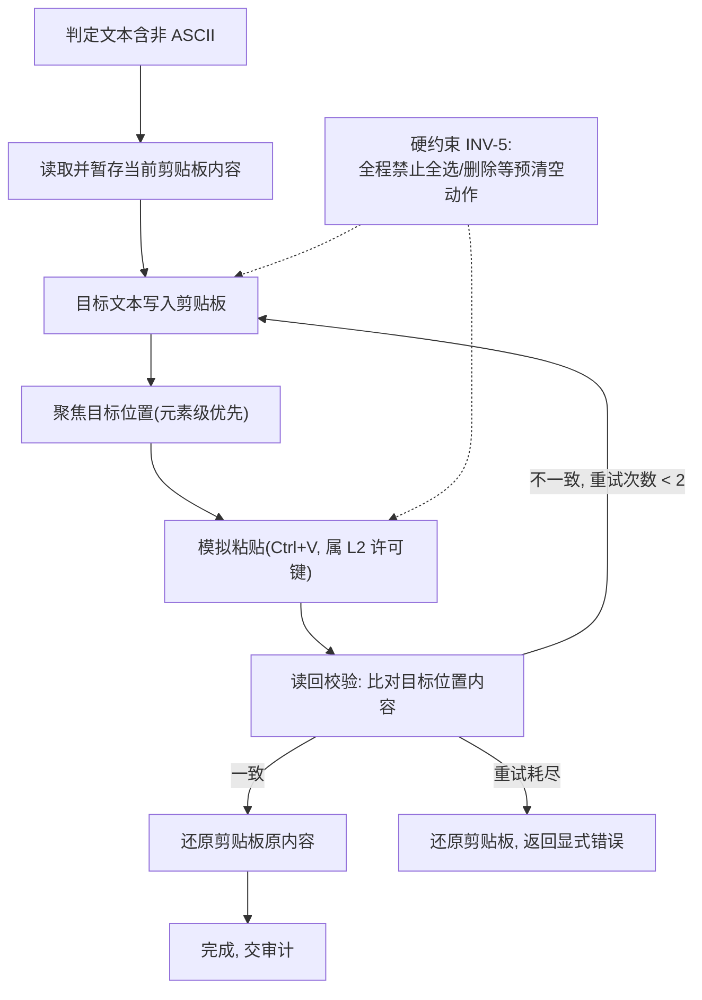

| 规则 | 说明 |
|------|------|
| 剪贴板还原 | 无论成功失败都必须还原（finally 语义） |
| 校验与重试 | 粘贴后读回比对，不一致重试，最多 2 次 |
| 禁止项 | 任何"先清空再输入"的按键序列不得出现（INV-5，评审逐条核） |

### 14.7 流程逻辑

**click_element 处理流程**（type_element 同理，仅动作换为设值）：

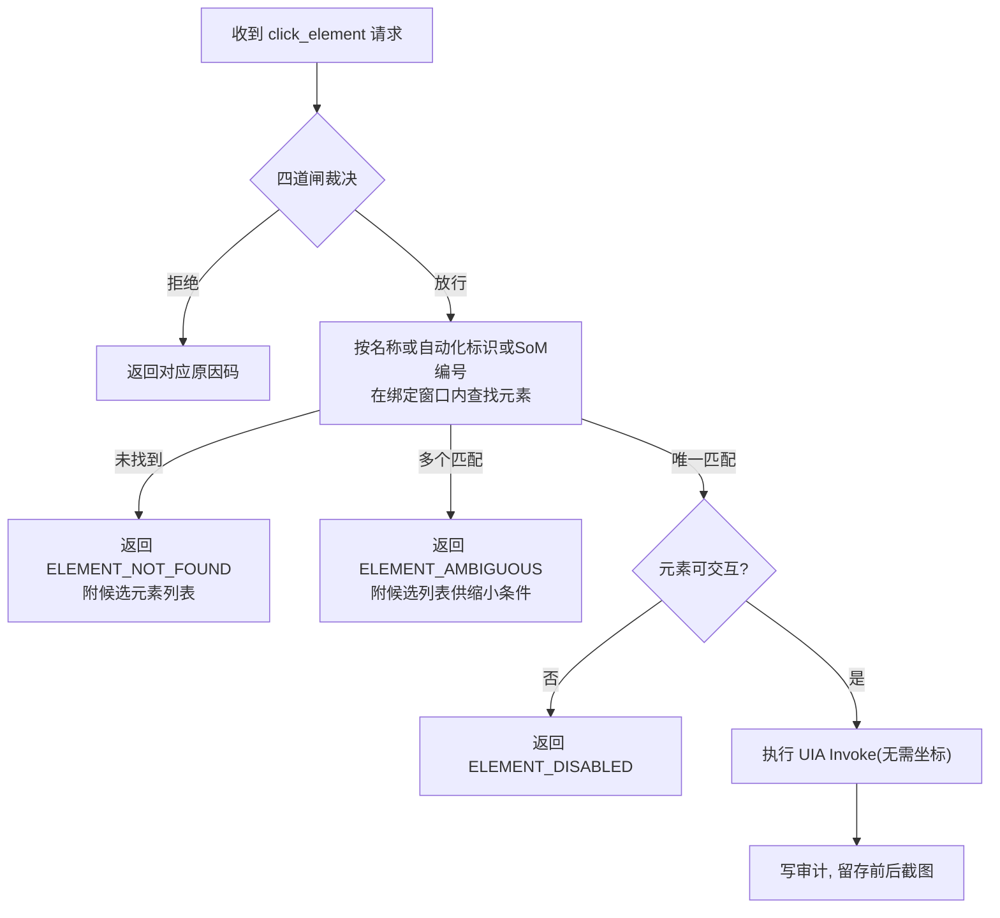

### 14.8 接口

| 接口 | 方向 |
|------|------|
| 9 个工具端点 | 被 mcp_server 分发调用 |
| 提交裁决 | 调用 enforcement（必经） |
| 感知辅助 | 调用 executor 只读面（如定位前的元素枚举） |

### 14.9 存储分配

无（绑定记录、令牌、审计分属 binding、approval、audit）。

### 14.10 注释设计

- type_text 输入路径注释 INV-5 禁令与评审要求；
- key 工具注释按键规范化与查表的去向（enforcement 闸三）；
- click 注释"兜底定位，仅 UIA 失效时使用"的设计意图。

### 14.11 限制条件

- 一切写操作必经 enforcement，禁止工具内直连执行层；
- type_element 不支持设值的元素必须显式报错并引导改用 type_text；
- key 的 L3 键须经人工批准；AI 重试仅携带原参数，审批令牌由审批通道直送强制层、全程不经 AI，且只消费一次；
- type_text / type_element / set_clipboard 的文本长度不得超过 policy limits.input_max_chars（默认 65536），超限 INVALID_PARAMS。

### 14.12 测试计划

| 用例 | 预期 |
|------|------|
| L2 工具对测试专用窗口（DESKPILOT_TEST_ 标记记事本） | 功能正确，绝不碰已有窗口 |
| 中英文混合输入 | 原样进入目标窗口，剪贴板还原 |
| 危险键被拒绝 / 经批准 | 拒绝 APPROVAL_DENIED（超时 APPROVAL_TIMEOUT）/ 同一调用内放行执行一次 |
| 文本超长度上限 | INVALID_PARAMS；恰在上限放行 |
| 端到端（M1 验收） | 打开测试记事本→输入中英文→读剪贴板校验→关闭不保存 |

### 14.13 尚未解决的问题

无。

---

## 附录 A 错误码一览

| 原因码 | 产生方 | 含义 | 给 AI 的引导 |
|--------|--------|------|--------------|
| INVALID_PARAMS | mcp_server | 参数缺失、类型错误或超长度上限 | 按工具契约修正参数 |
| NO_BINDING | 闸一 / binding | 无有效绑定 | 先 attach；原绑定可能已超时或窗口已关 |
| NOT_WHITELISTED | 闸二 / attach | 进程不在白名单 | 附"如何申请加入白名单"说明（INV-2） |
| POLICY_VIOLATION | 闸二 | 操作级别超白名单条目上限 | 换更低级别工具或申请策略调整 |
| KEY_DENIED | 闸三 | 场景受限键（如 Backspace 限输入场景）在非许可场景使用，或场景判定失败（fail-closed） | 将焦点置于文本编辑控件后重试，或改用许可键 |
| KEY_UNKNOWN | 闸三 | 按键未收录（fail-closed） | 该键不可用，换许可表内按键 |
| APPROVAL_DENIED | 闸四 / attach / approval | L3 操作被人类拒绝（或 M1 无弹窗恒拒） | 该操作未获批准，不得换参数重试绕过 |
| APPROVAL_TIMEOUT | 闸四 / attach / approval | L3 审批等待超时（人类未在 approval_ttl 内裁决） | 请人类留意本地审批弹窗后重新发起 |
| TARGET_NOT_FOUND | attach / 感知工具 | 找不到目标 | 用 find_window 确认目标存在 |
| AMBIGUOUS_TARGET | attach / binding | 目标不唯一 | 改用句柄指定 |
| WINDOW_GONE | 感知工具 / executor | 窗口已消失 | 重新 find_window + attach（INV-7） |
| ELEMENT_NOT_FOUND | executor uia | 元素不存在 | 附候选元素列表 |
| ELEMENT_AMBIGUOUS | executor uia | 元素不唯一 | 附候选，加定位条件 |
| ELEMENT_DISABLED | executor uia | 元素不可交互 | 换目标或先激活 |
| ELEMENT_UNSUPPORTED | executor uia | 元素不支持设值 | 改用 type_text |
| OUT_OF_BOUNDS | executor pixel | 落点在绑定窗口外 | 修正坐标或改用 click_element |
| TIMEOUT | waiter | 等待超时 | 附最后探测状态 |
| EMERGENCY_STOP | enforcement / executor | 急停冻结中 | 停止一切写尝试，等待人类复位 |
| AUDIT_FAILURE | audit | 审计写盘失败 | 操作未生效，报告人类检查磁盘 |
| INTERNAL_ERROR | 任意 | 未预期异常 | 一律按失败返回并记审计，不吞异常 |

统一约束：任何错误返回都必须含原因码与人类可读说明；任何内部异常必须转化为结构化错误并记审计——禁止裸异常抛给 MCP 客户端，禁止"静默成功"（INV-7）。

## 附录 B 功能—程序追溯

| 功能编号 | 落实程序 |
|----------|----------|
| F-CORE-01 | binding（§6） |
| F-CORE-02 | enforcement（§8） |
| F-CORE-03 | approval（§7） |
| F-CORE-04 | audit（§10） |
| F-CORE-05 | estop（§11） |
| F-CORE-06 | main（§3）+ policy（§5） |
| F-L0-01～08 | tools_l0（§12） |
| F-L1-01～05 | tools_l1（§13）+ binding（§6） |
| F-L2-01～09 | tools_l2（§14）+ enforcement（§8）+ executor（§9） |

## 附录 C 变更记录

| 版本 | 日期 | 变更内容 |
|------|------|----------|
| v0.1 | 2026-08-15 | 初版 |
| v0.2 | 2026-08-15 | 按 GB/T 8567-2006"详细设计说明书"模板重构：改为逐程序 13 小节结构；数据实体并入各程序"存储分配"；错误码、追溯关系移入附录 |
| v0.2.1 | 2026-08-16 | 统一审批令牌模型为"令牌不经 AI"：闸四按操作指纹在服务端内部查证并消费；key 工具去除审批令牌参数；修订 §2.3、§2.4、§7、§8.4、§14 相关表述 |
| v0.2.2 | 2026-08-16 | 自查修订：set_clipboard 补充绑定令牌参数与 NO_BINDING 错误码（对齐 INV-1）；§8.7 增补 launch_app 闸一豁免规则；§8.6 与附录 A 明确 KEY_DENIED 语义（场景受限键） |
| v0.3 | 2026-08-16 | 按审核意见修订：新增输入场景判定机制（§8.6/§8.7，fail-closed）；审计只读隔离分级为协议级基线 + OS 级可选加固（§10.8，关闭 §10.13）；急停复位具体化为复位热键 Ctrl+Shift+F11 / 本地 CLI，明确"持有 shell 的 AI 属威胁模型之外"措辞，复位键永不进许可表（§11）；policy 新增 limits.input_max_chars 与 estop 节、keys 场景受限键与控件类型表（§5.9）；get_clickable_map 去绑定改用窗口标识，SoM 缓存增 hwnd 一致性校验（§12、§9.9）；审计新增 params_full 全文字段（§10.6/§10.9）；冻结期 L0 默认可用定案（§11.11，关闭 §11.13） |
| v0.4 | 2026-08-20 | 按 ISS-0002（急停冻结无法复位）整改：§11 新增热键持有归属（daemon 独占、stdio 瘦代理探活跳过）、注册失败退避重试+逐次审计+stderr 告警、复位 no-op 记"复位请求-未冻结"审计；复位通道落地为本机 HTTP 端点 POST /estop/reset 与 CLI `--reset`（§11.8）；§3 增补瘦代理跳过规则与 --reset 入口 |
| v0.5 | 2026-08-21 | 按 ISS-0003 整改：审批改同步阻塞模型（§2.4、§7 全节、§8.7 流程与闸表）——闸四挂起调用同步等待人类裁决，批准即同一调用内执行，AI 无重试；错误码 NEEDS_APPROVAL 移除，新增 APPROVAL_DENIED / APPROVAL_TIMEOUT（附录 A，全量 20 码）；§7.13 写锁语义定案关闭 |
| v0.6 | 2026-08-21 | 按 ISS-0004 整改：§11 落地冻结人类通知——文件邮箱协议（estop-state.json / estop-reset.req / 单例 lock）、弹窗状态机与对称滑动动画、--freeze-notify 进程形态；§5.9 estop 节新增 freeze_remind_interval（默认 180s） |
