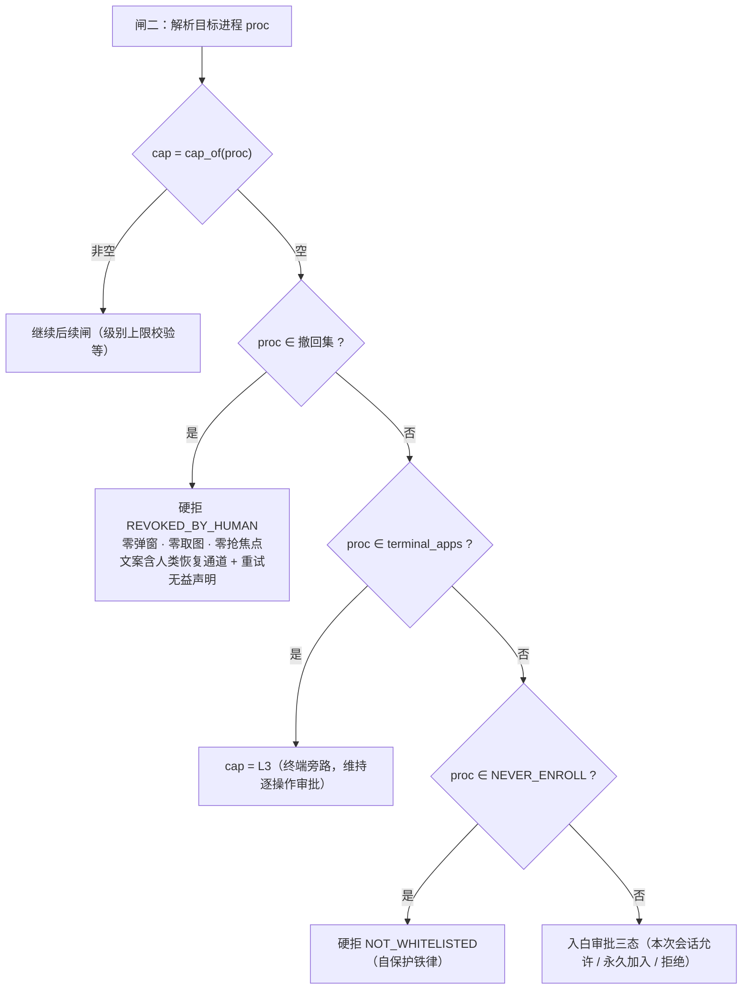

# ISS-0072：【设计引入】撤回墓碑被再次入白审批抹平

| 项 | 内容 |
|----|------|
| 问题单号 | ISS-0072 |
| 标题 | 撤回墓碑在强制层与"素未谋面"同值——人类刚移出的进程，AI 一句 attach 即获赠「永久加入」 |
| 严重级 | **高**（安全语义级：人类撤销权被架空，且撤销时效短至一次 AI 请求） |
| 状态 | **P3 绿·待 sdfang 验收**（方案 v0.2 已评审；14 用例全绿 + 全量回归绿） |
| 提出 | 2026-09-11（手工测试 D-03~09 白名单批次现场目击，sdfang 截图） |

## 1. 现场实证

**时序（`dist/audit/logs/audit-20260911.jsonl` + sdfang 截图 `Snipaste_2026-09-11_12-08-23.png`）**：

| 时刻 | 事件 | 证据 |
|------|------|------|
| 12:00:42 | 人类裁决「移出」→ seeyou.exe 写墓碑 | seq 18「白名单移除」、seq 19「白名单移除-经AI请求」、seq 20 tool row removed=True |
| 12:07:13 | AI `attach seeyou` → **弹出「入白审批」窗，三按钮含「永久加入」** | 截图 + seq 23 `APPROVAL_TIMEOUT` 90448ms |
| 12:09:33 | 重试 → **又一个同样的入白审批窗** | seq 24 90403ms |
| 12:13:10 | 重试 → 又一个 | seq 28 90435ms |
| 12:18:29 | 重试 → 又一个 | seq 29 90396ms |

**落盘状态（`dist/policy.local.yml`）**：

```yaml
whitelist:
- process: winver.exe
  max_level: L2
- process: seeyou.exe
  max_level: null        # ← 墓碑：人类 12:00:42 的裁决
```

**弹窗文案（截图直读）**：

> AI 请求操作新应用「西柚加速器」
> 进程 seeyou.exe（显示名来源：窗口标题）当前未经本地授权（请求动作 attach）。本次会话允许 = 重启前有效（会话级，不落盘）；**永久加入 = 写入白名单长期有效**，可随时在白名单管理中移出（实拍存疑：目标无法前置，未截图）
> [本次会话允许] [永久加入] [拒绝]

## 2. 根因（机制层）

**墓碑在到达强制层之前就被丢弃了，强制层拿到的是"该进程不存在"这一与全新进程完全相同的信号。**

链路三跳，每跳都丢一点信息：

**跳一：`policy.py:83-84`——墓碑被 pop，信息就此消失**

```python
level = entry.get("max_level")
if level is None:
    merged.pop(proc, None)               # 墓碑：撤回
```

`_merge_local_whitelist` 只产出合并后的白名单字典，墓碑的**存在性**没有进入 `Policy` 的任何字段。`policy.whitelist` 里没有 seeyou.exe——与"从来没听说过 seeyou.exe"不可区分。

**跳二：`enforcement.py:139`——`cap_of()` 一个 `None` 承担两种语义**

```python
cap = self._admin.cap_of(proc) if proc else None
```

`WhitelistAdmin.cap_of()`（`whitelist_admin.py:84-90`）返回 `self._static.get(p)`，而 `_static` 由合并后的白名单构造，墓碑进程根本不在其中 → 返回 `None`。**"已被人类否决"和"从未见过"折叠成同一个值。**

**跳三：`enforcement.py:149-168`——`None` 触发全新进程的入白审批路**

```python
if cap is None and proc:
    # 审批入白：人类三态裁决（本次允许=会话 / 永久加入=落盘 / 拒绝）
    fp = compute_fingerprint(tool, self._fingerprint_params(request))
    desc = self._describe_enroll(request, binding, proc)
    decision = self._approvals.request_enroll(proc, desc, fp, ...)
    if decision == "approve_always":
        self._admin.add_permanent(proc, L2)
```

三态按钮一个不少，**「永久加入」赫然在列**。

### 2.1 为什么这是缺陷而不是设计意图

ISS-0012 §4.2 的验收原文是：

> 实盘：托盘右键 → 白名单管理 → 移出 Excel → **AI 再操作即回到审批/拒绝**

"回到审批/拒绝"被实现成了"回到审批"——字面上不违反，但**"再次入白审批"这个形态本身就让「永久加入」重新成为一键可选项**。ISS-0032 A6 写墓碑的立意是：

> 撤回记录永续,未来出厂加回该进程也不被静默逆转

立意只覆盖了"对抗出厂策略回填"，**没有覆盖"对抗 AI 再次请求"**。这正是 §2.1 交叉面清单要求的枚举对象（撤回 × 再次请求），本单即按该规则补表。

### 2.2 真实风险

不是"AI 能自己点弹窗"——`NEVER_ENROLL` 自保护铁律挡着，弹窗永远要人类点。风险是：

1. **撤销时效 = 一次 AI 请求**。人类 12:00:42 的裁决，12:07:13 就在屏幕上被重新问了一遍。人类若误点、手抖、或图省事，撤销当场作废。
2. **AI 可以低成本反复请求**。四次 attach 四次弹窗，全程零成本。人类面对重复弹窗的疲劳，本身就是攻击面（弹窗疲劳是现代 UI 安全设计的已知失效模式）。
3. **撤销的语义被降级成"提醒"**。人类表达的"这个进程别再动了"，系统执行成了"这个进程下次要再问一次"。

## 3. 整改方案（v0.2 定稿，Q1 已裁定）

### 3.0 不变量（本单确立，写入 DESIGN.md INV-2 补款）

> **撤回即人类否决，永久有效。** 被人类移出的进程，其撤回态不受任何强度、任何频次
> 的 AI 请求影响；系统在闸二就地拒绝，不产生任何审批交互。恢复授权的唯一通道是
> 人类在白名单管理窗口中的显式动作。

### 3.1 闸二流程改后形态



**位置是有意的**：撤回判定排在终端旁路与自保护之前。理由——撤回是人类的显式否决，
其强度应高于"终端类默认旁路"这一系统推定；而 `NEVER_ENROLL` 排在撤回之后不构成
削弱，因为 deskpilot.exe 永不可入白（`_check_enrollable`），也就永远拿不到墓碑，
两支互斥。

### 3.2 四处改动

| # | 位置 | 改动 | 补回的信息 |
|---|------|------|-----------|
| 1 | `policy.py` `_merge_local_whitelist` | 遇墓碑不再只是 `pop`：把进程名收集进撤回集合并**返回**它（`load_policy` 无 local 时得空集） | 跳一丢失的"存在性" |
| 2 | `models.py` `Policy` | 增只读字段 `revoked: frozenset[str]` | 撤回事实进入策略只读视图 |
| 3 | `whitelist_admin.py` `WhitelistAdmin` | 增构造入参 `revoked`（装配侧由 `policy.revoked` 注入）与查询口 `is_revoked(proc)`；`remove()` 命中静态时并入撤回集合；`add_permanent()` 命中时移出撤回集合；`add_session()` **不得**移出（会话放行弱于永久否决） | 跳二丢失的"人类已否决"语义 |
| 4 | `enforcement.py` 闸二 | 在 `cap is None` 且 `is_revoked(proc)` 时硬拒 `REVOKED_BY_HUMAN`，不进入任何审批路径 | 跳三误判为"素未谋面" |

`errors.py` 增原因码 `REVOKED_BY_HUMAN`。**计数订正（P2 核对，最小诚实）**：本单
v0.1 草稿写的"现 19 个 → 20 个"源自 `errors.py:3` 的自述，而该自述本身失真
（实有 25 常量，附录 A 实有 20 行，五码从未登记）。故本单**不碰任何计数声明**：
`errors.py` 文件头注释改为不再自述数量、功能设计说明书的"全量 20 个错误码"改为
不写数字，只登记自己这一码进附录 A。登记册的全量回填与单源化属
[ISS-0074](ISS-0074-【文档】错误码登记册与实现漂移.md)，不在本单顺手改。

### 3.3 拒绝文案（ISS-0027 AI 可自愈规范）

须同时表达三件事，缺一不可：

1. **事实**：目标进程已被人类从白名单移出；
2. **重试无益**：该决定对本进程长期有效，重复请求不会改变结果（否则 AI 会陷入
   重试循环——现状的 `APPROVAL_TIMEOUT` 天然劝退，改为硬拒后必须显式劝退）；
3. **恢复通道归属**：恢复授权须由人类在 DeskPilot 白名单管理窗口中主动操作。

第 3 条只陈述**谁**能恢复，不陈述**如何**恢复——与 ISS-0012 B"面向 AI 的拒绝文本
不授任何加入方法"及自保护文案保持同一纪律。

### 3.4 约束

- 出厂 base 文件永不触碰（ISS-0030 铁律保持）。
- 墓碑格式不变（`max_level: null`），不得引入新 YAML 形态（ISS-0032 A5：消灭同形三语义）。
- 单文件模式（测试/兼容装配）语义不得破坏：无 local 时撤回集恒为空，`is_revoked` 恒假。
- 素未谋面的进程行为**零变化**：仍走三态入白审批。
- 撤回态拒绝只写标准工具审计行（decision=拒绝 + 原因码），不新造事件词汇
  （事件词汇收敛归 ISS-0060，本单不越界）。
- 生产放行路径既有像素/文案不得回归（`tests/test_policy*.py`、`tests/test_whitelist*.py`、
  `tests/test_dualfile*.py`、`tests/test_enforcement.py` 全绿为底线）。

## 4. 评审裁定

| # | 问题 | 裁定 | 依据 |
|---|------|------|------|
| Q1 | 撤回态收到操作请求怎么处理？ | **①硬拒**：零弹窗，fail-closed 最纯 | sdfang 2026-09-11 裁定。理由：②的护栏是软的（文案+焦点），弹窗疲劳是硬的；墓碑立意要求撤回不被静默逆转，而任何形态的"再次询问"都是把裁决重新推回人类面前 |
| Q2 | 撤回是否有效期？ | **①永久有效**（无 TTL） | 由 Q1 ① 派生：TTL 到期后撤回自动失效＝重新打开攻击窗，与①自相矛盾；且 ISS-0032 A6"撤回记录永续"已定调 |
| Q3 | 人类主动从管理窗加回，是否允许？ | **允许**，且须覆盖墓碑为真条目 | 人类显式动作，非 AI 可触达路径。`_write_disk` 现有 merged 语义已支持（TC-72-06 锁住） |
| Q4 | 撤回语义是否压过终端旁路？ | **压过**（§3.1 位置已体现） | fail-closed 方向。**标注为假设**：终端类本就不可永久入白（`cap_of` 恒 None），只有人工手写墓碑才能构造该形态；若评审认为终端逐操作审批已足够，改为排在终端旁路之后即可，仅 TC-72-08 预期随之变 |
| Q5 | 是否与 ISS-0073 合并整改？ | **分开** | 根因不同：0072 是策略信息丢失（安全语义级），0073 是取证判据过严与副作用未挂账（证据面/体验面）。可独立验收，合并会抬高单次改动面 |

## 5. 测试设计（五要素，P1 红坐标准备完毕）

层级边界：**黑盒**不 import 任何源码，只用 HTTP/命令行驱动；**集成**允许 import
公共方法但**禁止打桩 mock**，链路真实直达数据层（落盘 YAML / 审计 JSONL），
断言在数据层；**单元**允许替身，断言在返回值/异常/替身调用记录。

### 5.1 用例表

| 用例 | 场景 | 前提 | 步骤 | 预期结果 | 断言代码（出处＝被调方法返回值/替身记录/落盘文件，直出） | 层 | P1 |
|------|------|------|------|----------|------------------------------------------------------|----|----|
| **TC-72-01** | 墓碑存在性抵达策略视图 | base 含 notepad/explorer；local 含 `{seeyou.exe, null}` | `p = load_policy(base, local_path=local)` | 策略视图能回答"seeyou 被撤回过"，且仍在白名单外 | `assert "seeyou.exe" in p.revoked`；`assert "seeyou.exe" not in p.whitelist` | 单元 | 红（无 `revoked` 字段） |
| **TC-72-02** | 撤回压过出厂同名片 | base whitelist 含 `seeyou.exe: L2`；local 墓碑同进程 | `load_policy(base, local_path=local)` | 出厂回填不被静默逆转（ISS-0032 A6 立意可断言化） | `assert "seeyou.exe" not in p.whitelist`；`assert "seeyou.exe" in p.revoked` | 单元 | 红 |
| **TC-72-03** | 撤回态**零审批交互**（Q1=① 的正面锁） | 双文件 admin（seeyou 墓碑）；`approver.decision = "approve_always"`（最危险产品） | `d = enf.submit(OperationRequest("attach", {"process":"seeyou.exe"}, None))` | 拒绝；审批通道零调用；未产生任何入白 | `assert d.allowed is False`；`assert d.reason_code == REVOKED_BY_HUMAN`；`assert approver.requests == []`；`assert a.cap_of("seeyou.exe") is None` | 单元 | 红（当前走 enroll，requests 非空且 reason_code 为 APPROVAL_*） |
| **TC-72-04** | 硬拒路径零副作用（不抢焦点/不取图） | 同上，且 `executor.live_windows` 预置 seeyou 的**可见**窗口（走取图链必被激活） | 同 TC-72-03 的 submit | 未触碰用户窗口：无前置、无实拍 | `assert executor.activate_calls == []`；`assert executor.approval_shot_rects == []` | 单元 | 红（当前 activate_calls == [hwnd]） |
| **TC-72-05** | 运行期撤回即时进入撤回态 | 双文件 admin，notepad.exe 在 static | `a.remove("notepad.exe")` 后查 `a.is_revoked("notepad.exe")` | 撤回返回 "static"，撤回态即真，cap 即空 | `assert a.remove("notepad.exe") == "static"`；`assert a.is_revoked("notepad.exe") is True`；`assert a.cap_of("notepad.exe") is None` | 单元 | 红（无 `is_revoked`） |
| **TC-72-06** | 人类加回＝唯一恢复通道 | 承接 TC-72-05 的撤回态 | `a.add_permanent("notepad.exe", "L2")` | 撤回态解除、恢复放行、盘面墓碑被真条目覆盖 | `assert a.is_revoked("notepad.exe") is False`；`assert a.cap_of("notepad.exe") == "L2"`；`assert not any(i["process"]=="notepad.exe" and i.get("max_level") is None for i in yaml.safe_load(local.read_text())["whitelist"])` | 单元 | 半红（盘面覆盖已成立，`is_revoked` 部分红） |
| **TC-72-07** | **撤回不可被 AI 重复请求逆转**（现场 4 次复现） | 双文件，seeyou 墓碑；`approver.decision = "approve_always"`；真实 AuditLogger | 连续 4 次 `enf.submit(attach seeyou)`，读落盘 YAML 与审计 JSONL | 4 次结果恒定；零审批；盘面墓碑原样；审计 4 行同码 | `assert [d.reason_code for d in ds] == [REVOKED_BY_HUMAN]*4`；`assert approver.requests == []`；`assert yaml.safe_load(local.read_text())["whitelist"] == [{"process":"seeyou.exe","max_level":None}]`；`assert [r["reason_code"] for r in read_audit(ad) if r.get("tool")=="attach"] == [REVOKED_BY_HUMAN]*4` | 集成 | 红 |
| **TC-72-08** | 撤回压过终端旁路（Q4 假设锁） | local 手写墓碑 `cmd.exe`；base 的 `terminal_apps` 含 cmd.exe | `enf.submit(attach cmd.exe)` | 拒绝，**不**升 L3、不进审批 | `assert d.reason_code == REVOKED_BY_HUMAN`；`assert approver.requests == []` | 集成 | 红（当前走终端旁路 → cap=L3 → 审批放行） |
| **TC-72-09** | **非空对照**：素未谋面进程三态入白不回归 | 双文件；`fresh.exe` 既不在 whitelist 也不在 revoked；`approver.decision="approve"` | `enf.submit(attach fresh.exe)` | 三态入白照旧，会话放行 | `assert approver.requests[0]["enroll"] == "fresh.exe"`；`assert d.allowed is True`；`assert a.cap_of("fresh.exe") == "L2"` | 集成 | 绿（回归守卫，改后须仍绿） |
| **TC-72-10** | 出厂 base 永不被写 | 双文件；notepad.exe 在 base | 记录 `file_sha256(base)` → `a.remove("notepad.exe")` → 再算 | base 字节不变；变化落在 local | `assert file_sha256(base) == before`；`assert file_sha256(base) == before`；local 中出现 `{notepad.exe, null}` | 集成 | 绿（回归守卫） |
| **TC-72-11** | 经 HTTP 外表面可判且零弹窗 | 双文件；`HttpDaemon(ctx, port=0, whitelist_admin=a)`（真实端口、真实文件、零桩）；`seeyou.exe` 有墓碑 | `remote_call("attach", {"process":"seeyou.exe"}, base_url, timeout)` → `POST /call` | 响应体拒绝码正确、文案含恢复通道声明 | `assert body["error_code"] == "REVOKED_BY_HUMAN"`；`assert "人类" in body["message"]`；`assert "重复请求" in body["message"]` | 集成 | 红 |
| **TC-72-12** | 自保护铁律不回归 | 双文件 | `enf.submit(attach deskpilot.exe)` | 仍硬拒 NOT_WHITELISTED、零弹窗 | `assert d.reason_code == "NOT_WHITELISTED"`；`assert approver.requests == []` | 单元 | 绿（回归守卫；撤回判定插在其前，须证不削弱） |
| **TC-72-13** | 拒绝文案满足 AI 可自愈三要素 | 承接 TC-72-03 | 取 `d.message` | 事实 + 重试无益 + 恢复通道归属三者齐备，且不含加入方法教学 | `assert "已被人类" in d.message`；`assert "重复请求" in d.message`；`assert "白名单管理窗" in d.message`；`assert "policy" not in d.message and "yml" not in d.message` | 单元 | 红 |
| **TC-72-14** | 文档随代码走 | 实现完成后 | 读 DESIGN.md / 详细设计说明书 / 功能设计说明书 | INV-2 补款、附录 A 登记新行、**本单这一码**在附录 A ↔ 实现层双向一致、功能设计清单同步 | `assert REVOKED in codes`（附录 A 行键，从文件解析）；`assert REVOKED in consts`（`errors.py` 常量，正则直出）；`assert "撤回即人类否决" in design`；`assert REVOKED in func` | 单元 | 红 |

### 5.2 手工用例（真机黑盒，补黑盒层）

| 用例 | 场景 | 步骤 | 预期 | 断言（外部可观测） |
|------|------|------|------|-----------------|
| **M-72-01** | 真机 daemon 上复现现场 | ①托盘移出某进程 ②AI attach 该进程 ③观察屏幕 | 屏幕**无任何弹窗**；AI 收到 REVOKED_BY_HUMAN | 响应 error_code == REVOKED_BY_HUMAN；审计 `attach 拒绝 REVOKED_BY_HUMAN` 行；无审批弹窗截图 |

（M-72-01 复用进行中的 D-03~09 白名单手工批次现场，不新增破坏面。）

### 5.3 R6 需求 ↔ 用例双向映射（孤儿检查）

| 需求/验收点 | 用例 | 反向 |
|------------|------|------|
| R1 墓碑存在性抵达强制层 | TC-72-01, 02 | ✓ |
| R2 撤回态硬拒、零审批交互 | TC-72-03, 04, 07, 11, M-72-01 | ✓ |
| R3 撤回不可被 AI 重复请求逆转 | TC-72-07 | ✓ |
| R4 人类管理窗加回是唯一恢复通道 | TC-72-06 | ✓ |
| R5 素未谋面进程入白三态不回归 | TC-72-09 | ✓ |
| R6 撤回压过终端旁路（假设） | TC-72-08 | ✓ |
| R7 自保护铁律不削弱 | TC-72-12 | ✓ |
| R8 出厂 base 永不写 | TC-72-10 | ✓ |
| R9 单文件模式语义不回归 | 复用 `test_whitelist_iss12` / `test_dualfile_fix_iss32` 现存全绿 | ✓ |
| R10 错误码 AI 可自愈（三要素文案） | TC-72-13 | ✓ |
| R11 文档随代码走（4 处） | TC-72-14 | ✓ |
| — | 无孤立用例 | ✓ |

### 5.4 R7 失效原因核对（防"借道假绿"）

| 用例 | 若断言通过，可能因为什么**无关**原因？ | 排除措施 |
|------|--------------------------------|---------|
| TC-72-03 / 07 的 `approver.requests == []` | 请求更早被拒（未知工具/无绑定/冻结），审批通道根本没被到达 | 同时断言 `reason_code == REVOKED_BY_HUMAN`，把拒绝点钉在闸二撤回分支 |
| 同上 | `approver` 替身未接线，恒空列表 | **TC-72-09 为期提供非空对照**：同一 fixture 下 fresh.exe 必须产生一条 enroll 请求；TC-72-09 绿是 TC-72-03/07 有效的前提 |
| TC-72-07 的盘面断言 | local 本来就是那个内容（用例没真正写盘） | 前置用 admin 双文件装配先落墓碑，并断言 `file_sha256(local)` 在 4 次 submit **前后相等**（证明"零写入"，而非"恰好相同"） |
| TC-72-01 / 02 的 `revoked` | 字段存在但恒为空集（改了个空壳） | 02 断言同名进程**同时**满足 `not in whitelist` 与 `in revoked`；另加反向：`assert "explorer.exe" not in p.revoked` |
| TC-72-05 / 06 的 `is_revoked` | 恒真/恒假的退化实现 | 05 与 06 互为对立断言（撤回后真 → 加回后假），单一常量实现无法同时满足 |
| TC-72-08 | cmd.exe 被别的原因拒（不在白名单） | 终端类本就走旁路放行，须用**改前行为**做对照说明：改前该请求 allowed=True，改后 REVOKED_BY_HUMAN |

### 5.5 交叉面清单（随单必附，§2.1 规则）

| 触及对象 | 其他写入者 / 读取者 | 覆盖 |
|---------|-----------------|------|
| `policy.local.yml` | 写：`_write_disk` / `migrate_whitelist` / 人工编辑；读：`_merge_local_whitelist` / 指纹守望 | TC-72-01/02/06/07/10 |
| `Policy` 只读视图 | 装配：`load_policy` → `WhitelistAdmin`/`Enforcement`；`main.py` 注入 | TC-72-01/02 |
| `WhitelistAdmin` 内存三态（static/session/revoked） | 写：`add_session`/`add_permanent`/`remove`/`clear_session`；读：`cap_of`/`entries`/`is_revoked`/管控端点 | TC-72-03/05/06/12 |
| 强制层闸二分支序 | 终端旁路 / NEVER_ENROLL / 入白审批 / 级别上限 | TC-72-08/09/12 |
| 审计 | 工具行（拒绝+原因码）；事件词「白名单移除」「白名单移除-经AI请求」「白名单入白-永久」 | TC-72-07 |
| 出厂 base | 写：构建同步 / 安装器；本单禁写 | TC-72-10 |
| 文档 | DESIGN.md INV-2 / 详细设计 附录A+闸二流程 / 功能设计 §4.1+错误码清单 / 测试设计说明书 | TC-72-14 |
| 单文件模式装配 | `WhitelistAdmin(policy_path, static)` 无 local 的测试/兼容路径 | R9 现存用例 |

## 6. 变更记录

| 版本 | 日期 | 内容 |
|------|------|------|
| v0.1 | 2026-09-11 | 建单。现场实证（截图 + 审计 4 行 + 落盘墓碑）入 §1；根因定位到 `policy.py:83-84` pop 墓碑 → `cap_of` 单值双语义 → `enforcement.py:149` 走全新入白三态；§4 五问待评审 |
| v0.2 | 2026-09-11 | Q1 经 sdfang 裁定取**①硬拒**；Q2 由①派生为永久有效；Q3 允许人工加回；Q4 取压过终端旁路并标注为假设；Q5 分开。§3 定稿为不变量 + mermaid 分支图 + 四处改动 + AI 可自愈文案三要素；§5 测试设计由 10 条草稿扩为 14 条五要素用例（补 TC-72-04 零副作用、TC-72-09 非空对照、TC-72-13 文案、TC-72-14 文档同步）+ M-72-01 真机黑盒，并补 R6 双向映射与 R7 失效原因核对两张闸门表 |
| v0.3 | 2026-09-11 | 自检（R2 断言出处）修正：TC-72-11 原假设的 `POST /tool` 端点不存在，工具调用外表面实为 `POST /call`（`httpd.py:314`），入口改经 `remote_call()`（`httpd.py:363`），响应体四字段 `{ok,error_code,message,data}`（`httpd.py:346`）。审计行键名由 `asdict(AuditEntry)` 直接产出（`audit.py:34`），`reason_code` 无须转换即可断言 |
| v0.4 | 2026-09-11 | P2 核对修正（R2 断言出处，违反即停手上报后经 sdfang 裁定取"最小诚实"）：TC-72-14 原断言 `assert "20 个错误码" in 详细设计说明书` **无出处**——该字符串不存在于详细设计说明书（实存于 `功能设计说明书.md:219`），且其基准失真（详细设计附录 A 实 **20** 行，`errors.py` 实有 **25** 个常量，其中 `ELEVATION_REQUIRED`/`WINDOW_OCCLUDED`/`TOOL_TIMEOUT`/`OCR_TEXT_NOT_FOUND`/`OCR_AMBIGUOUS` 五码从未登记；`errors.py:3` 自述"19 个原因码"）。改法：断言改为**从文件解析**的三大同步面——附录 A 必含新行 + 附录 A 行数与文档"全量 N 码"声明自洽（不写死数字）+ INV-2 补款 + 功能设计清单同步；`errors.py:3` 失真的计数改为真话。五码未登记属**既有文档漂移**，按范围控制纪律记入待查清单，不在本单顺手改 |
| v0.5 | 2026-09-11 | P1 完成并取得设计签名红：14 用例 **11 红 / 3 绿**，3 绿恰为设计标注"改后须仍绿"的回归守卫 TC-72-09（素未谋面入白不回归）/TC-72-10（出厂 base 永不被写）/TC-72-12（自保护铁律不削弱）；11 红失败原因分类齐整且全为设计预期（`Policy.revoked` 缺失 ×2、`is_revoked` 缺失 ×2、闸二 `reason_code` 空串 ×6、附录 A 未登记 ×1） |
| v0.6 | 2026-09-11 | P3 完成：**14/14 全绿**。四处改动按 §3.2 落地（`policy._merge_local_whitelist` 返回撤回集 → `Policy.revoked` → `WhitelistAdmin(revoked=…)/is_revoked` → 闸二硬拒 `REVOKED_BY_HUMAN`），`main.py:396-402` 注入 `policy.revoked`（合并视图，非出厂视图），`Enforcement` 缺省装配一并注入使撤回语义不因缺省而丢失。P3 首跑 `7 failed / 7 passed`，六条闸二失败经查为**本用例文件自身装配缺口**——`_assembly` 未把 `policy.revoked` 注入 `WhitelistAdmin`，与 `main.py` 装配不一致（实现无误）；已按"装配须逐参对齐真实装配线"修正，非私改测试迁就实现。全量回归：`649 passed / 17 skipped`（另一次全量跑出现 `test_whitelist_iss12::test_post_clear_session` 单点失败，隔离与连跑三次均绿，判为已知端口竞争间歇，与本单无涉，记入待查）。待办：M-72-01 真机黑盒（复用 D-03~09 手工批次现场） |
