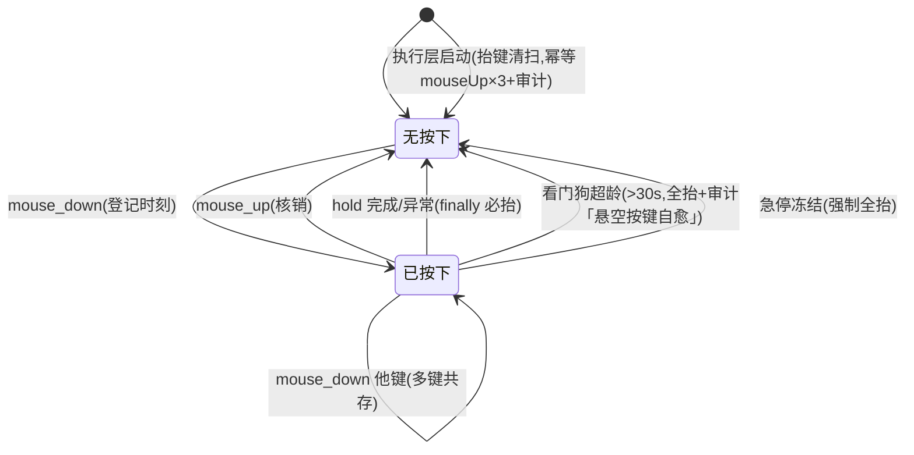
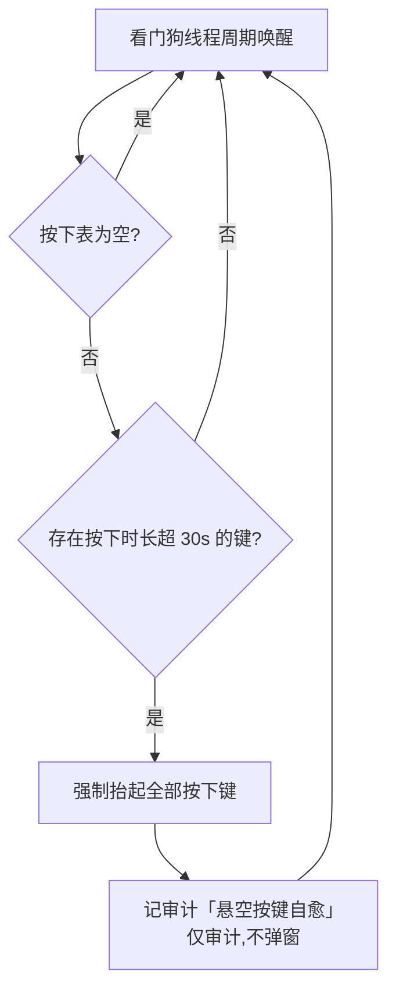
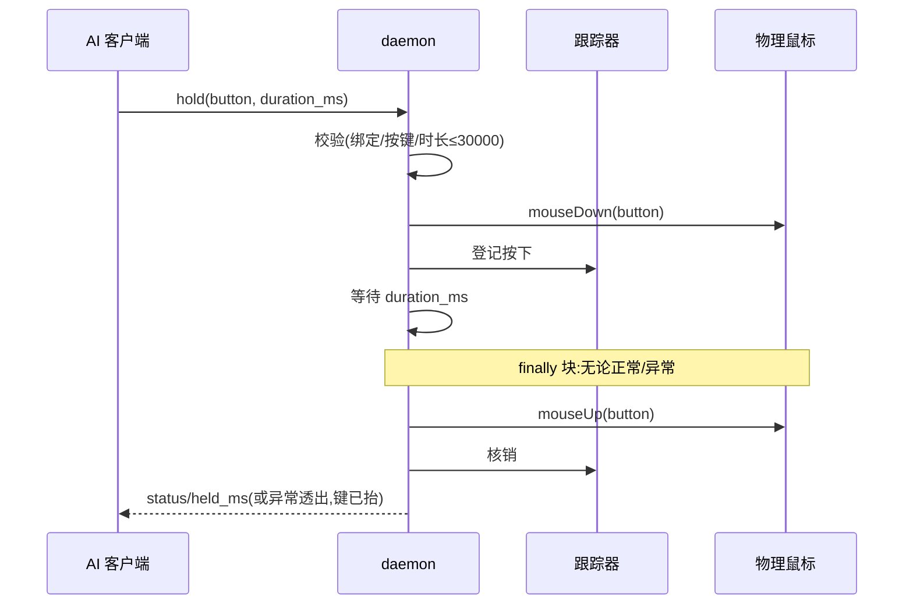

# REQ-001 鼠标能力补全 —— 功能设计(IEEE 1016 轻量融合)

| 项 | 内容 |
|----|------|
| 文档 | REQ-001 功能设计 v0.1 |
| 上游 | [REQ-001-鼠标能力补全.md](REQ-001-鼠标能力补全.md)(需求规格 v0.2)、[决策记录](REQ-001-鼠标能力补全-决策记录.md)(D-01~D-04)、[原始输入](REQ-001-鼠标能力补全-原始输入.md) |
| 标准 | IEEE 1016(软件设计描述)轻量融合:组成/接口/信息/状态动态/交互五视图 |
| 约束 | 本文档禁止代码与伪代码;算法以 mermaid+文字说明表达(sdfang 2026-09-08 规矩) |
| 状态 | 待评审 |

## 1. 设计立场(设计驱动因素)

| 驱动 | 来源 | 对设计的约束 |
|------|------|-------------|
| 组合自由(人持鼠标的全自由度) | 需求 MOUSE-01~03 | 原语层必须暴露且状态可共存,禁止"只给动词不给基座" |
| 三重安全网为硬约束 | 需求 MOUSE-04~06 | 任一缺失评审不过;按下状态生命周期必须有三条独立兜底路径 |
| 默认参数行为零变化 | 需求 MOUSE-15 | 全部扩展参数走可选位,既有调用零感知 |
| 工具=物理层,判断归 AI | sdfang 裁定 | 不做落点校验/碰撞检测;只给原语与感知 |
| 证据成本控制 | 需求 MOUSE-14 | 原语层 down/up 只记审计不拍图 |
| 通用性优先 | 项目规矩 | 新工具走注册表/参数化,禁止 if 链与 bespoke 分支 |

## 2. 组成视图

| 模块 | 变更 | 职责 |
|------|------|------|
| executor/mousehold.py(新增) | 新建 | 按下状态跟踪器 + 看门狗:按下登记、抬起核销、超龄检测、强制全抬;时钟可注入(测试接缝) |
| executor/core.py | 扩展 | 装配跟踪器;新增 mouse_down/mouse_up/hold 执行方法;click/drag/scroll/click_text 参数扩展;启动抬键清扫接线;急停冻结挂钩 |
| mcp_server.py | 扩展 | TOOL_SCHEMAS 增 3 工具 + 4 工具参数扩展;scroll direction 枚举扩 left/right |
| models.py | 扩展 | TOOL_LEVELS 增 3 条 L2;BINDING_REQUIRED_TOOLS 增 3 条 |
| executor/core.py _dispatch | 扩展 | 新工具派发分支(并入既有写路径,无独立通道) |
| estop(急停) | 消费 | 冻结时调用跟踪器强制全抬 |
| audit | 消费 | 新事件:「启动抬键清扫」「悬空按键自愈」 |

## 3. 接口视图(工具契约)

### 3.1 新增工具

| 工具 | 参数 | 返回 | 语义 |
|------|------|------|------|
| mouse_down | token(必填)、button(必填,枚举 left/right/middle) | status、button、pressed(当前按下键清单) | 按下指定键并登记;重复按下同键幂等(状态不变,如实返回) |
| mouse_up | token(必填)、button(必填,枚举同上) | status、button、released(布尔:本次是否真抬起) | 抬起指定键并核销;**无对应按下时 no-op 成功返回 released=false**(幂等,防重试误抬) |
| hold | token(必填)、duration_ms(必填,整数 1~30000)、button(可选,默认 left) | status、button、held_ms | 按下→等待→抬起;**任何异常路径必抬(finally)**;超上限 INVALID_PARAMS |

### 3.2 扩展工具(默认参数行为零变化)

| 工具 | 新增参数 | 说明 |
|------|---------|------|
| click | button(可选,默认 left)、clicks(可选,1/2/3,默认 1) | 右/中键单击、双击、三连击 |
| drag | button(可选,默认 left) | 右/中键拖拽 |
| scroll | direction 枚举扩 left/right | 水平滚轮:left=负向,right=正向(与垂直对称) |
| click_text | clicks(可选,默认 1)、button 扩 middle | 与 click 对称 |

### 3.3 描述面(AI 友好)

三新工具描述须含:用途、组合示例(mouse_down+move+mouse_up=按住拖动)、
安全网说明(30s 看门狗/急停强抬/启动清扫)、参数与返回;长度 ≤200 字、
含领域限定词(描述质量测试既有规则)。

## 4. 信息视图

| 数据 | 形态 | 生命周期 |
|------|------|---------|
| 按下状态 | 跟踪器内部表:button → 按下时刻 | 进程内;mouse_down 写入,mouse_up/hold 完成/看门狗/急停/启动清扫五路核销 |
| 看门狗阈值 | 常量 30s(安全参数,不开放) | 编译期固定 |
| 审计事件 | 「启动抬键清扫」「悬空按键自愈」 | 永续 JSONL |

## 5. 状态动态视图

按下状态的生命周期(mermaid):

看门狗判定逻辑(mermaid):

## 6. 交互视图

hold 时序(mermaid):

启动抬键清扫时序:执行层初始化完成时,对 left/right/middle 三键各发一次
幂等 mouseUp(无按下=系统级 no-op),记审计「启动抬键清扫」——兜底
"旧进程死亡时悬空按键"场景(D-02)。

## 7. 错误语义

| 场景 | 错误码 | 行为 |
|------|--------|------|
| button 非法值 | INVALID_PARAMS | 零派发,错误信息含合法枚举 |
| clicks 越界(非 1/2/3) | INVALID_PARAMS | 零派发 |
| duration_ms 超 30000 或 <1 | INVALID_PARAMS | 零派发 |
| 无绑定令牌 | 既有绑定校验链 | 与 click/drag 同链 |
| 急停冻结中 | 既有 EMERGENCY_STOP 链 | 与既有写操作同链 |
| hold 中途任意异常 | 异常透出 | **键必已抬起**(finally),错误信息明示"键已抬" |

## 8. 交叉面清单(SDD §2.1)

| 触及对象 | 其他写入者/读取者 | 覆盖 |
|---------|-----------------|------|
| TOOL_SCHEMAS(25→28) | validate_call 形态断言、test_validation 计数、描述质量测试(≤200字/领域词) | TC-MOUSE-10+既有回归 |
| BINDING_REQUIRED_TOOLS | enforcement 绑定校验 | 形态断言 |
| 按下状态(新增执行层状态) | 写入:down/up/hold/drag(button 扩展);读取:estop/看门狗/审计 | TC-MOUSE-11~15+启动清扫用例 |
| executor._click/_drag/_scroll | dispatch/click_text 链路、test_elements 打桩面 | TC-MOUSE-01~09 |
| estop 冻结路径 | 新增强制全抬消费方 | TC-MOUSE-13 |
| 执行层启动路径 | 抬键清扫接线点(daemon 与本地直跑两形态) | 新增用例(审计断言) |
| pyautogui | 多键共存语义(实现期实测留痕) | TC-MOUSE-11 |
| 审批面 | 全部 L2 并入既有链路,不新增审批路径 | 豁免声明 |

## 9. 测试设计输入(移交给测试设计的接缝)

| 接缝 | 用途 |
|------|------|
| 跟踪器时钟注入 | 看门狗超龄用假钟推进(与既有 FakeClock 模式一致) |
| pyautogui 调用面 | 单元测试替身计数(down/up/click/hscroll 调用序列直出) |
| 审计面 | 「启动抬键清扫」「悬空按键自愈」事件 JSONL 断言 |
| estop 触发器 | 冻结注入后断言按下表清空+物理抬起调用 |
| 启动装配 | 构造执行层即触发清扫(审计断言,不依赖真 daemon) |

用例基线:原始输入 15 条(TC-MOUSE-01~15)+ 新增启动抬键清扫 1 条,
验证矩阵见需求规格 §5。

## 10. 设计决策(本层新增,非需求层决策)

| 编号 | 决策 | 理由 |
|------|------|------|
| FD-01 | 按下状态由独立模块(mousehold)承载,不内嵌 core | 状态有独立生命周期与五路核销方,独立成模块符合单一职责;core 只做装配 |
| FD-02 | 看门狗为后台线程周期检测(非调用时惰性检测) | 惰性检测在"按下后无任何后续调用"场景失效——那恰是悬空的高发场景 |
| FD-03 | mouse_up 返回 released 布尔(而非静默 ok) | AI 需区分"真抬起"与"本已无按下"——诊断组合动作断链的关键信息,AI 友好 |
| FD-04 | 多击间隔采用 pyautogui 默认(实现期实测留痕) | 需求未定义;引入自定义间隔是无依据发明 |

## 11. 演进记录

| 版本 | 日期 | 内容 |
|------|------|------|
| v0.1 | 2026-09-08 | 功能设计成文(IEEE 1016 轻量融合:组成/接口/信息/状态动态/交互五视图;mermaid 表达算法,零代码;FD-01~04 本层决策),待评审 |
