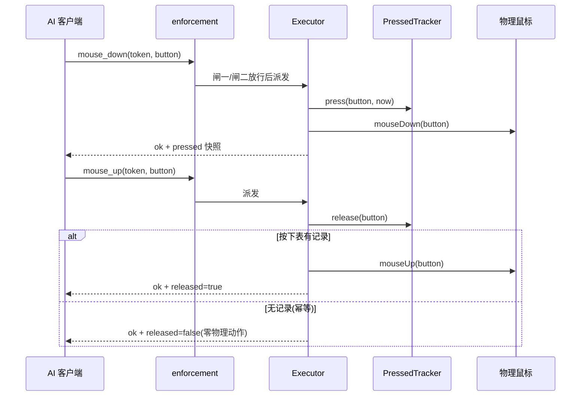
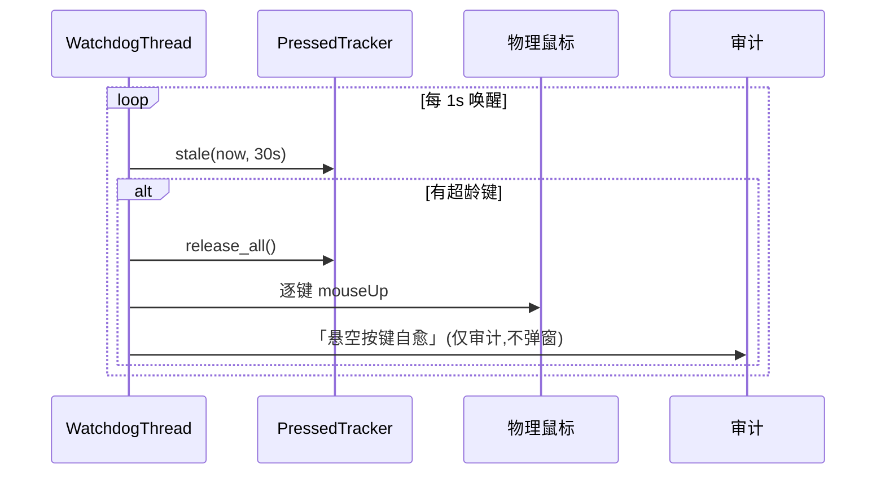
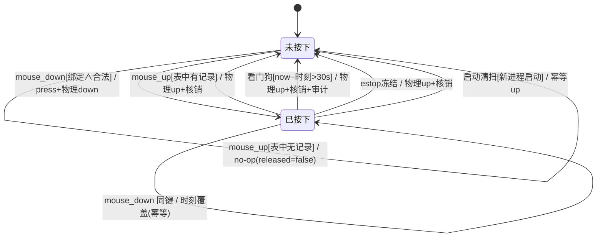
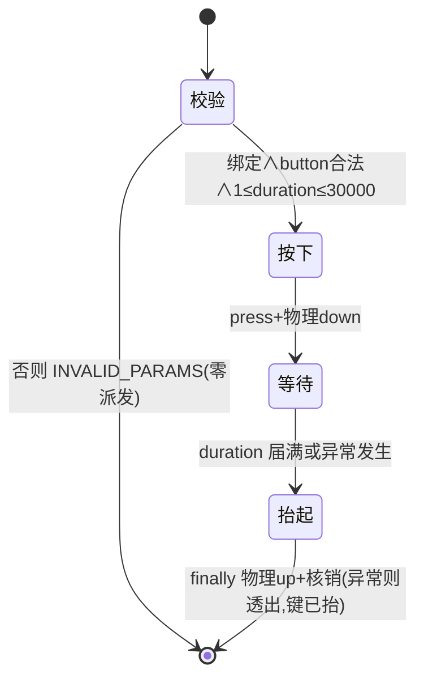
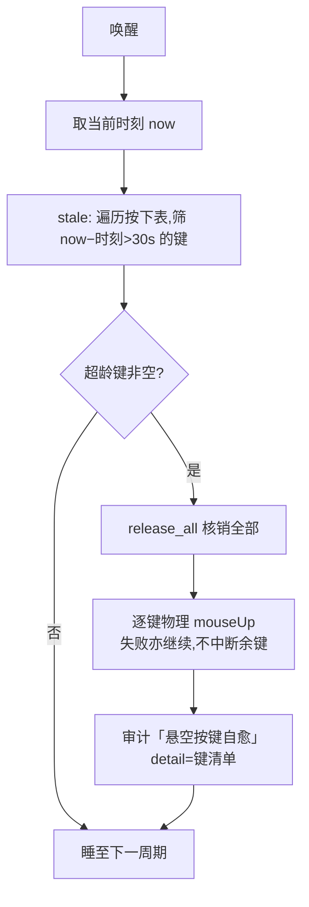
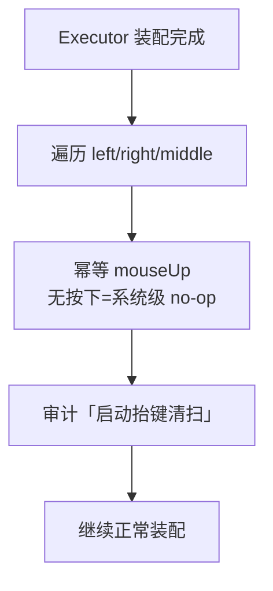
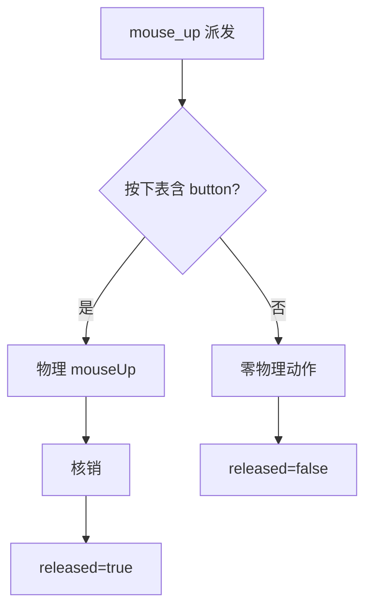

# REQ-001 鼠标能力补全 —— 详细设计(IEEE 1016 全视图)

| 项 | 内容 |
|----|------|
| 文档 | REQ-001 详细设计 v0.1 |
| 上游 | [需求规格](REQ-001-鼠标能力补全.md) v0.2、[功能设计](REQ-001-鼠标能力补全-功能设计.md) v0.1、[决策记录](REQ-001-鼠标能力补全-决策记录.md) |
| 标准 | IEEE 1016(软件设计描述)全视图:上下文/组成/逻辑/信息/接口/结构/交互/状态动态/算法/资源/错误语义 |
| 约束 | 本文档禁止代码与伪代码;算法以 mermaid+文字说明表达 |
| 状态 | 待评审 |

## 1. 设计上下文

### 1.1 设计标识

| 设计实体 | 标识 |
|---------|------|
| 新模块 | `deskpilot.executor.mousehold`(按下状态跟踪器+看门狗) |
| 扩展模块 | `deskpilot.executor.core`、`deskpilot.mcp_server`、`deskpilot.models`、`deskpilot.tools` |

### 1.2 设计驱动(继承,不重复论证)

组合自由(原语基座)、三重安全网+启动清扫为硬约束、默认参数行为零变化、
工具=物理层判断归 AI、证据成本控制(原语不拍图)、通用性(注册表/参数化)。

### 1.3 术语(增量)

| 术语 | 定义 |
|------|------|
| 按下表 | 跟踪器内 button→按下时刻 的映射,单一事实源 |
| 核销 | 按下表移除某键记录(抬起/强抬/清扫的统称) |
| 超龄 | 按下时长超过看门狗阈值(30s) |

## 2. 组成视图

| 组成 | 职责(单一) | 协作方 |
|------|-----------|--------|
| PressedTracker(mousehold) | 按下表持有者:登记/核销/超龄检测/强制全抬/快照;线程安全 | Executor(调用)、看门狗线程(读取)、estop(强抬)、audit(事件) |
| WatchdogThread(mousehold) | 周期唤醒,驱动超龄检测与自愈 | PressedTracker、audit、时钟接缝 |
| Executor(core) | 装配跟踪器与看门狗;实现 mouse_down/mouse_up/hold;扩展 click/drag/scroll/click_text;启动抬键清扫;estop 冻结挂钩 | PressedTracker、pyautogui、enforcement |
| TOOL_SCHEMAS(mcp_server) | 3 新工具注册 + 4 工具参数扩展 + 描述 | validate_call、_input_schema |
| TOOL_LEVELS/BINDING_REQUIRED_TOOLS(models) | 分级与绑定声明(注册表) | enforcement |

## 3. 逻辑视图

### 3.1 PressedTracker(契约级,非代码)

| 成员 | 形态 | 语义 |
|------|------|------|
| `_pressed` | 映射:button→按下时刻(单调时钟值) | 单一事实源;同一 button 至多一条 |
| `_lock` | 互斥锁 | 按下表一切读写必须持锁(HTTP 多线程处理面) |
| `press(button, now)` | 无返回 | 登记;同键重复按下为幂等(覆盖时刻,不新增条目) |
| `release(button)` → bool | 返回"是否真抬起" | 有记录→核销返 True;无记录→返 False(幂等 no-op) |
| `release_all()` → list[button] | 返回被核销键清单 | 强制全抬(estop/看门狗/清扫共用) |
| `stale(now, max_age)` → list[button] | 返回超龄键清单 | 判定:now−按下时刻 > max_age |
| `snapshot()` → list[button] | 当前按下键清单(副本) | 诊断返回用(mouse_down 返回 pressed 清单) |

**不变式**:①同一 button 在按下表至多一条;②表外无状态——任何"键正按着"
的判定只能以按下表为准;③release_all 返回后表必为空。

### 3.2 WatchdogThread(契约级)

| 成员 | 形态 | 语义 |
|------|------|------|
| 时钟接缝 | 可注入单调时钟 | 测试以假钟推进(与既有 FakeClock 模式一致) |
| 唤醒间隔 | 常量 1s(实现期可微调到 0.5~2s,留痕) | 超龄检出延迟上界=间隔+阈值判定开销 |
| 停止事件 | threading.Event | daemon 关停时通知线程退出(防僵尸线程) |

### 3.3 Executor 侧(新增/扩展方法的契约见 §5)

装配关系:Executor 构造时创建 PressedTracker 并启动 WatchdogThread;
执行启动抬键清扫(§8.3);向 estop 注册"冻结→release_all"挂钩。

## 4. 信息视图

| 数据 | 形态 | 写入 | 读取 | 生命周期 |
|------|------|------|------|---------|
| 按下表 | button→时刻 | mouse_down/hold/drag(button≠left 时) | mouse_up/看门狗/estop/清扫/快照 | 进程内;五路核销 |
| 看门狗阈值 | 常量 30s | 编译期 | 看门狗 | 不变(安全参数不开放) |
| 审计「启动抬键清扫」 | 事件 | 启动清扫 | 审计 JSONL | 永续 |
| 审计「悬空按键自愈」 | 事件(含键清单) | 看门狗 | 审计 JSONL | 永续 |

## 5. 接口视图(工具契约,精确到参数/返回/前置/后置/错误)

### 5.1 mouse_down(L2,绑定必需)

| 项 | 内容 |
|----|------|
| 参数 | token(str,必填);button(enum left/right/middle,必填) |
| 返回 | status=ok;button;pressed(按下表快照清单) |
| 前置 | 绑定有效(闸一);button 合法(校验层) |
| 后置 | 物理按下发生;按下表含 button;审计轻量记录(不拍图) |
| 错误 | INVALID_PARAMS(button 非法,零派发);绑定/急停既有链 |
| 幂等 | 同键重复 down:物理上重复 mouseDown(与物理鼠标一致),按下表幂等(时刻覆盖) |

### 5.2 mouse_up(L2,绑定必需)

| 项 | 内容 |
|----|------|
| 参数 | 同 mouse_down |
| 返回 | status=ok;button;released(bool,本次是否真抬起) |
| 后置 | released=True:物理抬起+按下表核销;released=False:**无任何物理动作**(按下表本就无此键)——幂等 no-op,防重试误抬 |
| 错误 | 同 mouse_down(除物理动作差异) |

### 5.3 hold(L2,绑定必需)

| 项 | 内容 |
|----|------|
| 参数 | token(必填);duration_ms(int,必填,1~30000);button(可选,默认 left) |
| 返回 | status=ok;button;held_ms(实际按住毫秒数) |
| 后置 | 按下→等待→抬起完整;**任何异常路径键必已抬起**(finally);按下表无残留 |
| 错误 | INVALID_PARAMS(duration_ms<1 或 >30000、button 非法,零派发);执行中异常透出且键已抬 |

### 5.4 扩展参数(默认值=既有行为,零变化)

| 工具 | 参数 | 校验 | 物理映射 |
|------|------|------|---------|
| click | button(可选,默认 left);clicks(可选,int 1/2/3,默认 1) | button 非法/clicks 越界→INVALID_PARAMS 零派发 | pyautogui.click(button, clicks) |
| drag | button(可选,默认 left) | 同上 | mouseDown/mouseUp 带 button;**按下表在 mouseDown 后登记、mouseUp 后核销——任意 button 对称**(安全网覆盖一切物理按下;左键既有可观测行为不变,仅新增内部簿记) |
| scroll | direction 枚举扩 left/right | 枚举既有链 | left=hscroll(−amount);right=hscroll(+amount) |
| click_text | clicks(可选,默认 1);button 扩 middle | 同上 | 与 click 对称(寻址后同链) |

### 5.5 描述面约束

三新工具描述 ≤200 字、含领域限定词、含组合示例与安全网说明
(down+move+up=按住拖动;30s 看门狗/急停强抬/启动清扫/up 幂等)。

## 6. 结构视图(内部调用结构)

```
mcp_server._call
  └─ tools.call_tool ─ enforcement(闸一绑定/闸二白名单)
       └─ Executor._dispatch
            ├─ mouse_down → tracker.press + pyautogui.mouseDown
            ├─ mouse_up   → tracker.release?→(True:pyautogui.mouseUp / False:no-op)
            ├─ hold       → down→sleep→(finally)up
            ├─ click/drag/scroll/click_text(扩展参数)
            └─ (装配期)启动抬键清扫:三键幂等 mouseUp+审计
WatchdogThread ─周期→ tracker.stale → tracker.release_all + pyautogui.mouseUp + 审计
estop 冻结     ─挂钩→ tracker.release_all + pyautogui.mouseUp
```

## 7. 交互视图

### 7.1 mouse_down/mouse_up 时序(mermaid)



### 7.2 看门狗自愈时序(mermaid)



### 7.3 启动抬键清扫时序

执行层装配完成时:对 left/right/middle 逐一发幂等 mouseUp
(无按下=系统级 no-op)→ 记审计「启动抬键清扫」——兜 daemon 死亡期悬空(D-02)。

## 8. 状态动态视图

### 8.1 单键状态机(mermaid,守卫与动作精确化)



### 8.2 hold 状态机(mermaid)



## 9. 算法视图

### 9.1 看门狗 tick(mermaid+说明)



说明:全抬而非仅抬超龄键——悬空场景下按下表整体可信度已低,
保守全收(与急停同策略);逐键抬起独立容错,单键失败不阻断其余键
与审计落笔(宁多记不漏放)。

### 9.2 启动抬键清扫(mermaid)



### 9.3 mouse_up 幂等判定(mermaid)



## 10. 资源视图

| 资源 | 获取 | 释放 | 失败路径 |
|------|------|------|---------|
| 看门狗线程 | Executor 装配时启动(daemon 线程) | 停止事件置位即退出;daemon 关停时置位 | 未置位:daemon 线程随进程消亡,不阻退出 |
| 按下表锁 | 构造期创建 | 进程生命周期 | 持锁区极短(单字段读写),无死锁面 |
| estop 挂钩 | 装配期注册 | 进程生命周期 | 重复注册防护(装配恰一次) |

## 11. 错误语义(全表)

| 触发 | 码 | 行为 |
|------|----|------|
| button 非法 | INVALID_PARAMS | 零派发;信息含合法枚举 |
| clicks 越界 | INVALID_PARAMS | 零派发 |
| duration_ms<1 或 >30000 | INVALID_PARAMS | 零派发 |
| 无/失效绑定 | 既有绑定链 | 与 click/drag 同 |
| 冻结中 | 既有 EMERGENCY_STOP 链 | 同既有写操作 |
| hold 执行中异常 | 异常透出 | **键必已抬**(finally),信息明示"键已抬" |
| 看门狗抬起失败 | 不抛 | 审计如实记录,余键继续 |

## 12. 交叉面清单(SDD §2.1)

| 触及对象 | 其他写入者/读取者 | 覆盖 |
|---------|-----------------|------|
| TOOL_SCHEMAS(25→28) | validate_call/_input_schema(ISS-0040 教训:新类型须同步两表)、test_validation 计数、描述质量测试 | TC-MOUSE-10+既有回归 |
| BINDING_REQUIRED_TOOLS(+3) | enforcement 闸一 | 形态断言 |
| 按下表(新执行层状态) | 写:down/hold/drag;读:up/看门狗/estop/清扫/快照 | TC-MOUSE-11~15+清扫用例 |
| _click/_drag/_scroll/click_text | dispatch 链路、test_elements 打桩面 | TC-MOUSE-01~09 |
| estop 冻结路径 | 新增 release_all 消费方 | TC-MOUSE-13 |
| Executor 装配路径 | 清扫接线点(daemon/本地两形态) | 新增审计断言用例 |
| pyautogui | 多键共存语义(实现期实测留痕) | TC-MOUSE-11 |
| 审批面 | 全 L2 并既有链,无新增审批路径 | 豁免声明 |

## 13. 测试设计输入

| 接缝 | 用途 |
|------|------|
| tracker 时钟注入 | 看门狗超龄以假钟推进 |
| pyautogui 调用面 | 替身计数(down/up/click/hscroll 序列直出) |
| 审计 JSONL | 「启动抬键清扫」「悬空按键自愈」事件断言 |
| estop 触发注入 | 冻结后按下表清空+物理抬起计数 |
| Executor 装配 | 构造即触发清扫(审计断言,不依赖真 daemon) |
| tracker 本体 | 单元直测(press/release/release_all/stale/快照 直出) |

用例基线:原始输入 15 条(TC-MOUSE-01~15)+ 启动抬键清扫 1 条。

## 14. 演进记录

| 版本 | 日期 | 内容 |
|------|------|------|
| v0.1 | 2026-09-08 | 详细设计成文(IEEE 1016 全视图;契约到方法级;mermaid 表达全部算法,零代码),待评审 |
| v0.2 | 2026-09-08 | §5.4 drag 行修正:按下表登记/核销改为任意 button 对称(原稿"button≠left 时"为非对称缺陷——左键 drag 中途异常同样悬空,安全网必须按键无关;"行为零变化"只管可观测结果,不管内部簿记。测试设计自查发现,sdfang 裁定直接修正) |
