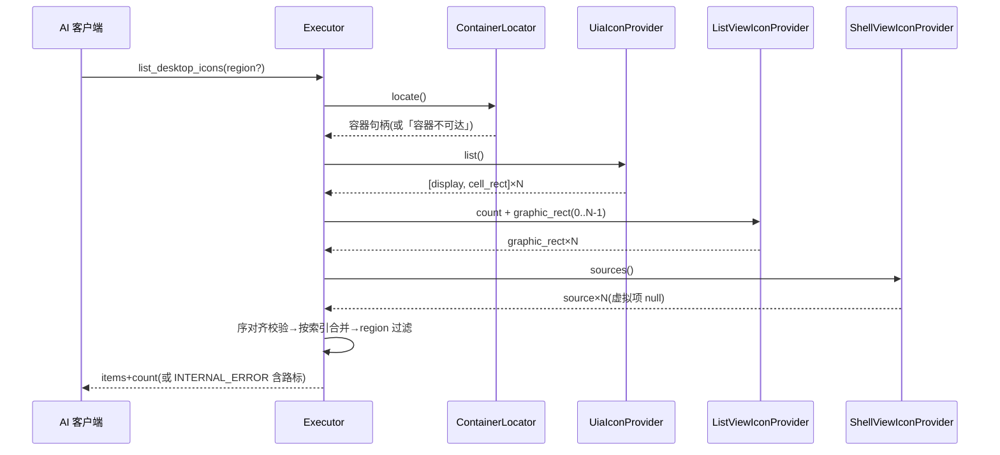
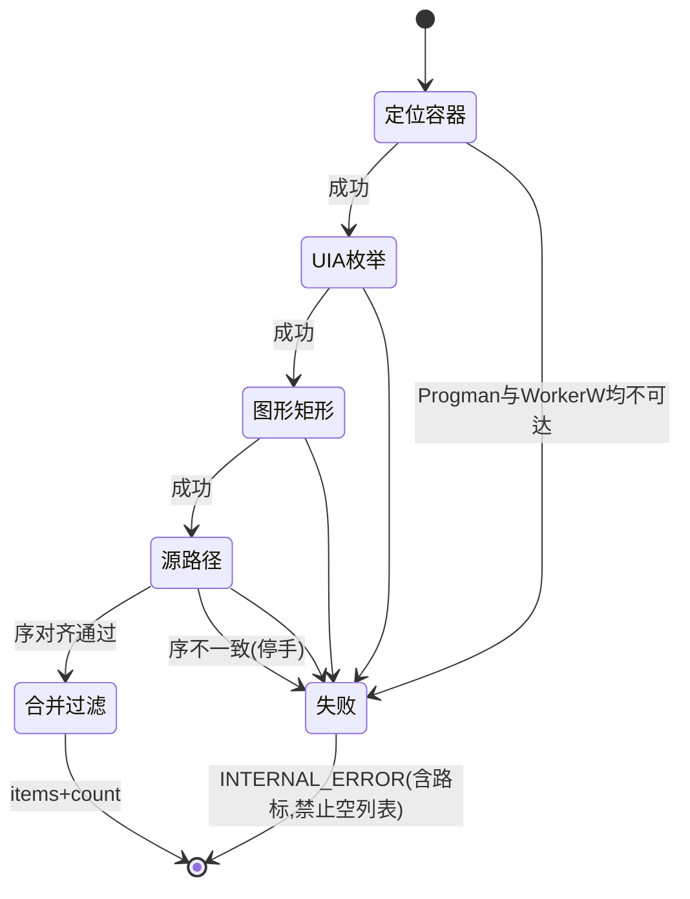
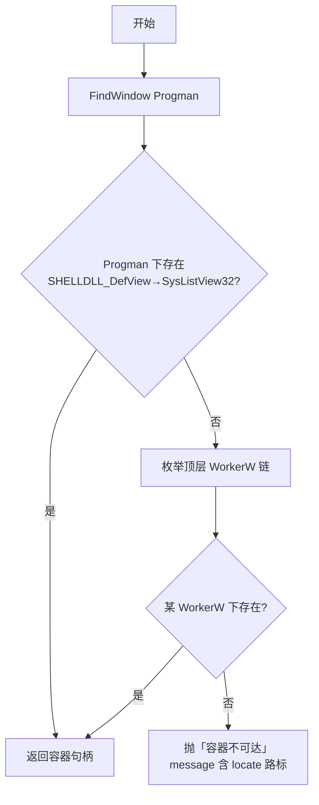
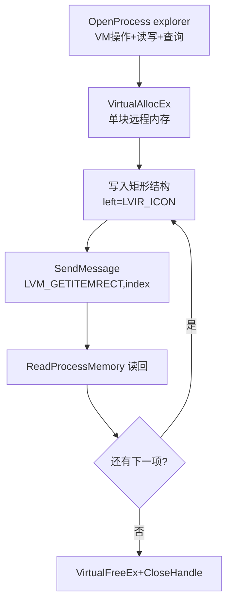
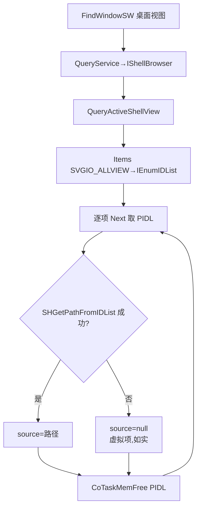
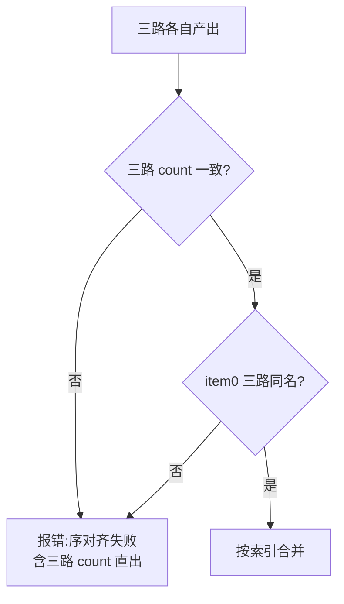
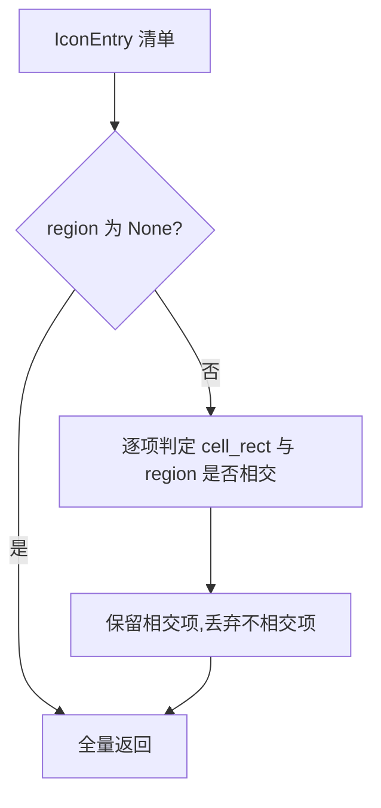

# REQ-002 桌面图标感知 —— 详细设计(IEEE 1016 全视图)

| 项 | 内容 |
|----|------|
| 文档 | REQ-002 详细设计 v0.1 |
| 上游 | [需求规格](REQ-002-桌面图标感知.md) v0.2、[功能设计](REQ-002-桌面图标感知-功能设计.md) v0.1、[决策记录](REQ-002-桌面图标感知-决策记录.md)(含侦察证据归档) |
| 标准 | IEEE 1016(软件设计描述)全视图:上下文/组成/逻辑/信息/接口/结构/交互/状态动态/算法/资源/错误语义 |
| 约束 | 本文档禁止代码与伪代码;算法以 mermaid+文字说明表达 |
| 状态 | 待评审 |

## 1. 设计上下文

### 1.1 设计标识

| 设计实体 | 标识 |
|---------|------|
| 新模块 | `deskpilot.executor.desktop_icons`(三路 provider+装配) |
| 扩展模块 | `deskpilot.executor.core`、`deskpilot.mcp_server`、`deskpilot.models`、`deskpilot.tools` |

### 1.2 设计驱动(继承)

感知归工具判断归 AI;fail-closed(取不到即显式报错,禁止空列表);
hwnd 易变(每次调用动态定位,禁止缓存);零新三方件(comtypes/ctypes 既有);
通用性(三 provider 各自可注入);序对齐假设 A-2(实现期校验)。

### 1.3 术语(增量)

| 术语 | 定义 |
|------|------|
| 容器 | 桌面图标列表所在的 SysListView32 控件(经 Progman 或 WorkerW 链可达) |
| 序对齐 | UIA 枚举序 == ListView 索引序 == IFolderView 枚举序(A-2) |
| 虚拟项 | 无文件系统路径的命名空间项(如回收站),source 如实为 null |

## 2. 组成视图

| 组成 | 职责(单一) | 协作方 |
|------|-----------|--------|
| ContainerLocator | 每次调用动态定位桌面容器(Progman 链,WorkerW 兜底) | 三 provider 共用 |
| UiaIconProvider | 经既有 UIA 元素通道产出 display+cell_rect | 元素源接缝(可注入) |
| ListViewIconProvider | 跨进程读图形矩形(LVIR_ICON) | 容器句柄、进程内存助手 |
| ShellViewIconProvider | COM 链产出 source(路径或 null) | comtypes、shell32 |
| DesktopIconAssembler | 序对齐校验、按索引合并、region 过滤、错误归约 | 三 provider、Executor |
| Executor.list_desktop_icons | 公开入口:编排+直调路径返回 | tools._L0_DIRECT |

## 3. 逻辑视图(契约级)

### 3.1 ContainerLocator

| 成员 | 语义 |
|------|------|
| `locate()` → 容器句柄 | Progman→SHELLDLL_DefView→SysListView32 逐级查找;失败则枚举 WorkerW 窗口链找其下 SHELLDLL_DefView/SysListView32;再失败→抛「容器不可达」 |
| 约束 | **禁止缓存**:每次调用现取(hwnd 易变实证) |

### 3.2 UiaIconProvider

| 成员 | 语义 |
|------|------|
| `list()` → [UiaItem] | 以容器句柄为根走既有元素通道,收集 ListControl「桌面」直下全部 ListItemControl |
| UiaItem 形态 | display=元素 name;cell_rect=元素 BoundingRectangle(虚拟桌面坐标) |

### 3.3 ListViewIconProvider

| 成员 | 语义 |
|------|------|
| `graphic_rect(index)` → rect | 跨进程消息:远程内存写入 LVIR_ICON 标记的矩形结构→发 LVM_GETITEMRECT→读回 |
| `count()` → int | LVM_GETITEMCOUNT |
| 进程内存助手 | 持有 explorer 进程句柄与单块远程内存(尺寸=max(矩形结构,LVITEM 结构)+文本余量),所有消息复用;**用完即释**(VirtualFreeEx+CloseHandle) |

### 3.4 ShellViewIconProvider

| 成员 | 语义 |
|------|------|
| `sources()` → [str\|null] | COM 链:IShellWindows.FindWindowSW(SWC_DESKTOP, INCLUDEPENDING)→IServiceProvider.QueryService(SID_STopLevelBrowser→IShellBrowser)→QueryActiveShellView→IFolderView→Items(SVGIO_ALLVIEW→IEnumIDList)→逐 PIDL 取路径;取不到路径的虚拟项→null |
| COM 线程纪律 | 每次调用在当前线程 CoInitialize/CoUninitialize 配对(HTTP 多线程处理面;对象不跨线程传递) |

### 3.5 DesktopIconAssembler

| 成员 | 语义 |
|------|------|
| `assemble(region=None)` → [IconEntry] | 序对齐校验→按索引合并三路→region 相交过滤→返回 |
| IconEntry 形态 | display、source(str\|null)、graphic_rect、cell_rect |

## 4. 信息视图

| 数据 | 来源 | 形态 | 说明 |
|------|------|------|------|
| display | UIA | str | 桌面显示名 |
| source | ShellView | str\|null | 文件路径;虚拟项 null(不编造) |
| graphic_rect | ListView | [l,t,r,b] | LVIR_ICON 矩形;抓点取中心 |
| cell_rect | UIA | [l,t,r,b] | 单元矩形;槽位核验 |
| 序对齐证据 | 三路 | item0 名称一致 | 实现期校验留痕 |

## 5. 接口视图(工具契约)

| 项 | 内容 |
|----|------|
| 工具名 | list_desktop_icons |
| 分级 | L0(直调,零写锁,不入绑定) |
| 参数 | region(可选,rect 四元数值;非法形态 INVALID_PARAMS) |
| 返回 | items=[{display, source, graphic_rect, cell_rect}];count |
| 前置 | 桌面容器可达 |
| 后置 | 无写副作用;无缓存状态残留 |
| region 语义 | 保留 cell_rect 与 region 相交的条目(物理事实裁剪) |
| 失败 | 容器不可达/任一路异常→INTERNAL_ERROR,message 含失败路标(locate/uia/listview/shellview);**禁止空列表假装成功** |
| 描述面 | ≤200 字、含领域限定词;明示与 screenshot ocr:true 的分工(图标矩形 vs 文字);明示 source 虚拟项为 null、栈叠各成一条 |

## 6. 结构视图

```
mcp_server._call(L0 直调)
  └─ tools._run_sensing ─ Executor.list_desktop_icons(region)
       └─ DesktopIconAssembler.assemble
            ├─ ContainerLocator.locate ──(失败→错,路标 locate)
            ├─ UiaIconProvider.list ──(失败→错,路标 uia)
            ├─ ListViewIconProvider.count/graphic_rect×N ──(失败→错,路标 listview)
            ├─ ShellViewIconProvider.sources ──(失败→错,路标 shellview)
            ├─ 序对齐校验(三路 count 一致 ∧ item0 同名;不一致→停手报错)
            ├─ 按索引合并 IconEntry×N
            └─ region?→ cell_rect 相交过滤
```

## 7. 交互视图



## 8. 状态动态视图

本工具为无状态只读调用:无持久状态机。单次调用的阶段状态(mermaid):



## 9. 算法视图

### 9.1 容器定位(mermaid+说明)



说明:WorkerW 分支兜底壁纸类应用托管场景(行业标准查找模式);
每次调用全量执行,禁止任何缓存(Progman hwnd 易变实证 131500→65896)。

### 9.2 跨进程图形矩形读取(mermaid+说明)



说明:远程内存**单块复用**全部 N 项(侦察实证本进程地址空间对
explorer 不可读,必须远程分配);获取-释放严格配对,任何一步失败
跳清理路径并报 listview 路标。

### 9.3 source 获取与虚拟项(mermaid)



### 9.4 序对齐校验(mermaid)



说明:仅校验"计数一致+首项同名"两项弱证据;更严格的逐名校验成本
与收益不成比例(侦察三路一致 30=30=30);若实现期发现序漂移,
停手上报,禁止静默错位合并(A-2)。

### 9.5 region 相交过滤(mermaid)



说明:相交=两矩形存在正面积重叠(边界相触不算);以 cell_rect 为准
(FD-04:图形在区内标签在区外的图标不被误判出界)。

## 10. 资源视图

| 资源 | 获取 | 释放 | 失败路径 |
|------|------|------|---------|
| explorer 进程句柄 | OpenProcess(跨进程路) | CloseHandle(finally) | 获取失败→报 listview 路标 |
| 远程内存 | VirtualAllocEx(单块复用) | VirtualFreeEx(finally) | 任一步失败先释后报 |
| PIDL | IEnumIDList.Next | CoTaskMemFree(逐项) | 路径取用后立即释,不累积 |
| COM 单元 | CoInitialize(调用线程) | CoUninitialize(调用末,配对) | 对象不跨线程;异常路径同样配对 |
| 容器句柄 | 系统 hwnd(非持有) | 无需释放(不 DuplicateHandle) | 每次调用现取,禁缓存 |

## 11. 错误语义(全表)

| 触发 | 码 | 行为 |
|------|----|------|
| region 形态非法 | INVALID_PARAMS | 零执行 |
| 容器不可达(Progman+WorkerW 均失败) | INTERNAL_ERROR | message 含 locate 路标;禁止空列表 |
| UIA 枚举异常 | INTERNAL_ERROR | 路标 uia |
| 跨进程打开/分配/读写失败 | INTERNAL_ERROR | 路标 listview;资源先释后报 |
| COM 链任一步失败 | INTERNAL_ERROR | 路标 shellview |
| 序对齐失败(count 不一致/首项不同名) | INTERNAL_ERROR | 含三路 count 直出,停手 |
| 虚拟项 source 为 null | 非错误 | 如实返回,schema 描述明示 |

## 12. 交叉面清单(SDD §2.1)

| 触及对象 | 其他写入者/读取者 | 覆盖 |
|---------|-----------------|------|
| TOOL_SCHEMAS(+1) | validate/_input_schema、描述质量测试 | 形态断言 |
| TOOL_LEVELS/_L0_DIRECT(+1) | L0 直调路径(零写锁) | 形态断言 |
| 预算面 | L0 默认 5s;三路实测亚秒级;超限走 ISS-0039 覆盖表再议 | 实现期实测留痕 |
| screenshot ocr:true(ISS-0037) | 互补不重叠(图标矩形 vs 文字) | 描述互相指引 |
| get_ui_tree | 复用 UIA 通道但独立定位,不动既有方法 | 无回归面 |
| UIA 元素源接缝 | 与 test_elements 打桩面同缝 | 单测可注入 |
| 审计 | L0 轻量记录(与既有感知类一致) | 既有模式 |

## 13. 测试设计输入

| 接缝 | 用途 |
|------|------|
| 三 provider 各自可注入 | 单元以替身断言合并/过滤/序对齐/报错归约(替身计数直出) |
| ContainerLocator 可注入 | 替身返回假句柄/抛异常,覆盖 WorkerW 与 fail-closed 分支 |
| region 相交纯函数 | 相交判定单元用例(直出) |
| 序对齐校验函数 | count 不一致/首项不同名两分支(直出) |
| 真机终验收(集成,--run-integration) | 本机桌面 30+ 图标(含栈叠列)清单返回,display/graphic_rect 与像素实测一致;栈叠各成一条;虚拟项 source=null |

## 14. 演进记录

| 版本 | 日期 | 内容 |
|------|------|------|
| v0.1 | 2026-09-08 | 详细设计成文(IEEE 1016 全视图;三路契约到方法级;mermaid 表达全部算法,零代码),待评审 |
