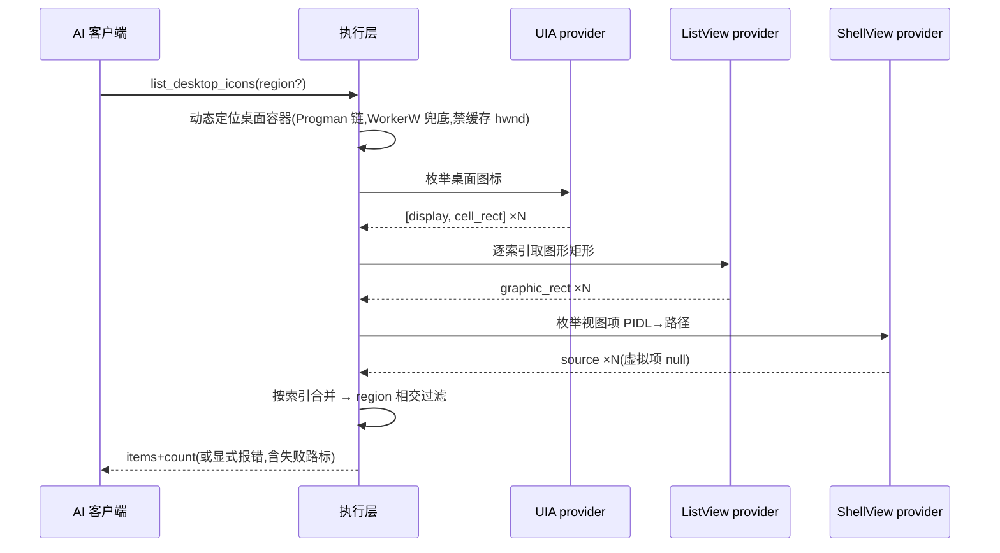
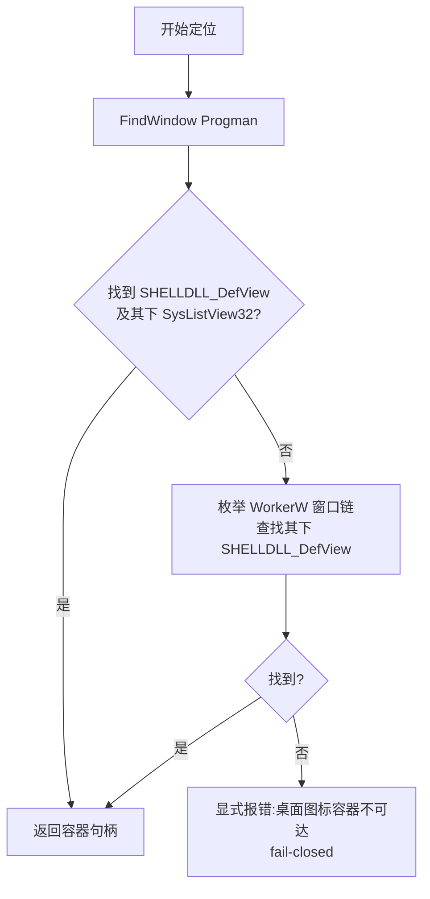

# REQ-002 桌面图标感知 —— 功能设计(IEEE 1016 轻量融合)

| 项 | 内容 |
|----|------|
| 文档 | REQ-002 功能设计 v0.1 |
| 上游 | [REQ-002-桌面图标感知.md](REQ-002-桌面图标感知.md)(需求规格 v0.2)、[决策记录](REQ-002-桌面图标感知-决策记录.md)(D-05~D-10+侦察证据归档)、[原始输入](REQ-002-桌面图标感知-原始输入.md) |
| 标准 | IEEE 1016(软件设计描述)轻量融合:组成/接口/信息/交互/错误语义 |
| 约束 | 本文档禁止代码与伪代码;算法以 mermaid+文字说明表达(sdfang 2026-09-08 规矩) |
| 状态 | 待评审 |

## 1. 设计立场(设计驱动因素)

| 驱动 | 来源 | 对设计的约束 |
|------|------|-------------|
| 感知归工具,判断归 AI | sdfang 裁定 | 只交付 display/source/双矩形事实,零判断零排序承诺 |
| fail-closed | 需求 ICONS-05 | 任一路失败=显式报错,禁止空列表/半截数据假装成功 |
| hwnd 易变(侦察实证) | 决策记录 D-10 | 每次调用动态定位桌面容器,禁止缓存窗口句柄 |
| 零新三方件 | 需求约束 | comtypes/ctypes 均为既有依赖 |
| 通用性优先 | 项目规矩 | 三路数据源各为可替换 provider,接缝可注入 |

## 2. 组成视图

| 模块 | 变更 | 职责 |
|------|------|------|
| executor/desktop_icons.py(新增) | 新建 | 桌面图标三路数据装配:容器定位、UIA 枚举、跨进程图形矩形、ShellView 源路径;三路 provider 各自独立可注入 |
| executor/core.py | 扩展 | list_desktop_icons(region=None) 公开入口:编排三路 provider、按序合并、region 过滤、错误归约 |
| mcp_server.py | 扩展 | TOOL_SCHEMAS 增 list_desktop_icons(L0 感知描述,含与 screenshot ocr:true 的分工说明) |
| models.py | 扩展 | TOOL_LEVELS 增 1 条 L0;不入 BINDING_REQUIRED_TOOLS(无需绑定) |
| tools/__init__.py | 扩展 | _L0_DIRECT 增 1 条,直调路径零写锁 |

三路 provider 职责(D-10 选型):

| provider | 数据 | 通道 | 侦察证据 |
|----------|------|------|---------|
| UIA provider | display、cell_rect | 桌面 UIA 树枚举(复用既有元素通道) | 一次调用全量 30 图标(2026-09-08 实测) |
| ListView provider | graphic_rect | 跨进程 LVM_GETITEMRECT(LVIR_ICON) | item0=[0,5,76,57](实测) |
| ShellView provider | source | IShellWindows→IServiceProvider→IShellBrowser→QueryActiveShellView→IFolderView→IEnumIDList→PIDL→路径 | …\Desktop\Visual Studio Code.lnk(实测);虚拟项(回收站)如实 null |

## 3. 接口视图(工具契约)

| 项 | 内容 |
|----|------|
| 工具名 | list_desktop_icons |
| 分级 | L0(只读,零副作用,不入绑定) |
| 参数 | region(可选,rect 四元组;默认全桌面) |
| 返回 | items(图标条目清单)、count(条数) |
| 条目形态 | display(显示名,与 OCR/视觉一致)、source(文件名/解析路径;虚拟项如实为 null)、graphic_rect(图形矩形,抓点用)、cell_rect(图形+标签单元矩形,核验用);全部矩形为虚拟桌面坐标系 |
| region 语义 | 保留 cell_rect 与 region 相交的条目(过滤是物理事实裁剪,非判断) |
| 失败语义 | 容器不可达/任一路异常 → 显式报错(含失败路标),禁止空列表 |

## 4. 信息视图

| 数据 | 来源路 | 说明 |
|------|--------|------|
| display | UIA | 桌面显示名(如「微信」「新建 文本文档.txt」) |
| source | ShellView | 文件系统路径(.lnk/真实文件);虚拟命名空间项(回收站)为 null——如实,不编造 |
| graphic_rect | ListView | 图标图形包围盒(LVIR_ICON);拖拽抓点取中心 |
| cell_rect | UIA | 图标单元包围盒;槽位核验与占用判断 |

**序对齐假设(A-2,实现期校验)**:三路枚举序一致(UIA 枚举序 == ListView
索引序 == IFolderView 枚举序)。侦察计数三路一致(30=30=30);实现期
P1 以"三路 item0 均为回收站"做口径校验留痕,不一致则停手上报,禁止
静默错位合并。

## 5. 交互视图

调用时序(mermaid):

容器定位逻辑(mermaid):

## 6. 错误语义

| 场景 | 错误码 | 行为 |
|------|--------|------|
| 桌面容器不可达(桌面被替换/锁定) | INTERNAL_ERROR | 显式报错,含定位阶段信息;禁止空列表 |
| UIA 枚举异常 | INTERNAL_ERROR | 错误信息标失败路=uia |
| 跨进程内存操作失败 | INTERNAL_ERROR | 错误信息标失败路=listview |
| ShellView 链异常 | INTERNAL_ERROR | 错误信息标失败路=shellview |
| region 参数形态非法 | INVALID_PARAMS | 既有校验链 |
| 虚拟项 source | 非错误 | 如实 null(回收站类命名空间项本就无文件路径) |

## 7. 交叉面清单(SDD §2.1)

| 触及对象 | 其他写入者/读取者 | 覆盖 |
|---------|-----------------|------|
| TOOL_SCHEMAS(+1) | validate/_list 描述面、描述质量测试(≤200字/领域词) | 形态断言 |
| TOOL_LEVELS/_L0_DIRECT | L0 直调路径(零写锁) | 形态断言 |
| 预算面 | L0 默认 5s;三路实测远低(亚秒级);超限走 ISS-0039 覆盖表再议 | 实现期实测留痕 |
| screenshot ocr:true(ISS-0037) | 互补不重叠:本工具给图标矩形,ocr:true 给文字 | 描述面互相指引 |
| get_ui_tree | 本工具复用其 UIA 通道但独立定位(不动既有方法) | 无回归面 |
| 审计 | L0 轻量记录(与既有感知类一致) | 既有模式 |

## 8. 测试设计输入(移交给测试设计的接缝)

| 接缝 | 用途 |
|------|------|
| 三 provider 各自可注入 | 单元测试以替身 provider 断言合并/过滤/报错归约(替身计数直出) |
| 容器定位函数可注入 | 替身返回假句柄/抛异常,覆盖 WorkerW 分支与 fail-closed 分支 |
| region 过滤纯函数 | 相交判定单元用例(直出) |
| 序对齐校验 | 实现期三路 item0=回收站 口径断言 |
| 真机终验收(集成) | 本机桌面 30+ 图标(含栈叠列)清单返回,名称/矩形与像素实测一致;栈叠图标各成一条(D-06) |

## 9. 设计决策(本层新增,非需求层决策)

| 编号 | 决策 | 理由 |
|------|------|------|
| FD-01 | 三路 provider 各自独立成可注入对象,不做单体大函数 | 侦察证明三路各自有独立失败面;独立 provider 使测试可按路替换,符合通用性与装配守门 |
| FD-02 | ~~合并键为枚举索引而非 display~~ **ISS-0054 推翻并改写:合并键=规范化 display 名归并键(小写去空白、剥 .lnk/.url);LVIR 图形矩形仍按索引(同视图同源,序天然一致)** | 原理由实机反转:枚举序分叉才是错位之源;同名错位风险由归并歧义 fail-closed(拒绝+改名指引)承接 |
| FD-03 | source 取不到路径的虚拟项如实 null,不回退显示名 | 「不编造」原则;schema 描述中明示 null 语义,AI 可预期 |
| FD-04 | region 过滤以 cell_rect 相交为准 | cell 是图标的完整占位;以 graphic 过滤会把"图形在区内、标签在区外"的图标判出界,失真 |

## 10. 演进记录

| 版本 | 日期 | 内容 |
|------|------|------|
| v0.1 | 2026-09-08 | 功能设计成文(IEEE 1016 轻量融合;mermaid 表达算法,零代码;D-10 选型随侦察证据落地,FD-01~04 本层决策),待评审 |
| v0.2 | 2026-09-17 | ISS-0077 回填:FD-02 按 ISS-0054 实装改写(按名归并+重名歧义 fail-closed);FD-01/03/04 不变 |
