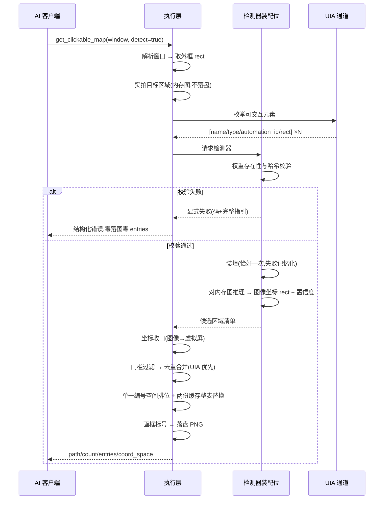
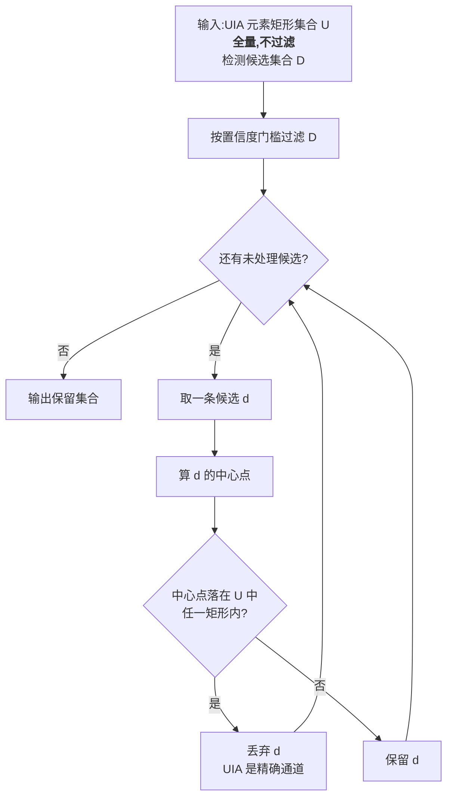
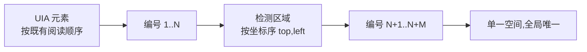
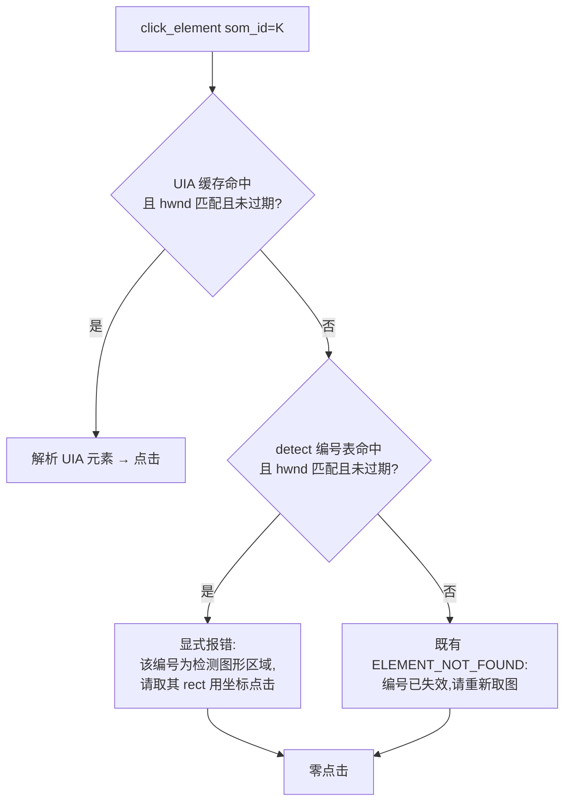

# REQ-003 GUI 图形检测与 SoM 扩面 —— 功能设计(IEEE 1016 轻量融合)

| 项 | 内容 |
|----|------|
| 文档 | REQ-003 功能设计 v0.3 |
| 上游 | [REQ-003-GUI图形检测与SoM扩面.md](REQ-003-GUI图形检测与SoM扩面.md)(需求规格 v0.2)、[决策记录](REQ-003-GUI图形检测与SoM扩面-决策记录.md)(D-11~D-18)、[原始输入](REQ-003-GUI图形检测与SoM扩面-原始输入.md) |
| 标准 | IEEE 1016(软件设计描述)轻量融合:设计立场/组成/接口/信息/交互/错误语义六视图 |
| 约束 | 本文档禁止代码与伪代码;算法以 mermaid+文字说明表达(sdfang 2026-09-08 规矩) |
| 现状 | 检测器**选型未终裁**(D-12 待 R-02/R-03 实测);本文档按 DET-06 设计成检测器无关形态,检测器派生数字留回填位 |
| 状态 | 待评审 |

## 1. 设计立场(设计驱动因素)

| 驱动 | 来源 | 对设计的约束 |
|------|------|-------------|
| 检测是 UIA 的补充,不是替代 | 需求 §1(证据链三条硬结论)+ RK-2 | UIA 优先原则贯穿:重叠时 UIA 胜、编号在前、`som_id` 只认 UIA |
| 权重不入包、运行时可选出 | D-11 + D-16 | 主包零权重;代码内**无任何下载器**;权重目录为唯一装配位 |
| 默认零变化 | D-15 + MOUSE-15 | `detect` 缺省时**不进入任何检测代码路径**,含不做权重校验(DET-04) |
| fail-closed,零静默降级 | DET-05 + 安全纪律 | 检测任一步失败=显式报错;**禁止**退回"仅 UIA 的图假装成功" |
| 两路点击分开 | D-14 | `som_id` 只解析 UIA;detect 编号误用须给**指引级**诊断,复用既有失效消息即为误导 |
| 检测器可替换 | DET-06 + 项目通用性原则 | 注册表 + 装配位注入;新增检测器**不改调用面** |
| 工具=物理层,判断归 AI | sdfang 裁定 | 只交付 rect + 置信度事实;不输出"这是按钮"类语义(DET-01 边界) |
| 只读 | DET-07 + GOV-02 | L0 分级不变,不新增审批路径;截图不出本机(远程推理已由 D-11 否决) |
| 已交付形态复用优先 | RK-3 | 懒加载/失败记忆化承 ISS-0008;per-tool 预算承 ISS-0039;目录锚定承 ISS-0010 |

## 2. 组成视图

| 模块 | 变更 | 职责 |
|------|------|------|
| `executor/detector.py`(新增) | 新建 | 检测器注册表(标识→工厂);权重目录解析纯函数;权重哈希清单出厂常量;存在性+哈希校验纯函数;检测结果坐标系收口(图像坐标→虚拟屏坐标) |
| `executor/core.py` | 扩展 | `get_clickable_map(window, detect=false)` 编排:懒装配检测器、吃内存图执行检测、去重合并、单一编号空间编排、两份编号缓存整表替换、`coord_space` 补齐;`_click_element` 增 detect 编号诊断分支 |
| `mcp_server.py` | 扩展 | `get_clickable_map` 增可选 `detect`(bool);描述补 `source` 语义与两路点击分野(≤200 字) |
| `models.py` | 扩展 | 分级**不变**(`get_clickable_map` 仍 L0,GOV-02);`TOOL_BUDGET_OVERRIDES` 增 `get_clickable_map` 条目(**数字待 R-04 回填**) |
| `tools/__init__.py` | 扩展 | L0 直调路径透传 `detect` |
| `main.py` | 扩展 | 装配 `detector_factory`(与既有 `_ocr_factory` 同处);**`weight_manifest` 不赋值**——保持出厂常量缺省(详设 §3.2/D-18) |
| 打包(`deskpilot.spec`) | **不动** | 权重不入包(D-11);推理后端已随既有依赖在树(`onnxruntime` 由 `rapidocr-onnxruntime` 带入),**本单不新增三方依赖** |

**检测器实现契约**(DET-06 的"替换"落地面,不含代码):

| 契约项 | 要求 |
|--------|------|
| 形态 | 可调用对象,由注册表按标识产出 |
| 输入 | 一张**已在内存**的截图(PIL 图像);不接受路径 |
| 输出 | 候选区域清单:每条为**图像坐标** rect + 置信度浮点(0~1) |
| 副作用 | **零**:不触目标窗口、不注入输入、不写盘、不联网(DET-07) |
| 状态 | 装填后无状态;多次调用结果可复现 |

**关键边界(如实记账)**:检测器**选型**不在本文档——D-12 由 R-02/R-03 实测终裁。
本文档按 DET-06 把选型隔离在注册表的一个条目内,选型变更**不改本设计的任何视图**。

## 3. 接口视图(工具契约)

### 3.1 `get_clickable_map`(扩展)

| 项 | 内容 |
|----|------|
| 分级 | L0(只读,零副作用,不入绑定)——**不变**,GOV-02 |
| 参数 | `window`(必填,既有);`detect`(可选,布尔,**默认 `false`**)——D-15 |
| 返回 | `path`、`count`、`entries`;**本单补 `coord_space`**(与 `get_ui_tree`/`screenshot` 对齐;现实现未输出该字段) |
| `detect=false` | 走既有路径,**零检测代码路径**(连权重校验都不做),返回结构与耗时与现状一致(DET-04/SOM-06) |
| `detect=true` | 执行检测并参与编号;检测任一步失败 → **显式报错,不落图、不返回 entries**(DET-05) |
| 编号语义 | **单一编号空间**,`id` 全局唯一(SOM-02);UIA 条目按既有阅读顺序在前,检测区域追加在后按坐标序;编号**仅在本次取图 + 60s 缓存窗内有效** |

### 3.2 条目形态(SOM-02)

统一键集,AI 侧无需分支取值:

| 键 | UIA 条目 | 检测区域条目 |
|----|---------|-------------|
| `id` | 整数,同一空间内唯一 | 同左 |
| `source` | `"uia"` | `"detect"` |
| `name` | 控件名 | **恒 `null`**(检测不产出语义——如实,不编造) |
| `control_type` | 控件类型 | **恒 `null`** |
| `automation_id` | AutomationId | **恒 `null`** |
| `rect` | 虚拟屏坐标 `[l,t,r,b]` | 同左(**已收口**,见 FD-03) |
| `confidence` | **恒 `null`** | 检测器给的置信度浮点 |

### 3.3 描述面(GOV-01,AI 友好)

`get_clickable_map` 描述须含:**用途**、`detect` 开关语义、`source` 两值、
**两路点击分野**(`source="detect"` 的编号**不可**传 `click_element` 的
`som_id`,须取其 `rect` 走坐标点击)。长度 ≤200 字、含领域限定词
(既有描述质量测试规则,现描述 89 字,余量 111 字)。

`click_element` 描述须补一句同向指引(现描述 183 字,余量 17 字——
**须先压既有冗余再补**,不得超限)。

## 4. 信息视图

| 数据 | 形态 | 生命周期 | 出处 |
|------|------|---------|------|
| 检测器注册表 | 标识 → 工厂 | 模块级常量,编译期固定 | `detector.py` |
| 权重哈希清单 | 标识 → {模型相对路径 → sha256} | **出厂只读常量**(不可用户改写——否则校验形同虚设) | `detector.py` |
| 权重目录 | 由锚定规矩产出的绝对路径 | 每次 `detect=true` 调用时解析(不吃配置) | FD-07 |
| 已装填检测器 | 单例 + 失败记忆串 | 进程内;首次使用时装填恰好一次,失败记忆化 | 承 ISS-0008 形态 |
| UIA 编号缓存 | `id` → hwnd/name/automation_id/过期时刻 | 进程内;**每次取图整表替换**;60s 过期 | FD-05 |
| detect 编号表 | `id` → hwnd/过期时刻(**无寻址信息**) | 进程内;**每次取图整表替换**;60s 过期 | FD-02 |
| 置信度门槛 | 检测器装配参数 | 随检测器装填固定 | FD-06 |

**坐标契约(FD-03 的落地点,A-5)**:检测器契约的进出都是**图像坐标**;
UIA 元素 rect 与响应体 rect 都是**虚拟屏坐标**。两者之间由
`detector.py` 的**单一转换点**平移(图像原点 → 虚拟屏原点),平移量即
`get_clickable_map` 截图时的区域左上角。去重判据(§5)**在虚拟屏坐标上做**。

> 本条是对侦察章程 §8.2 教训的正面回应:同一概念两种矩形格式并存必然
> 出错,且**混用不报错、静默给 0**——属静默降级。本设计把转换收在单点,
> 并作为测试设计的第一接缝(§9)。

## 5. 交互视图

### 5.1 `detect=true` 主链(时序)

### 5.2 去重合并算法(SOM-05)

口径按 §4.2 设计默认:**检测框中心点是否落在某 UIA 元素矩形内**,
落入即去重(该检测区域不进编号空间)。判据为**纯函数**,单点收口(FD-04)。

判据集合 U 取 **UIA 枚举全量**(不做 `enabled`/非零面积过滤),而**编号空间**仍按 §5.3
只收过滤后那批;故 U ⊋ 编号集合。二者的关系是"**凡 UIA 枚举到的矩形,检测不在其上编号**",
检测通道于是成为**纯增量**(只覆盖 UIA 从枚举层面看不见的地方)。详细设计 §3.6 记有取全量的
五条理由与代价认账。

### 5.3 编号空间排位

UIA 部分**完全沿用既有排序**,检测部分追加——这保证 `detect=false`
时编号与现状逐位一致(SOM-06 回归面的设计前提)。

### 5.4 `_click_element` 的 som_id 诊断分支(SOM-04)

> 这个分支是 D-14"诊断性要求"的落地点。既有失效消息("请重新调用
> get_clickable_map 取图")对 detect 编号是**误导**——重取图后同一个
> 编号仍是 detect 编号,AI 会陷入循环。故 detect 编号必须**另表登记**
> (只记 hwnd 与过期时刻,不记寻址信息,因为它本就不可寻址)。

## 6. 错误语义

| 场景 | 错误码 | 行为 |
|------|--------|------|
| `detect` 非布尔 | INVALID_PARAMS | 既有校验链(`bool` 严格判定,ISS-0037 B) |
| 检测器未装配 / 权重缺失 | **DETECTOR_UNAVAILABLE**(推荐案,见下) | 报错含:权重目录绝对路径、期望文件清单与 sha256、获取步骤;零落图零 entries |
| 权重存在但哈希不符 | 同上 | 报错含:实际 sha256 vs 期望 sha256、目录路径;"文件被改动或版本不符"的下一步 |
| 检测器装填失败(后端缺失/模型非法) | 同上 | 报错含:失败原文(承 ISS-0027 回显形态) |
| 推理异常或超时 | 同上 | 报错含:失败原文;**零静默降级**(不得返回仅 UIA 的图) |
| `detect=false` 且检测器未装配 | **非错误** | 不进入检测路径,不做校验——DET-04 的"默认零变化" |
| `som_id` 指向 detect 编号 | **ELEMENT_UNSUPPORTED**(推荐案,见下) | 报错含:该编号 `source="detect"`、请取其 `rect` 用 `click`;**零点击** |
| `som_id` 已过期/跨窗/不存在 | 既有 ELEMENT_NOT_FOUND | 既有行为不变 |

**错误码选型两案(本层推荐,评审可推翻)**:

| 案 | 选型 | 理由 | 代价 |
|----|------|------|------|
| **推荐** | 新增 `DETECTOR_UNAVAILABLE` 一码;三情形(缺失/不符/装填失败)由 message 区分;`som_id` 误用复用既有 `ELEMENT_UNSUPPORTED` | ①缺权重是**配置缺口**不是"服务内部异常",`INTERNAL_ERROR` 语义不符;②三情形 AI 侧处置动作同为"转告人类去放权重",一码足够,不必三码;③`ELEMENT_UNSUPPORTED` 既有形态就是"报此码+指引另一条路"(`core.py` 设值不支持→引导 `type_text`),本处同构 | 新增 1 码进登记册,**触及 ISS-0074 的漂移面**——本单加码时须按 ISS-0074 口径同步登记详细设计附录 A |
| 备选 | 全部复用 `INTERNAL_ERROR` | 零新增码,不动登记册 | 语义不符(缺权重非内部异常);AI 无法把"人类该动手"与"服务坏了"区分开,削弱 GOV-04 的可自愈性 |

**fail-closed 边界(如实记账)**:`detect=true` 时**不设**"检测失败退回纯 UIA"
的降级路径——任何此类路径都是静默降级,纪律禁止。检测在流程中位于
**落图之前**,故失败时天然零残留文件。

## 7. 交叉面清单(SDD §2.1)

| 触及对象 | 其他写入者/读取者 | 覆盖 |
|---------|-----------------|------|
| `TOOL_SCHEMAS["get_clickable_map"]` | `validate_call` 形态断言、`list_tools` 输出、描述质量测试(≤200字/领域词/组合引导) | 形态断言 + 既有描述用例 |
| `click_element` 描述 | 描述质量测试(**余量仅 17 字**,须先压冗余) | 形态断言 |
| `TOOL_BUDGET_OVERRIDES` | `resolve_budget` 单源消费面、`test_budget_iss24`、`test_ocrbudget_iss39`(断言 `find_window` 仍 5.0)、`test_timeoutchain_iss33` | 新增用例 + 既有回归 |
| `_som_cache` 语义(**整表替换**) | `tests/test_m3.py` 全组(过期/跨窗/命中/空窗 5 条)、`test_clicktarget_iss44`(som_id 与 control_type 互斥) | **既有用例须复核**:整表替换不改这 5 条的成因(它们靠时钟推进或跨窗,不靠残留),但须逐条确认 |
| `errors.py` + 详细设计附录 A | ISS-0074 的漂移治理面 | 本单加码时按 ISS-0074 口径登记 |
| 执行层装配 | `main.py` 接线、`conftest.py` 构造替身、测试注入替身检测器**与替身权重清单** | 装配守门(替身经**公开装配位**注入:`detector_factory` / `weight_manifest`,详设 §3.2/§3.7;生产两处均不赋值) |
| 依赖与打包 | `pyproject.toml`(**无变更**)、`deskpilot.spec`(**无变更**) | 形态断言:主包不含权重文件 |
| 审计面 | L0 轻量记录(既有 `_light_audit`) | 无需新增事件 |
| `screenshot(ocr:true)` | 互补不重叠:本工具给图形 rect 与编号,OCR 给文字 | 描述面互相指引 |
| `get_ui_tree` | 共用 UIA 通道,不涉本单改动 | 无回归面 |
| REQ-004"画布占位感知" | 依赖本单 rect 输出,不依赖 detect 编号可点 | 依赖点已在两单互指 |

## 8. 测试设计输入(移交给测试设计的接缝)

| 接缝 | 用途 |
|------|------|
| **坐标转换纯函数** | 图像坐标→虚拟屏坐标直出断言;含"截图原点非零"用例(承章程 §8.2 静默 0 教训) |
| **去重判据纯函数** | 中心点落入/不落入/边界/多矩形重叠 直出断言 |
| **检测器装配位可注入** | 替身检测器(定长候选清单)注入,断言合并/编号/门槛过滤,替身调用计数直出——DET-06 的"调用面不变"由此证 |
| **权重校验纯函数** | 目录缺失/文件缺失/哈希不符/哈希相符 四分支直出断言 |
| **权重目录解析纯函数** | 冻结形态与源码形态两锚定分支(与 `resolve_audit_dir` 同规矩) |
| **两份编号缓存** | 整表替换断言(先取 N 条,再取 M<N 条,旧编号必失效);detect 编号误用 → 指引级错误且零点击 |
| **时钟注入** | 60s 过期(既有 FakeClock 模式) |
| **主包形态** | `detect=false` 时替身检测器**零调用**(计数直出)——DET-04 零变化的最强证据 |

用例基线:验证矩阵 REQ-003 §5 的 17 行(DET-01~07 / SOM-01~06 / GOV-01~04)
逐行对应用例;SOM-06 为回归面(既有 SoM 用例零修改全绿)。

## 9. 设计决策(本层新增,非需求层决策)

| 编号 | 决策 | 理由 |
|------|------|------|
| FD-01 | 检测器经执行层**公开装配位**注入 + 懒装填 + 失败记忆化,与 `ocr_factory` 同构 | 该形态已被 ISS-0008/0039 验证一轮;复用已收敛模式而非另造;公开属性是测试注入面,不必绕过公开入口 |
| FD-02 | detect 编号**不进 UIA 寻址缓存**,单列一张**只记 hwnd 与过期时刻**的诊断表 | D-14 要求误用给指引级诊断;而既有失效消息会诱导 AI 循环重取图。只记非寻址信息,物理上保证"静默代点"不可能发生 |
| FD-03 | 检测器契约进出均为**图像坐标**;图像→虚拟屏的平移**单点收口**;去重判据在虚拟屏坐标上做 | A-5 的落地;章程 §8.2 实测教训:两种矩形格式混用**不报错、静默给 0**。收在单点后可测、可证伪 |
| FD-04 | 去重判据为**纯函数**(输入两组矩形,输出保留集合),实现 §4.2 设计默认的中心点口径 | 纯函数可单测、可解释、可复现;把"评审可推翻"的口径做成可替换的单点,推翻时不牵动编排逻辑 |
| FD-05 | 两份编号缓存**每次取图整表替换**(非逐键覆盖) | 既有实现逐键覆盖,当本次条目少于上次时旧编号残留→AI 持旧编号可命中漂移目标,属**静默降级**。该缺陷在纯 UIA 空间已潜在存在,本单引入 detect 后(条目数每次都变)放大为**必然触发**,故属本单自身引入面,在本单处置(§7 已列既有用例复核面) |
| FD-06 | 置信度门槛是**检测器装配参数**,不进 `policy.yml` | 不同检测器的置信度量纲不同,0.5 在两模型上含义不同;放进全局策略文件会诱导"一套数字通吃"的错。需求 §4.2 只要求"配置项而非硬编码",装配参数即满足 |
| FD-07 | 权重目录锚定规矩与 `resolve_audit_dir` **同构但基准独立**(不吃 `audit_dir` 配置);哈希清单为**代码内出厂只读常量** | ①现无通用用户数据目录,锚定规矩是既有唯一先例(ISS-0010);②权重不跟可配置的审计路径跑——审计目录可指到任意绝对路径,权重跟过去会让"约定位置"失去约定性;③清单若可被用户改写,哈希校验形同虚设,故必须出厂只读 |
| FD-08 | 预算按**工具名**登记进既有覆盖表(承 D-15);**不引入**按参数分档预算的新机制;不设检测器级独立超时 | ①D-15 已明示"同一登记表、同一链路";按参数分档要改 `resolve_budget` 签名及全部消费面,超本单范围;②只读工具超时**无副作用**,不存在"报错但动作已执行"式撒谎,外层 per-tool 预算即唯一时限——不发明不必要机制。**已知边界**:`detect=false` 的调用也拿到同一预算上限(预算是上限非耗时,不影响零变化承诺,但削弱其可观测性,如实记账) |
| FD-09 | 条目键集**统一**,取不到的值如实 `null`(不省略键) | AI 侧取值无需分支;承 REQ-002 FD-03"不编造"原则。检测区域不产出语义标签(DET-01 边界),`name`/`control_type`/`automation_id` 恒 `null` 即如实 |

## 10. 演进记录

| 版本 | 日期 | 内容 |
|------|------|------|
| v0.1 | 2026-09-12 | 功能设计成文(IEEE 1016 轻量融合:设计立场/组成/接口/信息/交互/错误语义六视图;mermaid 表达算法,零代码;FD-01~09 本层决策)。**检测器选型不在本文档**——D-12 待 R-02/R-03,本文档按 DET-06 设计成检测器无关形态,检测器派生数字(预算值/A-3 精度论证)留回填位。待评审 |
| v0.2 | 2026-09-12 | **§5.2 去重合并的判据集合口径钉为「UIA 枚举全量」(sdfang 裁定)**:§5.2 原文只写「某 UIA 元素矩形」,未定该集合是否经 `enabled`/非零面积过滤——此口径直接决定检测通道的覆盖范围,故在详设 §3.6 记清后回钉本层。**取全量**:判据集合 U ⊋ 编号集合;编号空间仍按 §5.3 只收过滤后那批。五条理由(SOM-05 字面即此 / 检测通道为纯增量、不与平台裁决矛盾 / `enabled` 是零成本精度判词,应当用于过滤 39.5% 天花板的检测输出 / 键集冻结七键使"落在禁用控件上的检测框"对 AI **不可学习**,而 `click_element` 点到死目标仍报成功=静默假成功 / 全量取同一条摘要流,无第二处过滤可漂移)与代价认账(「UIA 误报 `enabled=False` 但像素可点」的目标取不到编号——等价于现状,非本单新增损失,且未实测不预设)见详设 §3.6 |
| v0.3 | 2026-09-12 | **随详设 v0.4 的 D-18 同步(权重清单增设公开装配位)**：①§2 组成表 `main.py` 行的装配动作补明——只装 `detector_factory`,**`weight_manifest` 不赋值**,保持出厂常量缺省;②§7 交叉面「执行层装配」行补明替身**两类**(检测器 + 权重清单)、两处均经**公开装配位**注入,生产均不赋值。**本层为何要改**:§2 的装配动作是详设 §6 结构视图与 §7 交叉面的上游,§8 移交的接缝清单也直接引用它们,若只改详设,本层与移交面的表述会对不上;③**两处均为文档面同步,零行为变更**——不涉接口、信息、交互与错误语义四个视图的任何取值。D-18 的实质(为什么增设、为什么不是安全面放宽)在详设 §3.2 与决策记录 D-18 行,本层只回钉**装配动作的清单**,不重复论证 |
