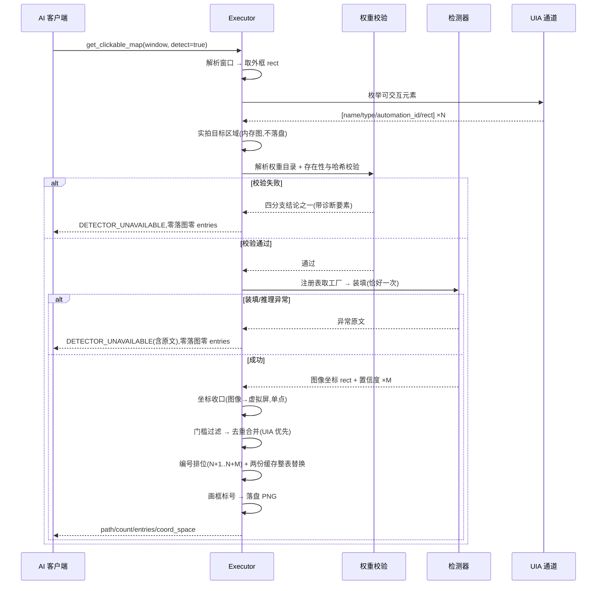
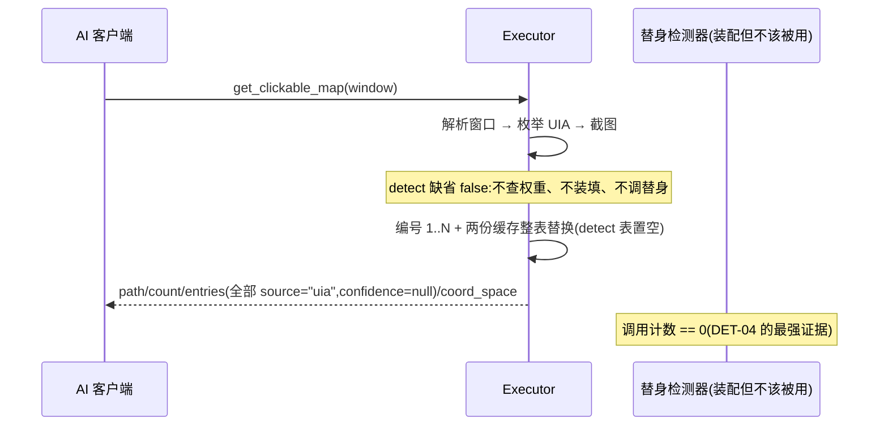
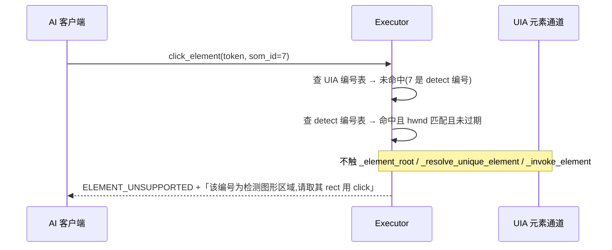
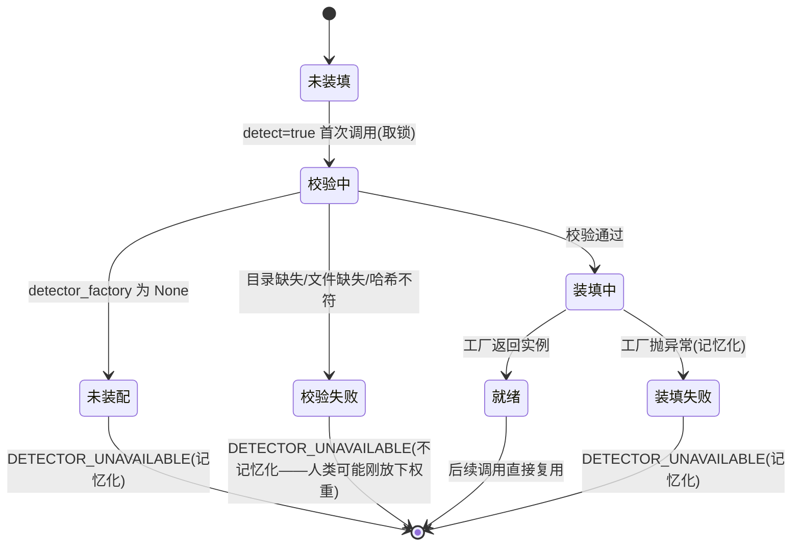
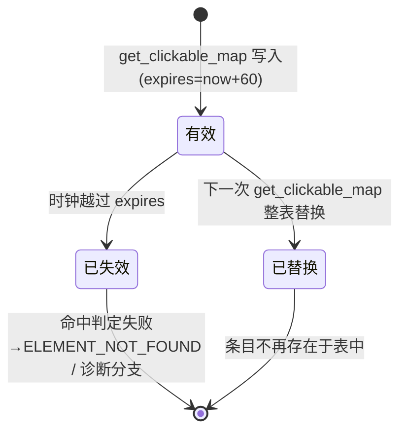
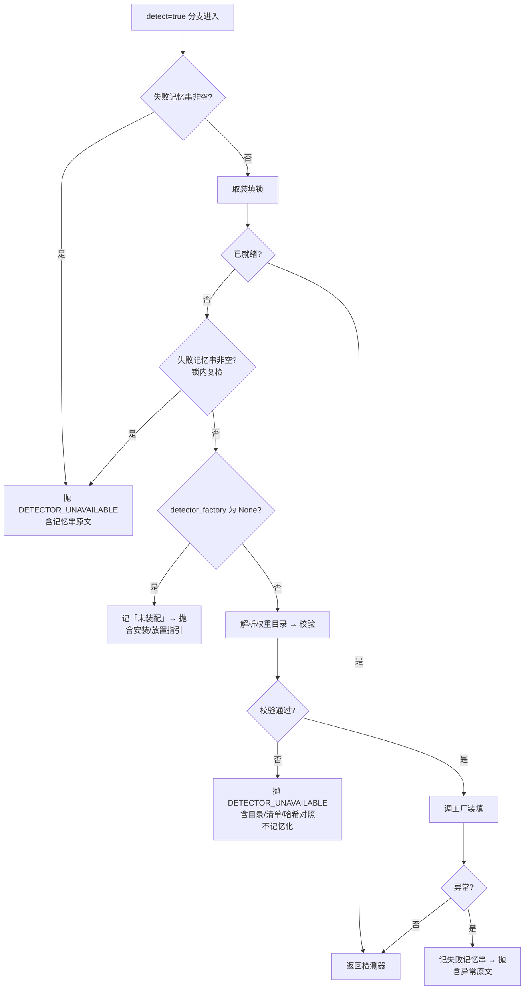
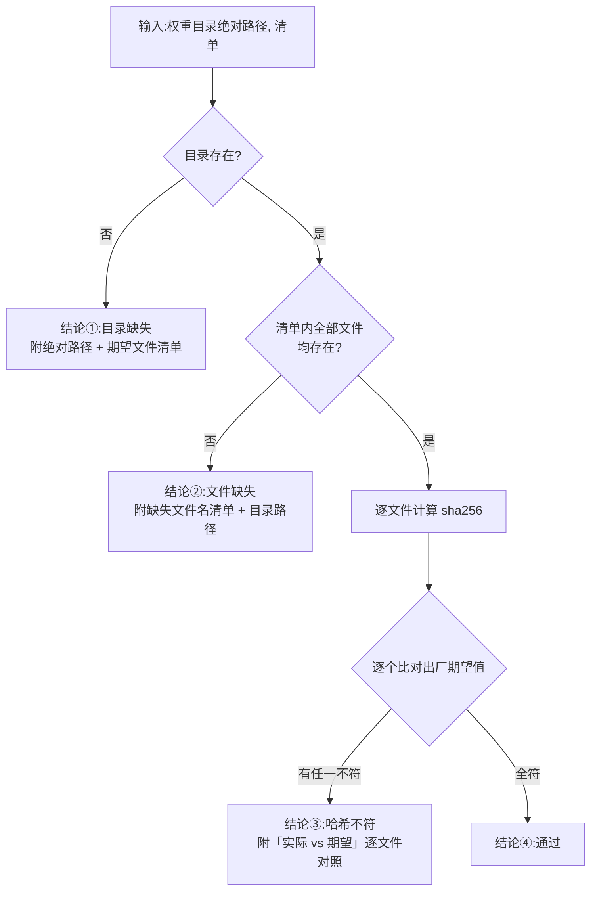
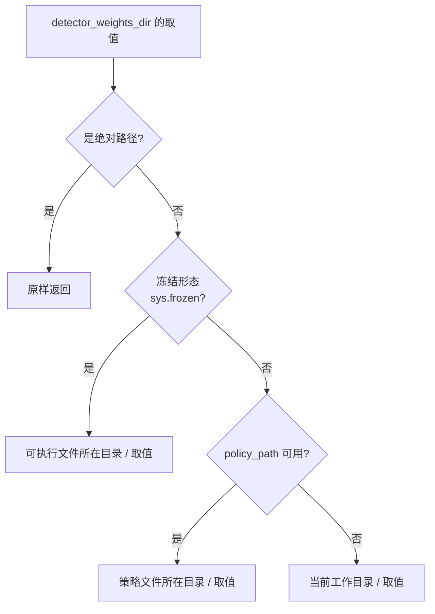
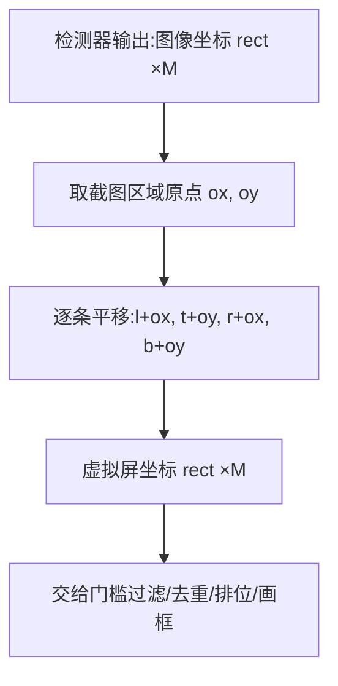
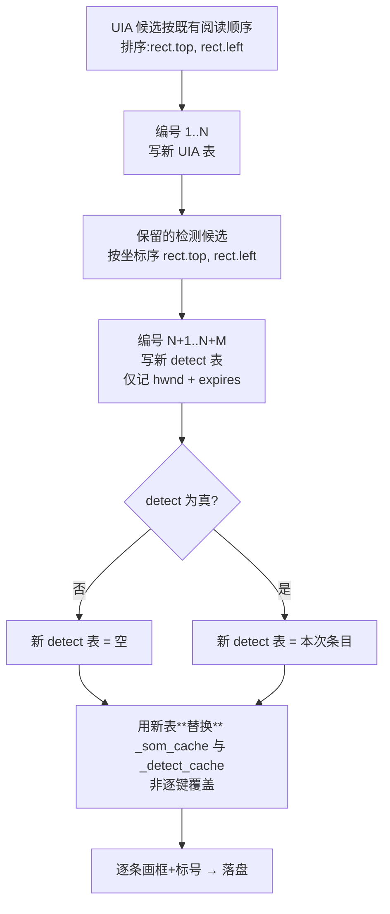

# REQ-003 GUI 图形检测与 SoM 扩面 —— 详细设计(IEEE 1016 全视图)

| 项 | 内容 |
|----|------|
| 文档 | REQ-003 详细设计 v0.4 |
| 上游 | [需求规格](REQ-003-GUI图形检测与SoM扩面.md) v0.2、[功能设计](REQ-003-GUI图形检测与SoM扩面-功能设计.md) v0.2、[决策记录](REQ-003-GUI图形检测与SoM扩面-决策记录.md)(D-11~D-18) |
| 标准 | IEEE 1016(软件设计描述)全视图:上下文/组成/逻辑/信息/接口/结构/交互/状态动态/算法/资源/错误语义 |
| 约束 | 本文档禁止代码与伪代码;算法以 mermaid+文字说明表达 |
| 现状 | **D-12 已终裁**(2026-09-15:CV 单线出货,标识 `cv-contour`,零权重);**R-04 已实测**(装填≈0ms,稳态 ~18ms@1920×1080)。历史:【回填】标记的待裁/待实测项已全部落定,演进记录 v0.5 收口 |
| 状态 | 待评审 |

## 1. 设计上下文

### 1.1 设计标识

| 设计实体 | 标识 |
|---------|------|
| 新模块 | `deskpilot.executor.detector`(检测器注册表 + 权重目录解析 + 权重校验 + 坐标收口 + 去重判据) |
| 扩展模块 | `deskpilot.executor.core`、`deskpilot.mcp_server`、`deskpilot.models`、`deskpilot.tools`、`deskpilot.main` |
| 不动的模块 | `deskpilot.spec` **本单零改动**;`pyproject.toml`(**本单零新三方依赖**)。注:spec 内的 `collect_data_files('rapidocr_onnxruntime')`(既有,`deskpilot.spec:13`)会带入 OCR 后端自带的 3 个 ONNX,那是**既有**打包产物;本单新增的检测权重**另走用户数据区**,与主包无关 |

### 1.2 设计驱动(继承,不重复论证)

UIA 优先(检测是补充不是替代);权重不入包 + 人类显式获取放置(D-16 口径,D-11 措辞已统一);**默认零变化**
(`detect` 缺省时不进任何检测代码路径);fail-closed 零静默降级;两路点击
分开(`som_id` 只认 UIA);检测器可替换(注册表 + 装配位);
工具=物理层判断归 AI(只交付 rect+置信度,不产出语义);
只读(L0 不变,无新审批路径,截图不出本机)。

### 1.3 术语(增量)

| 术语 | 定义 |
|------|------|
| 检测器标识 | 注册表键,字符串;调用面只认标识,不认模型名 |
| 权重目录 | 权重文件放在用户数据区下的绝对路径,由锚定规矩产出(§9.3) |
| 权重清单 | 检测器标识 → {模型相对路径 → sha256};**出厂常量为缺省**,经装配位可替(§3.2,D-18) |
| 收口点 | `detector.py` 内把图像坐标 rect 平移为虚拟屏 rect 的**唯一**位置 |
| UIA 编号表 | 既有 `_som_cache`,编号 → 寻址信息(可点) |
| detect 编号表 | 新增,编号 → {hwnd, 过期时刻};**不含寻址信息**(物理上不可点) |
| 覆盖度 | 单位面积内检测候选的密集程度——§9.5 说明中提到的门槛调节依据,本设计不引入该参数,如实记账为已知边界 |

## 2. 组成视图

| 组成 | 职责(单一) | 协作方 |
|------|-----------|--------|
| DetectorRegistry | 标识 → 工厂 的只读映射;标识非法即报错 | Executor(经装配位)、WeightManifest |
| WeightDirResolver | 纯函数:由锚定规矩算出权重目录绝对路径 | Executor |
| WeightVerifier | 纯函数:校验权重目录下清单内文件的存在性与 sha256;产出四分支结论 | Executor、WeightManifest |
| WeightManifest | 标识 → 文件清单 → sha256;**出厂常量为缺省**,经装配位可替(§3.2,D-18) | WeightVerifier、测试替身注入 |
| CoordCloser | 纯函数:图像坐标 rect → 虚拟屏坐标 rect(平移量=截图区域左上角) | Executor |
| Deduper | 纯函数:检测候选 + UIA 矩形集合 → 保留集合(中心点口径) | Executor |
| Executor.get_clickable_map | 公开入口:编排懒装填、内存图检测、坐标收口、门槛过滤、去重、编号排位、两份编号缓存整表替换、落图 | 上述全部、`_capture`、`_probe` |
| Executor._click_element | 既有公开入口的**诊断分支扩展**:som_id 未命中 UIA 表时查 detect 编号表给指引 | UIA 编号表、detect 编号表 |
| TOOL_SCHEMAS | `get_clickable_map` 增可选 `detect`(bool)+描述扩写;`click_element` 描述补同向指引 | validate_call / `_input_schema` / 描述质量测试 |
| TOOL_BUDGET_OVERRIDES | 增 `get_clickable_map` 条目(R-04 已实测回填:5.0 与 L0 同值,实测确认) | `resolve_budget`(单源消费) |
| main 装配位 | `detector_factory` 与既有 `ocr_factory` 同处赋值;`weight_manifest` 缺省即出厂常量(生产不赋值) | Executor、测试替身注入 |

> **D-18(本单)**:权重清单**增设与 `detector_factory` 平行的公开装配位**
> `weight_manifest`,缺省 = 出厂常量。动因见 §3.2「为什么增设装配位」——
> 没有它,任何 `detect=true` 的**成功**路径都不可测:校验先于工厂(§9.1),
> 替身工厂照样撞真清单。它**不是**安全面放宽:缺省值钉在出厂常量上,
> 校验本体(§3.4 `verify`)与编排(§9.1 流程)**一字未改**。

**检测器实现契约**(DET-06 的落地面,不含代码):

| 契约项 | 要求 |
|--------|------|
| 形态 | 可调用对象,由注册表按标识产出 |
| 输入 | 一张**已在内存**的 PIL 图像(PIL.Image);**不接受路径** |
| 输出 | 候选区域清单:`list[dict]`,每条**恰两键**——`{"rect": [l,t,r,b], "confidence": float}`。`rect` 四元整型/浮点,为**图像坐标**;`confidence` 取值域 `0.0 ~ 1.0` |
| 输出**不含** `id` | 检测器**不产出**编号——编号是 Executor 侧按坐标序排位的结果(§9.6)。检测器给 `id` 会把编号权下放,与 §2「输出顺序不承诺」和 D-13「单一编号空间由 `get_clickable_map` 编排」冲突 |
| 无序性 | 输出顺序**不承诺**——排位由 Executor 侧按坐标序决定,不依赖检测器顺序 |
| 副作用 | **零**:不触目标窗口、不注入输入、不写盘、不联网(DET-07) |
| 状态 | 装填后无状态;多次调用结果可复现(同图同输出) |
| 异常 | 抛异常即失败,由 Executor 归约为结构化错误;**禁止**返回空清单表示失败(DET-05) |

**关键边界(如实记账)**:检测器**选型**不在本文档——D-12 由 R-02/R-03 实测
终裁。出厂注册表**条目数 ≥1** 且形态由此契约固定;新增检测器=注册表加一条
+ 清单加一段,**不改本文档任何视图**(DET-06 的可证伪表述)。

## 3. 逻辑视图(契约级)

### 3.1 DetectorRegistry

| 成员 | 语义 |
|------|------|
| `names()` → [标识] | 已注册标识清单(只读,出厂固定) |
| `build(标识)` → 检测器 | 标识不存在 → 抛「未知检测器标识」;存在 → 调工厂;工厂内异常原样上抛由调用方归约 |
| 约束 | 模块级常量,**无运行期改写入口**;新增检测器=改常量,不加分支 |

### 3.2 WeightManifest

| 成员 | 语义 |
|------|------|
| `files(标识)` → {相对路径 → sha256} | 该检测器所需的全部权重文件及其出厂期望哈希 |
| 约束 | 模块级常量为主体:**不读配置、不读环境、无写入入口**。若可被用户改写,校验形同虚设(FD-07)。清单**经装配位可替**(下表),但缺省值即本常量,生产装配(§6 `main 装配期`)**不赋值**——无用户或配置侧改写路径 |
| 装配位 `Executor.weight_manifest` | 与 `detector_factory`(§3.7)**平行**的同处装配属性;缺省 = 出厂常量;供测试注入替身清单、供日后 D-12 终裁后换出厂常量 |

**为什么增设装配位(D-18,sdfang 2026-09-12 裁定)**:

原钉法(清单=出厂只读常量、**无任何运行期改写入口**)与 §9.1 的
「**校验在工厂之前**」两条合起来,使 `detect=true` 的**成功**路径不可测:
测试即使经 §3.7 的公开装配位注入替身工厂,**执行序仍是真 `verify()`
先跑** → 真清单要求的权重文件不存在 → `J{校验通过?}=否` →
`K[抛 DETECTOR_UNAVAILABLE]`,替身永不触达。而真清单的内容由
**D-12**(待 R-02/R-03/R-04)终裁,当下不存在——于是
**TC-DET-01/05a/05b/07/08、TC-SOM-01~09、TC-CACHE-01/03/05 在 P3 无法转绿**,
与测试设计 §5「**无放宽**」直接冲突。该冲突不是"验收值待填",
是"整条链路不可达",故须在设计面解决而非等实测。

**为什么这不是安全面放宽**:

| 攻击面 | 结论 |
|--------|------|
| 用户/外部可否改写清单? | **否**。装配位是 Executor 的 Python 属性,与 `policy.yml`/环境变量**均不相通**(FD-07 的「不读配置、不读环境」未动);缺省即出厂常量,生产装配不赋值 |
| 校验本体是否被削弱? | **否**。§3.4 `verify()` 与 §9.1 流程**一字未改**;校验仍**先于**工厂,失败仍不记忆化、仍显式报错 |
| 供应链入口? | **无新增**。代码内仍**无任何下载器**(D-16);测试注入的替身清单是测试内构造的内存数据 |

即:变的只是"这份常量由谁供给",而**出厂常量仍是唯一缺省**。
与 §9.1 为锁内复检背书的理由同构(「与 `_ensure_ocr_engine` 同构,
**非新增机制**」)——本装配位与既有 `ocr_factory`/`_element_source`/
`_shot_fn` 四个装配位**形态相同**。

### 3.3 WeightDirResolver

| 成员 | 语义 |
|------|------|
| `resolve(configured, policy_path=None)` → `Path` | 绝对路径原样;冻结形态锚定到可执行文件所在目录;源码形态锚定到策略文件所在目录;两者皆无锚定当前工作目录(**与 `resolve_audit_dir` 同规矩、同签名、同分支顺序**) |
| 形参名 | `configured`(策略文件里的权重目录取值,`str`)、`policy_path`(`str \| None`,缺省 `None`)。与 `audit_paths.py:13 resolve_audit_dir(configured, policy_path=None)` **逐位同名同型同缺省**——`policy_path` 由 `main._find_policy_path()` 在装配期传入(与 `audit_dir` 的接线同一处) |
| 配置键名 | `policy.yml` **顶层键 `detector_weights_dir`**(实测该文件为扁平顶层键无分节,`audit_dir:` 即同级先例)。**可选键**:取用走 `data.get(key, "./detector_weights")`,**不进** `_REQUIRED_SECTIONS`(`policy.py:26` 现有五项不动)——既有策略文件零修改即可启动。形参 `configured` 取的就是该键的值,**不读** `audit_dir` |
| 独立性 | **不吃** `audit_dir` 配置:审计目录可指向任意绝对路径,权重跟过去会让"约定位置"失去约定性(FD-07) |

### 3.4 WeightVerifier

| 成员 | 语义 |
|------|------|
| `verify(目录, 清单)` → 单字典(结论 + 诊断要素同字典) | 返回 **`dict`**,键 `conclusion` 恒有,取值域四值闭合:`"dir_missing"` / `"file_missing"` / `"hash_mismatch"` / `"ok"`——①目录不存在 ②目录存在但清单内文件缺失 ③文件齐备但某文件哈希不符 ④全部相符 |
| 诊断要素键 | `dir`:**恒有**,该目录的绝对路径(`str`)。`missing`:**仅** `conclusion=="file_missing"` 时出现,缺失文件名 `list[str]`。`mismatched`:**仅** `conclusion=="hash_mismatch"` 时出现,逐文件对照 `list[{"name": str, "actual": str, "expected": str}]`。`conclusion=="ok"` 时除 `dir` 外无诊断键(键集恰为 `{"conclusion","dir"}`) |
| 为什么是单字典而非 `(结论, 诊断)` 元组 | 结论与诊断要素**同源同出**——分成两返回值会让调用方在每处都要处理"结论与诊断错配"的可能。仓库既有先例:`core.py:292` `{"found": False, "best_confidence": 0.0, "matches": []}`(结论+诊断同字典),`_detect_cache` 的 `{"hwnd","expires"}` 同构 |
| 约束 | 纯函数:只读文件系统,不改任何状态;不做缓存(每次 `detect=true` 都查) |
| 为什么不缓存 | 权重由人类手工放置,缓存会让"刚放下就该能用"失效;校验是本地哈希计算,成本相对推理可忽略 |

### 3.5 CoordCloser

| 成员 | 语义 |
|------|------|
| `to_virtual(rect, 原点)` → 虚拟屏 rect | 逐分量平移:`l+ox, t+oy, r+ox, b+oy`。**不做缩放**(截图为区域原样抓取,scale 恒 1.0,与 `screenshot` 的 `scale_x/scale_y` 契约一致) |
| `to_image(rect, 原点)` → 图像坐标 rect | **成对反向函数**,与 `to_virtual` 同签名、同形参顺序,逐分量平移:`l-ox, t-oy, r-ox, b-oy`。用途:`_draw` 画框前把虚拟屏 rect 转回图内相对坐标(§9.4)。同样**不做缩放** |
| 成对性要求 | 两函数互为逆运算:对任意 rect 与原点,`to_image(to_virtual(r, o), o) == r`(整型像素下恒等)。二者**同模块同置**,不得只在测试中出现 |
| 约束 | 检测器**进出均图像坐标**;虚拟屏坐标**只在此处产生**。调用方不得自行平移(FD-03 的单点收口) |
| 原点来源 | `get_clickable_map` 截图区域的左上角(`_probe.rect_of(hwnd)` 的 left/top),即该次 `_capture` 传入 region 的原点 |

### 3.6 Deduper

| 成员 | 语义 |
|------|------|
| `screened(候选集合, UIA矩形集合, 门槛)` → 保留集合 | 先按门槛过滤(置信度 < 门槛即丢弃),再逐条判**中心点是否落在任一 UIA 矩形内**;落入即去重(该候选不进编号空间) |
| 入参形态 | `候选集合` = 检测器输出的原样清单(`list[{"rect": [l,t,r,b], "confidence": float}]`,图像坐标经收口后的虚拟屏坐标);`UIA矩形集合` = `list[[l,t,r,b]]`(仅矩形,不带元素其余属性);`门槛` = `float`。返回值 = **同形态的 `list[dict]`**——保留下来的候选仍是**恰两键**的候选,`Deduper` **不产出 `id`**(编号权仍在 Executor,§9.6) |
| 中心点定义 | `((l+r)/2, (t+b)/2)`,浮点;**落在矩形内**= `l ≤ cx ≤ r` 且 `t ≤ cy ≤ b`(闭区间,边界点算落入) |
| 入参坐标 | **均为虚拟屏坐标**(收口之后),见 §4 坐标契约 |
| **UIA矩形集合的范围** | 是 `_iter_summaries` 摘要流的**全量减去结构容器类节点**——排除 `WindowControl`/`PaneControl`/`GroupControl`/`ScrollBarControl`/`TitleBarControl`/`MenuBarControl` 与**宿主型 CustomControl**(D-20,2026-09-15:容器是结构不是元素,字面全量会让整窗 Pane/画布 Group 把候选**全灭**;宿主 CustomControl=XAML 承载根,毯盖后代——判据=其矩形覆盖其它摘要中心点;**叶子型 CustomControl(真自绘控件)保留**,其上检测框仍按 UIA 优先去重防双编号);其余**不做** `enabled`/非零面积过滤,**不是**与编号空间同集(编号空间仍按 §6 装配流过滤 `enabled`+非零面积)。**判据集合** ⊋ **编号集合**,差值恰为「被过滤掉的 UIA 元素」 |
| 为什么取全量(而非与编号集合同源) | **①语义单一:检测通道是纯增量。** 编号空间 = 「UIA 枚举到的」∪「UIA 看不见的」,两集合互斥不相交。取同源会让检测额外覆盖「UIA 枚举到但否决交付」的区域,输出于是**推翻平台自己的裁决**(`enabled`)且无痕迹。**②SOM-05 字面即此。** 需求 §4.2 原文「检测区域与 UIA 元素**重叠时以 UIA 优先**」无例外条款;取同源等于给它挖一个 carve-out,是新增主张。**③免费精度过滤。** RK-2:检测精度天花板 SOTA 39.5%,而 `enabled` 是平台给出的零成本可用性判词——应当用 UIA 的判词过滤检测输出,方向不可逆。**④坏框不可学习。** 键集冻结七键,无任何字段能让 AI 知道"这条 `source="detect"` 的框坐落于禁用控件上";`click_element` 是物理层动作,点到死目标**照样报成功**——产出的是**静默假成功**,而取全量的失效形态是"图上有缺口",AI 可把这个说不出口报给人类。**可观察的"我做不到"优于静默的"我做完了"**(fail-closed)。**⑤无漂移面。** 全量取的是同一条摘要流,不依赖第二处过滤——取同源则两处过滤须逐字同步,漏改即静默产生"幽灵占位"(输出里不存在、却支配输出的元素) |
| **代价认账(取全量的真实代价,非零)** | 「UIA 误报 `enabled=False`、但像素上确实可点」的目标**取不到编号**(检测会因落在其矩形内而被丢弃)。这与现状(REQ-003 之前该类目标本就不在编号空间)等价,**非本单新增损失**;且该类是否真实存在、规模多大,**未实测,不预设**。若日后实测证明确有此类,它是一条**独立新需求**(「控件树的覆盖范围是否构成检测通道的上限」),须单独立单定验收判据,不得在 SOM-05 名下当参数改 |
| 约束 | 纯函数:无 IO、无时钟、无状态;口径可替换而不牵动编排(FD-04) |

### 3.7 Executor 侧新增/扩展状态

| 成员 | 语义 |
|------|------|
| `detector_factory`(公开属性) | 检测器工厂,**公开装配位**;缺省 `None`(未装配) |
| `weight_manifest`(公开属性) | 权重清单来源,**与 `detector_factory` 平行的公开装配位**;缺省 = 出厂常量(§3.2,D-18) |
| `_detector` / `_detector_failed` / `_detector_lock` | 已装填检测器实例 / 失败记忆串 / 一次性装填锁(承 `_ensure_ocr_engine` 形态) |
| `_detect_cache` | detect 编号表:`编号 → {hwnd, expires}`;**无 name/automation_id**(FD-02) |
| `_som_cache` | UIA 编号表(既有):`编号 → {hwnd, name, automation_id, expires}` |

## 4. 信息视图

| 数据 | 来源 | 形态 | 生命周期 | 说明 |
|------|------|------|---------|------|
| 检测器注册表 | 常量 | 标识 → 工厂 | 编译期固定 | `detector.py` |
| 权重清单 | 常量 + **装配位**(§3.2) | 标识 → {相对路径 → sha256} | **出厂常量缺省**;测试经装配位注入 | 缺省不可用户改写;装配位是测试面(D-18) |
| 权重目录 | 锚定纯函数 | 绝对路径 | 每次 `detect=true` 调用时解析 | 不吃配置的审计目录 |
| 已装填检测器 | 首次使用时装填 | 实例 | 进程内;**恰好一次**,失败记忆化 | 承 ISS-0008 形态 |
| UIA 编号表 | 每次取图 | 编号 → hwnd/name/automation_id/expires | 进程内;**每次取图整表替换**;60s | 可寻址 |
| detect 编号表 | 每次取图 | 编号 → hwnd/expires | 进程内;**每次取图整表替换**;60s | **不可寻址**(只用于诊断) |
| 置信度门槛 | 装配参数 | 浮点 | 随检测器装填固定 | **不进** `policy.yml`(FD-06) |
| 内存图 | `_capture` | PIL.Image | 单次调用内 | **不落盘**;落盘的只有最终标注图 |

**坐标契约(FD-03 的落地点,A-5)**:

| 面 | 坐标系 | 谁产出 |
|----|--------|--------|
| 检测器契约入参 | 图像坐标(原点=图左上角) | Executor 传内存图,不传坐标 |
| 检测器契约出参 rect | **图像坐标** | 检测器 |
| 收口点之后的检测 rect | **虚拟屏坐标** | `CoordCloser`(**唯一**产出位置) |
| UIA 元素 rect | 虚拟屏坐标 | 既有 `_iter_summaries` |
| 响应体 `entries[*].rect` | **虚拟屏坐标** | 收口后统一 |
| 去重判据 | **虚拟屏坐标** | `Deduper`(收口之后调用) |

> 本条是对侦察章程 §8.2 教训的正面回应:同一概念两种矩形格式并存必然出错,
> 且**混用不报错、静默给 0**——属静默降级。本设计把转换收在单点,并由
> §13 第 1 条接缝以"截图原点非零"用例直出证伪。

## 5. 接口视图(工具契约,精确到参数/返回/前置/后置/错误)

### 5.1 `get_clickable_map`(扩展)

| 项 | 内容 |
|----|------|
| 工具名 | get_clickable_map |
| 分级 | **L0(不变)**——只读、零副作用、不入绑定(GOV-02) |
| 参数 | `window`(必填,既有,`any`);`detect`(可选,布尔,**默认 `false`**)|
| `detect` 校验 | 走既有 `bool` 严格判定(拒绝 `1`/`"yes"`;ISS-0037 B)。**类型面已就绪**——`_input_schema` 的 `type_map` 含 `"bool"`(ISS-0040 已修),本次**不动类型表** |
| 返回 | `path`(标注图绝对路径)、`count`(entries 条数)、`entries`(见 5.2)、**`coord_space="virtual_desktop"`(本单补齐)** |
| 前置 | 窗口可解析且存活(既有 `_resolve_window` 链);`detect=true` 时另需权重校验通过 |
| 后置 | 标注图落盘;两份编号缓存**整表替换**;`detect=false` 时 `_detect_cache` 清空(见 §9.6) |
| `detect=false` | 走既有路径,**零检测代码路径**——不查权重、不装填检测器、不碰 `_detect_cache`(除整表替换为空)。返回结构除新增 `coord_space` 外与现状一致(DET-04/SOM-06) |
| `detect=true` | 执行检测并参与编号;检测任一步失败 → **显式报错,不落图、不返回 entries**(DET-05) |
| 编号语义 | **单一编号空间**,`id` 全局唯一(SOM-02);UIA 条目按既有阅读顺序在前,检测区域追加在后按坐标序;编号**仅本次取图 + 60s 窗内有效** |
| 幂等 | 非严格幂等(每次落一张新文件);重复调用的编号可能因界面变化而不同——这是既有语义,本单不改 |
| 错误 | `INVALID_PARAMS`(detect 非布尔)/ `DETECTOR_UNAVAILABLE`(缺权重/哈希不符/装填失败/推理失败)/ 既有 `WINDOW_GONE` 等 |

### 5.2 条目形态(SOM-02,统一键集)

| 键 | UIA 条目 | 检测区域条目 |
|----|---------|-------------|
| `id` | 整数,同一空间内唯一 | 同左 |
| `source` | `"uia"` | `"detect"` |
| `name` | 控件名 | **恒 `null`** |
| `control_type` | 控件类型 | **恒 `null`** |
| `automation_id` | AutomationId | **恒 `null`** |
| `rect` | 虚拟屏坐标 `[l,t,r,b]` | 同左(已收口) |
| `confidence` | **恒 `null`** | 检测器给的置信度浮点 |

键**不省略**(FD-09):取不到即 `null`,AI 侧取值无需分支。
检测区域**不产出语义标签**(DET-01 边界),故三个语义键恒 `null` 是**如实**
而非缺失。

### 5.3 `click_element`(诊断分支扩展)

| 项 | 内容 |
|----|------|
| 分级/参数 | **均不变**;`som_id` 语义仍为"UIA 精确寻址" |
| 解析顺序 | ①查 UIA 编号表(命中且 hwnd 匹配且未过期→既有点击路径)②未命中则查 detect 编号表(命中且 hwnd 匹配且未过期→**报 `ELEMENT_UNSUPPORTED` + 指引,零点击**)③两表皆未命中→既有 `ELEMENT_NOT_FOUND` |
| 指引文本要求 | 须含:该编号 `source="detect"`、它代表检测图形区域、**正确做法是取该条 `rect` 用 `click` 坐标点击**。**禁止**沿用既有失效消息("请重新调用 get_clickable_map 取图")——对 detect 编号是误导,重取图后同一编号仍是 detect 编号,AI 陷入循环(D-14) |
| 零点击保证 | 分支 ②③ 在 `_element_root`/`_resolve_unique_element`/`_invoke_element` **之前**返回,物理上无点击可能 |
| 既有互斥 | `som_id` 与 `control_type` 互斥校验(ISS-0044 G-01)**顺序在解析之前**,不变 |

### 5.4 描述面约束(GOV-01)

| 工具 | 现状字数 | 余量(限 200) | 本次要求 |
|------|---------|--------------|---------|
| `get_clickable_map` | 89 | 111 | 须补:用途、`detect` 开关语义、`source` 两值、**两路点击分野**(`source="detect"` 的编号**不可**传 `click_element.som_id`,须取其 `rect` 走坐标点击)。余量充足 |
| `click_element` | 183 | **仅 17** | 须补一句同向指引(**约 30~40 字**),故**必须先压既有冗余**。可压对象:**复述参数名的片段**——参数名与取值已由 `inputSchema` 对 AI 全量暴露,描述里罗列一遍属重复(D-15 的"AI 不翻文档即知"靠语义而非参数清单达成)。压缩后仍须满足既有五查:非空、无模板废话、核心链路含组合引导词、含领域限定词、≤200 字 |

两条描述须**互相指引**(`get_clickable_map` 说明 detect 编号怎么点,
`click_element` 说明 som_id 为何点不了 detect 编号),方向一致。

## 6. 结构视图(内部调用结构)

```
mcp_server._call(L0 直调)
  └─ tools._run_sensing ─ Executor.get_clickable_map(window, detect)
       ├─ _resolve_window(window) ──(窗口不可解析→WINDOW_GONE,既有)
       ├─ _element_root(hwnd) → _iter_summaries 过滤 enabled+非零面积
       │    └─ 既有阅读顺序排序 → UIA 条目候选 ×N
       ├─ _probe.rect_of(hwnd) → 外框 rect(即截图区域,原点收口据)
       ├─ _capture(region) → 内存图(不落盘)
       ├─ detect?├─ 否 → 跳过以下全部检测步骤
       │         └─ 是 → _ensure_detector()               ← 懒装填,失败记忆化
       │                  ├─ WeightDirResolver.resolve
       │                  ├─ WeightVerifier.verify ──(失败→DETECTOR_UNAVAILABLE,零落图)
       │                  ├─ DetectorRegistry.build
       │                  └─ 对内存图推理 ──(异常→DETECTOR_UNAVAILABLE,零落图)
       │                       └─ CoordCloser.to_virtual(图像 rect, 截图原点)
       │                            └─ Deduper.screened(候选, UIA矩形, 门槛)
       ├─ 编号排位:UIA 1..N → 检测 N+1..N+M(检测内部按 top,left 坐标序)
       ├─ _draw:逐条画框+标号(UIA 与检测同一套画法,SOM-03)
       ├─ 两份编号缓存整表替换(_som_cache / _detect_cache)
       └─ 落盘 PNG → 返回 {path, count, entries, coord_space}

mcp_server._call → enforcement(闸一/闸二)
  └─ Executor._dispatch → _click_element(params, hwnd)
       ├─ som_id 与 control_type 互斥校验(既有,ISS-0044 G-01)
       ├─ 查 _som_cache  → 命中:hwnd 匹配且未过期 → 既有 UIA 点击路径
       ├─ 查 _detect_cache → 命中:hwnd 匹配且未过期 → ELEMENT_UNSUPPORTED + 指引(零点击)
       └─ 两表皆未命中 → ELEMENT_NOT_FOUND(既有消息不变)

main 装配期:
  executor.ocr_factory = _ocr_factory        (既有,ISS-0008)
  executor.detector_factory = _detector_factory   (新增,同处)
  executor.weight_manifest  →  不赋值,保持出厂常量缺省(§3.2/D-18)
```

## 7. 交互视图

### 7.1 `detect=true` 主链(时序)



### 7.2 `detect=false` 零检测路径(替身零调用)



### 7.3 `som_id` 误用 detect 编号(诊断时序)



## 8. 状态动态视图

### 8.1 检测器装填状态机(承 `_ensure_ocr_engine` 形态)



**记忆化口径(如实记账)**:`未装配`与`装填失败`**记忆化**(重试无益:前者
是装配缺口,后者是权重/后端本身非法);**校验失败不记忆化**——人类按错误
指引把文件放进去后,下一次调用必须立即可用(A-1 的可用性要求);推理期
异常**不记忆化**(瞬态)。

### 8.2 编号缓存条目状态机



**整表替换是本节的关键守卫**(FD-05,缺陷单 ISS-0081):`get_clickable_map`
每次以**本次构建的新表**替换全表,而**不是**逐键覆盖。逐键覆盖在本次条目
少于上次时留下旧编号——AI 持旧编号可命中**漂移后的目标**并返回 `status:"ok"`,
属静默降级。该缺陷在纯 UIA 空间已潜在存在,**本单引入 detect 后条目数每次
都变,放大为必然触发**,故在本单处置。

## 9. 算法视图

### 9.1 检测器懒装填与失败记忆化(mermaid+说明)



说明:锁内**复检**是必要的——多线程 HTTP 服务面下两个并发 `detect=true`
调用会同时通过首次检查(与 `_ensure_ocr_engine` 同构,非新增机制)。
校验在工厂之前:缺权重时**不**进入后端加载路径,错误更早更准。
校验失败**不**记忆化(§8.1)。
节点 `I` 的"校验"取**当前 `weight_manifest`**(缺省=出厂常量,§3.2/D-18);
校验本体 `verify()` 与流程顺序**均未因 D-18 改动**。

### 9.2 权重存在性与哈希校验(mermaid+说明)



说明:三段递进(目录→存在→哈希),先粗后细,AI 侧按结论即可定位缺哪一步。
哈希用标准库计算,**不引入校验依赖**。

### 9.3 权重目录锚定(mermaid+说明)



说明:与 `resolve_audit_dir`(ISS-0010)逐分支同构,**基准独立**——取值由
权重自己的键 `detector_weights_dir` 提供,**不读** `audit_dir`(FD-07)。
三分支与既有函数一致是
刻意的:用户对"相对路径锚在哪"已有一次心智模型,不引入第二个。

### 9.4 检测结果坐标收口(mermaid+说明)



说明:**不做缩放**(scale 恒 1.0,与 `screenshot` 契约一致)。收口点是本
设计**唯一**把图像坐标变成虚拟屏坐标的位置;`_draw` 画框前需要把虚拟屏
rect 转回**图内相对坐标**——这是**反向**平移,同属收口模块提供的成对
函数,禁止在编排层手写减法(A-5 的可测性要求)。

### 9.5 去重合并(mermaid+说明)

```mermaid
flowchart TD
    A[输入:UIA 矩形集合 U(虚拟屏),<br>检测候选集合 D(虚拟屏)] --> B[按置信度门槛过滤 D]
    B --> C{还有未处理候选?}
    C -- 否 --> H[输出保留集合]
    C -- 是 --> I[取一条候选 d]
    I --> J[算 d 中心点 cx,cy]
    J --> K{存在 u ∈ U 使<br>u.l ≤ cx ≤ u.r 且 u.t ≤ cy ≤ u.b?}
    K -- 是 --> L[丢弃 d<br>UIA 是精确通道]
    K -- 否 --> M[保留 d]
    L --> C
    M --> C
```

说明:口径按需求 §4.2 设计默认(**中心点落入**,闭区间)。选这条口径的
理由可陈述:它对称(检测框横跨两个 UIA 元素时不会被误判为完全重叠)、
单点可判(无需求交面积比)、且**方向明确**——宁可多报一个检测区域,
不可吃掉一个 UIA 元素。**已知边界(如实记账)**:中心点在 UIA 元素内但
检测框远大于该元素的候选会被丢弃,这是"UIA 优先"的应有代价;
后续若实测发现漏报严重,替换口径只改 `Deduper` 单点,不动编排(FD-04)。

**判据集合 U 取 UIA 枚举全量**(§3.6):故「UIA 优先」的作用范围是**枚举面**
(凡 UIA 枚举到的矩形,检测不在其上编号),而**不是交付面**;编号空间仍只收
`enabled`+非零面积过滤后那批。两者是同一句话的两半,不可只读其一。

### 9.6 编号排位与两份编号缓存整表替换(mermaid+说明)



说明:**UIA 部分完全沿用既有排序**(`rect[1], rect[0]`),这保证
`detect=false` 时编号与现状**逐位一致**(SOM-06 回归面的设计前提)。
检测部分内部按**同一坐标序**排序——检测器输出顺序不承诺(§2 契约),
排位由本步骤确定,故结果可复现。**整表替换**是 ISS-0081 的修复口径;
`detect=false` 时 `_detect_cache` **置空**而非保留——避免了"上一次开了检测、
这一次没开,旧 detect 编号还能命中"的新残留面。

## 10. 资源视图

| 资源 | 获取 | 释放 | 失败路径 |
|------|------|------|---------|
| 检测器实例(含推理后端) | 首次 `detect=true` 时懒装填 | **进程生命周期内不释放**(与 OCR 引擎同策略:常驻避免重复加载) | 装填异常→记忆化→后续调用直接报错 |
| 内存图(PIL.Image) | `_capture` | 函数返回后由 GC 回收 | 截图失败→既有异常链 |
| 权重文件句柄 | 哈希校验时逐个打开 | 逐个即读即关(不持有) | 读失败→归入结论②/③并报错 |
| 标注图 PNG | `get_clickable_map` 落盘 | 无(交既有清理机制:ISS-0010 时空双阈值) | 落盘失败→异常透出(非静默) |
| 装填锁 | `_ensure_detector` 进入时 | `with` 语义保证异常路径同样释放 | — |
| 编号缓存 | 进程内字典 | 每次取图整表替换;容量=单次条目数 | — |
| 检测器临时内存(推理) | 推理调用内 | 推理返回后由后端/GC 管理 | 推理异常→DETECTOR_UNAVAILABLE,零落图 |

**不新增资源类型**:本单不引入新的外设、网络、子进程、临时文件。
截图**不出本机**(D-11/DET-07),检测器契约**禁止**联网与写盘(§2)。

## 11. 错误语义(全表)

| 触发 | 码 | 行为 |
|------|----|------|
| `detect` 非布尔 | INVALID_PARAMS | 既有校验链(`bool` 严格判定,ISS-0037 B);零执行 |
| `detector_factory` 未装配 | **DETECTOR_UNAVAILABLE** | message 含:未装配说明 + 权重目录绝对路径 + 期望文件清单与 sha256 + 获取步骤;**零落图零 entries**;记忆化 |
| 权重目录不存在 | DETECTOR_UNAVAILABLE | message 含:目录绝对路径 + 期望文件清单 + 获取步骤;**不记忆化** |
| 权重文件缺失 | DETECTOR_UNAVAILABLE | message 含:缺失文件名清单 + 目录绝对路径;**不记忆化** |
| 权重哈希不符 | DETECTOR_UNAVAILABLE | message 含:逐文件「实际 vs 期望」sha256 对照 + 目录路径 +「文件被改动或版本不符」的下一步;**不记忆化** |
| 检测器装填失败(后端缺失/模型非法) | DETECTOR_UNAVAILABLE | message 含:异常原文(承 ISS-0027 回显形态);记忆化 |
| 推理异常或超时 | DETECTOR_UNAVAILABLE | message 含:异常原文;**零静默降级**(不得返回仅 UIA 的图);不记忆化 |
| 未知检测器标识 | DETECTOR_UNAVAILABLE | message 含:该标识 + 已注册标识清单 |
| `detect=false` 且检测器未装配 | **非错误** | 不进检测路径,不查权重——DET-04 的"默认零变化" |
| 检测结果坐标越出截图区域 | **非错误** | 如实保留(检测器给的是它的判断,工具不做二次裁剪——判断归 AI) |
| `som_id` 指向 detect 编号 | **ELEMENT_UNSUPPORTED** | message 含:该编号 `source="detect"`、代表检测图形区域、**取其 `rect` 用 `click`**;**零点击** |
| `som_id` 已过期/跨窗/两表皆未命中 | 既有 ELEMENT_NOT_FOUND | 既有消息不变,既有行为不变 |
| 窗口不可解析/已消失 | 既有 WINDOW_GONE | 既有链不变 |

**错误码选型(本层推荐,评审可推翻)**:新增 `DETECTOR_UNAVAILABLE` **一码**,
六情形由 message 区分;`som_id` 误用**复用既有** `ELEMENT_UNSUPPORTED`。
理由:①缺权重是**配置缺口**不是"服务内部异常",`INTERNAL_ERROR` 语义不符;
②六情形的 AI 侧处置动作同为"转告人类去放权重/看原文",一码足够;
③`ELEMENT_UNSUPPORTED` 既有形态就是"报此码 + 指引另一条路"(设值不支持→
引导 `type_text`),本处同构。**备选案**:全部复用 `INTERNAL_ERROR`——零新增
码不动登记册,但 AI 无法把"人类该动手"与"服务坏了"区分开,削弱 GOV-04
的可自愈性。

**新码登记义务(承 ISS-0074 口径,本单 P3 交付项)**:`DETECTOR_UNAVAILABLE`
加入 `errors.py` 的同时,须按 ISS-0074 的协议在 `docs/详细设计说明书.md`
附录 A 追加一行——「产生方/含义/给 AI 的引导」三列**读源码逐码取证**,
禁按码名望文生义;表尾的单源计数声明同步更新;变更记录中的历史行
**是历史存档,不得修改**。

**fail-closed 边界(如实记账)**:`detect=true` 时**不设**"检测失败退回纯
UIA"的降级路径——任何此类路径都是静默降级,纪律禁止。检测在流程中位于
**落图之前**,故失败时天然零残留文件(仅内存图被丢弃)。

## 12. 交叉面清单(SDD §2.1)

| 触及对象 | 其他写入者/读取者 | 覆盖 |
|---------|-----------------|------|
| `TOOL_SCHEMAS["get_clickable_map"]` | `validate_call` 类型校验、`_input_schema`(`bool` 已在 type_map)、`list_tools` 输出、描述质量测试五查(≤200 字/领域词/无模板废话/核心链路组合词/注册表齐全) | 形态断言 + 既有描述用例 |
| `click_element` 描述 | 描述质量测试(**余量仅 17 字**,须先压冗余);`COMBO_TOOLS` 要求含"绑定" | 形态断言 + 既有用例 |
| `TOOL_BUDGET_OVERRIDES` | `resolve_budget` **单源消费**(覆盖表优先于级别表)、`test_budget_iss24`、`test_ocrbudget_iss39`(断言 `find_window` 仍 5.0)、`test_timeoutchain_iss33` | 新增用例 + 既有回归全组 |
| `_som_cache` 语义(**整表替换**) | `tests/test_m3.py` 五条 SoM 用例(命中/过期/跨窗/空窗/过滤编号)、`test_clicktarget_iss44`(som_id 与 control_type 互斥) | **既有用例须逐条复核**:整表替换不改这五条的成因(它们靠时钟推进或跨窗,不靠残留),复核结论须写入测试设计 |
| `_click_element` 分支顺序 | 既有 `ELEMENT_NOT_FOUND` 消息被两条用例断言含 `"get_clickable_map"`(`test_m3.py` 过期与跨窗用例)——**诊断分支不得改变这两条的命中路径** | 既有回归 + 新增诊断用例 |
| `errors.py` + 详细设计附录 A | ISS-0074 的漂移治理面(附录 A 现 21 行 vs `errors.py` 26 常量,缺口 5 码) | **本单 P3 加码时按 ISS-0074 口径同步登记**(§11 登记义务) |
| 执行层装配 | `main.py` 接线、`tests/conftest.py` 构造替身、测试注入替身检测器与**替身权重清单** | 装配守门:替身经**公开装配位**注入(`detector_factory` / `weight_manifest`,§3.2/D-18),不绕过公开入口 |
| 依赖与打包 | `pyproject.toml`(**无变更**)、`deskpilot.spec`(**本单无变更**) | 形态断言:①本单**新增的检测权重**零文件进 `deskpilot/`,权重只走用户数据区;②`deskpilot.spec` 的 `datas` 在本单前后**逐字不变**。注:spec 既有 `collect_data_files('rapidocr_onnxruntime')` 带入的 OCR 自带 ONNX 属**既有**产物,**不**在"本单权重不入包"断言之列——否则该断言对既成事实为假 |
| 审计面 | L0 轻量记录(既有 `_light_audit`,无截图证据) | 无需新增事件;`detect` 参数进 `params_digest`(自动) |
| `screenshot(ocr:true)` | 互补不重叠:本工具给图形 rect 与编号,OCR 给文字 | 描述面互相指引 |
| `get_ui_tree` | 共用 UIA 通道,不涉本单改动 | 无回归面 |
| REQ-004"画布占位感知" | 依赖本单 rect 输出,不依赖 detect 编号可点 | 依赖点已在两单互指 |
| ISS-0081(SoM 编号缓存只写不清) | 本单 FD-05 的整表替换即其修复口径 | 该单与本单同批交付;其用例并入本单测试设计 |

## 13. 测试设计输入(移交给测试设计的接缝)

| # | 接缝 | 用途 |
|---|------|------|
| 1 | **坐标转换纯函数(成对)** | 图像→虚拟屏、虚拟屏→图内 直出断言;含**"截图原点非零"**用例(承章程 §8.2 静默给 0 教训);含一个"若漏加原点则坐标恰为原值"的对照组 |
| 2 | **去重判据纯函数** | 中心点落入/不落入/恰好压边界/多 UIA 矩形重叠/候选框横跨两个元素 五分支直出 |
| 3 | **检测器装配位可注入** | 替身检测器(定长候选清单)经**公开属性**注入,断言合并/编号/门槛过滤;替身调用计数直出——DET-06 的"调用面不变"由此证 |
| 3b | **权重清单装配位可注入(D-18)** | 替身清单经 `executor.weight_manifest` 注入,使 `verify()` 连同 §9.1 全流程**真实跑通**:成功支(哈希相符)可达工厂,失败支(缺文件/哈希不符)仍**由真 `verify` 产出**。**断言出处**:注入清单后 `detect=true` 成功返回 + `verify` 结论字典直出。**证伪力**:替身清单缺席时同一用例必落 `DETECTOR_UNAVAILABLE`,故本条证明"可达性来自装配位而非绕过校验"。**不替代** §13 第 4/5 条接缝(纯函数直测与端到端是两件事) |
| 4 | **权重校验纯函数** | 目录缺失/文件缺失/哈希不符/哈希相符 四分支直出断言,断言值取自返回字典的 `conclusion` 字段 |
| 5 | **权重目录解析纯函数** | 绝对路径/冻结形态/策略目录三锚定分支(与 `resolve_audit_dir` 同规矩) |
| 6 | **两份编号缓存整表替换** | 先取 N 条,再取 M<N 条,断言旧编号 `[M+1..N]` 两表皆失效;`detect=false` 时 detect 表为空 |
| 7 | **时钟注入** | 60s 过期(既有 FakeClock 模式),含"恰好等于 expires 时刻"边界 |
| 8 | **主包形态** | `detect=false` 时替身检测器**零调用**(计数直出)——DET-04 零变化的最强证据;`detect=true` 且校验失败时**无新文件落盘**(目录快照对比) |
| 9 | **真机终验收(集成,`--run-integration`)** | 本机真实窗口:①`detect=false` 与改动前返回结构逐键一致(除新增 `coord_space`)②装入真实权重后 `detect=true`,检测区域出现在 entries 且 `rect` 与图像上标注框像素位置一致 ③detect 编号调 `click_element` 得指引级错误且目标窗口无点击副作用 |

**用例基线**:验证矩阵 REQ-003 §5 的 **17 行**(DET-01~07 / SOM-01~06 /
GOV-01~04)逐行对应用例;**SOM-06 为回归面**(既有 SoM 用例零修改全绿)。
另须覆盖 **ISS-0081** 的残留场景(§12 已列)。两道完备性闸门按既有规矩执行:
**R6 需求↔用例双向映射**(孤儿即漏)、**R7 失效原因核对**(防 `raises` 借道假绿)。

**装配守门五规则(既有强制)**:R1 装配矩阵 / R2 mock 边界 / R3 形态断言 /
R4 路径变迁表 / R5 终效应断言。

**【回填】依赖(不阻塞本设计,阻塞对应用例的验收值)**:
- 第 9 条接缝的真实权重路径与 `detect=true` 计时,待 **R-04** 实测;
- `TOOL_BUDGET_OVERRIDES["get_clickable_map"]` 的数字~~待 R-04~~ **已回填**(R-04 实测:装填≈0ms、稳态 ~18ms@1920×1080,5.0 与 L0 同值即实测确认);
- 检测器标识与工厂的具体形态待 **D-12** 终裁(R-02/R-03)。

> **D-18 之后的阻塞面收窄(本单 P1 前自查所得)**:上列三项**不再阻塞**
> `detect=true` **成功路径的可测性**——替身清单经 §3.2 装配位注入后,
> 校验经真 `verify()` 跑通,工厂可达,故 TC-DET-01/05a/05b/07/08、
> TC-SOM-01~09、TC-CACHE-01/03/05 可在 P3 转绿。**仍被阻塞的只有**:
> ①TC-INT-02(真机主链)——它要**真实权重**按 R-04 固定的路径就位,**不可**用替身
> (集成层禁替身),故仍等 R-04;②TC-GOV-03b 的预算数字;
> ③**出厂常量 `WeightManifest` 的内容**(标识 → 文件 → sha256),待 D-12 终裁后回填。
>
> **出厂常量本单的落地形态(HOW 自决,此处记账以防误读)**:D-12 未裁,
> 出厂标识未定,故本单**不写任何检测器标识**,出厂清单为空。
> 注意其**直接后果**:空清单下 `verify()` 对任意标识返回"无期望文件"即
> **校验通过**,是**真实语义**而非占位值——因此
> **空清单 ≠ 可用的出厂形态**,D-12 终裁后必须回填;且校验**失败**支的
> 证伪力**不**由空清单承担:TC-DET-03a/03b、TC-DET-08 的校验失败支一律
> 经 §3.2 装配位注入**故意不合**的替身清单(缺文件 / 哈希不符),
> 由**真 `verify()`** 产出结论。

## 14. 演进记录

| 版本 | 日期 | 内容 |
|------|------|------|
| v0.1 | 2026-09-12 | 详细设计成文(IEEE 1016 全视图;六组成契约到方法级;算法以 mermaid 表达,零代码)。FD-01~09 全部落到契约级:懒装填/诊断表/坐标收口/去重纯函数/整表替换/门槛装配参数/目录独立锚定/按工具名预算/统一键集。**检测器选型与推理耗时不在本文档**(D-12 待 R-02/R-03、预算数字待 R-04),对应位置标【回填】。新码 `DETECTOR_UNAVAILABLE` 的附录 A 登记义务写入 §11 与 §12。待评审 |
| v0.2 | 2026-09-12 | **纯函数层形态补钉(五处,不改任何已冻结口径)**:SDD P1 落地前自查发现 §3.3/§3.4/§3.5 与 §2 只写到概念名/形态,测试设计的断言列无法落地(其中 `TC-WVER-01~04` 断言列指名的「返回结论字段」全库无定义)。补钉:①§3.4 `verify` 返回**单字典**,键 `conclusion`(取值域四值闭合 `dir_missing`/`file_missing`/`hash_mismatch`/`ok`)+ 诊断键 `dir`(恒有)/`missing`(仅分支②)/`mismatched`(仅分支③);②§3.5 补 `to_image(rect, 原点)`,与 `to_virtual` **成对**(§9.4 与 §13 接缝 1 早已要求「成对」,此处仅命名与定签名);③§3.3 `resolve(configured, policy_path=None)`(与 `audit_paths.py:13 resolve_audit_dir` 同签名同分支顺序),并钉新配置键 `detector_weights_dir`(**可选**顶层键,不进 `_REQUIRED_SECTIONS`);④§2 检测器输出钉为**恰两键** `{"rect","confidence"}` 并**明示不产出 `id`**(编号权归 Executor,与「输出顺序不承诺」/§9.6/D-13 一致);⑤§3.6 `screened` 补入参/返回形态与**UIA矩形集合的范围**——与编号空间**同源同集**(即 `_iter_summaries` 过滤 `enabled`+非零面积后的集合),并说明取同源的理由(SOM-05 的目的是「同一视觉目标不重复标号」,判据须与「什么会被标号」同集合;取全量会让落在禁用/零面积元素上的候选既丢检测框又拿不到编号,AI 彻底失去落点)。**分支顺序、闭区间口径、锚定规矩、整表替换均未改动**。测试设计同步:TC-WVER-01~04 断言落到具体键;TC-DEDUP-06 去掉对未定义 `id` 的断言;新增 **TC-SOM-09** 验证⑤(55 用例) |
| v0.3 | 2026-09-12 | **§3.6 去重判据集合口径钉为「UIA 枚举全量」(sdfang 裁定,推翻 v0.2 的"同源同集")**:v0.2 把 `screened` 的 UIA 矩形集合定为与编号空间同源(经 `enabled`+非零面积过滤后)。**改取全量**——判据集合 ⊋ 编号集合,编号空间仍按 §6 装配流过滤。**五条理由**:①SOM-05 需求原文「重叠时以 UIA 优先」无例外条款,取同源等于给它挖 carve-out,是新增主张而非参数取值;②检测通道应为**纯增量**(只覆盖 UIA 从枚举层面看不见的地方),取同源会让它额外覆盖「UIA 枚举到但否决交付」的区域,输出于是**推翻平台自己的 `enabled` 裁决且无痕迹**;③RK-2 记检测精度天花板 SOTA 39.5%,而 `enabled` 是平台给出的零成本可用性判词——应用它过滤检测输出,方向不可逆;④条目键集冻结七键,**无字段**能让 AI 知道"这条 `source="detect"` 的框坐落在禁用控件上",而 `click_element` 是物理层动作、点到死目标仍报成功 → 取同源产出的是**静默假成功**,取全量的失效形态是"图上有缺口"、AI 可把这个说不出口报给人类(fail-closed:可观察的"我做不到"优于静默的"我做完了");⑤全量取的是同一条摘要流,不依赖第二处过滤——取同源需两处过滤**逐字同步**,漏改即静默产生"幽灵占位"(输出里不存在、却支配输出的元素)。**代价认账(非零)**:「UIA 误报 `enabled=False` 但像素上确实可点」的目标取不到编号;此与现状(REQ-003 之前该类本就不在编号空间)等价,**非本单新增损失**,且该类是否真实存在、规模多大**未实测不预设**;若日后实测证明确有,它是一条**独立新需求**(控件树覆盖范围是否构成检测通道上限),须单独立单定验收判据。§3.6 两行改写并新增代价行;§9.5 说明同步;**编排、`screened` 本体签名、中心点闭区间口径、门槛语义均未改动**(FD-04 兑现:换的只是调用点传入的集合) |
| v0.4 | 2026-09-12 | **权重清单增设与 `detector_factory` 平行的公开装配位(D-18,sdfang 2026-09-12 裁定)**:本单 P1 前接缝自查发现原钉法存在**设计遗漏**——§3.2 把 `WeightManifest` 钉为「出厂只读常量、**无运行期改写入口**」,§9.1 又把校验钉在工厂**之前**;两条合起来,`detect=true` 的**成功**路径在 P3 不可测:替身工厂经 §3.7 公开位注入后,真 `verify()` 仍先跑 → 真清单要求的权重不存在 → 落 `DETECTOR_UNAVAILABLE`,替身永不触达;而真清单内容待 D-12,当下不存在 ∴ TC-DET-01/05a/05b/07/08、TC-SOM-01~09、TC-CACHE-01/03/05 **无法转绿**,与测试设计 §5「无放宽」冲突。**改法**:①§2 新增 `Executor.weight_manifest` 公开装配位(与既有 `ocr_factory`/`element_source`/`shot_fn`/`detector_factory` 四者**形态相同**),**缺省 = 出厂常量**;②§3.2 新增「为什么增设装配位」与「为什么这不是安全面放宽」两节,逐面说明:装配位与 `policy.yml`/环境变量**均不相通**(FD-07 未动)、`verify()` 本体与 §9.1 流程**一字未改**、校验仍先于工厂、代码内仍**无下载器**(D-16)、生产装配**不赋值**故无用户改写路径;③§3.7 增 `weight_manifest` 行,§4 信息视图与 §6 结构视图同步,§6 `main 装配期` 明写"不赋值,保持出厂常量缺省";④§12 执行层装配行与 §13 接缝 3 扩为含替身清单,**新增接缝 3b**(附证伪力说明:替身清单缺席时同一用例必落 `DETECTOR_UNAVAILABLE`);⑤§13【回填】块增「D-18 之后的阻塞面收窄」——阻塞面由十余条用例收窄至 **TC-INT-02 + TC-GOV-03b + 出厂常量内容**;并记账出厂常量本单**空清单**落地的直接后果(空清单 = 校验通过,是真实语义而非占位,故**空清单 ≠ 可用出厂形态**,D-12 后必须回填;校验**失败**支的证伪力改由**故意不合的替身清单**经真 `verify()` 承担)。**§3.6 判据集合口径、坐标契约、错误语义全表、分支顺序、锚定规矩、整表替换、门槛语义、闭区间口径均未改动** |
| v0.5 | 2026-09-15 | **D-12 终裁落地 + D-20 容器口径 + R-04 实测回填**:①D-12(sdfang 终裁):CV 单线出货——`DetectorRegistry._REGISTRY` 回填 `cv-contour`(变体 E 管线产品化:自适应阈值+轻闭运算+连通域+填充率过滤),`_MANIFEST` 恒空(零权重,D-16 彻底闭环),`_ensure_detector` 增「空清单跳过校验直接装填」分支(空清单=无权重可验);main 装配期 `detector_factory` 接线(注册表真 build),`weight_manifest` 不赋值;生产 detect=true 由「未装配」转为**可用**;②**D-20(sdfang 裁定,TC-INT-02 真机暴露)**:判据集合=枚举全量**减结构容器**(Window/Pane/Group/ScrollBar/TitleBar/MenuBar)——容器是结构不是元素,字面全量会被整窗 Pane/画布 Group 毯式全灭;几何口径(含子节点即摘)被否(会误摘含 Image 子节点的可点 Button);③R-04 实测:装填≈0ms、稳态 ~18ms@1920×1080,`TOOL_BUDGET_OVERRIDES["get_clickable_map"]=5.0` 由占位转为**实测确认**(与 L0 同值,TC-GOV-03b 断言「实测×2≤覆盖值」看守);④TC-CVDET-01~08(检测器本体)+TC-SOM-10(D-20 容器两臂)+TC-INT-01/02/03+TC-GOV-03b 全部落地,集成层真机三绿一环境守卫跳过。**置信度口径**:CV 线 `confidence`=几何显著度(填充率派生,值域 [0.5,0.99]),非语义置信度 |
