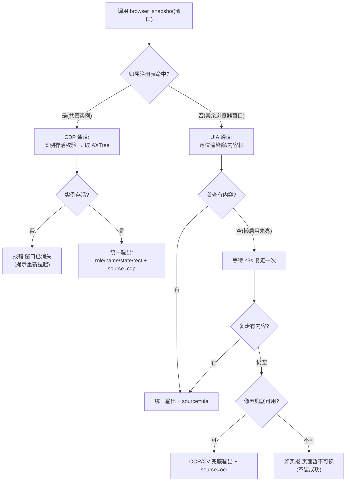
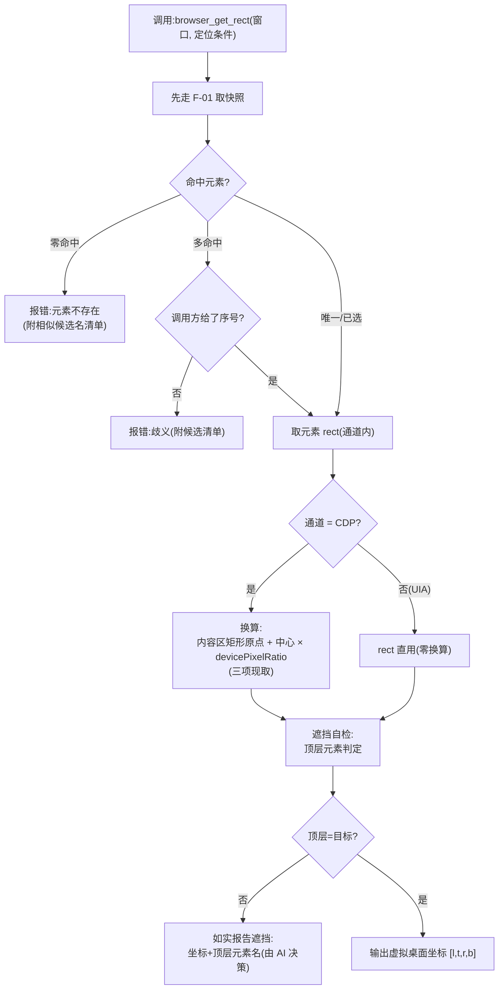
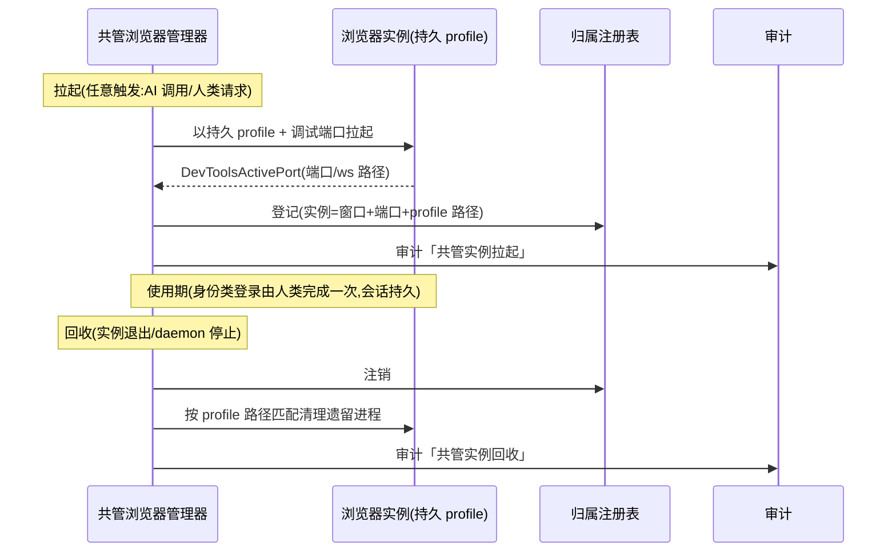
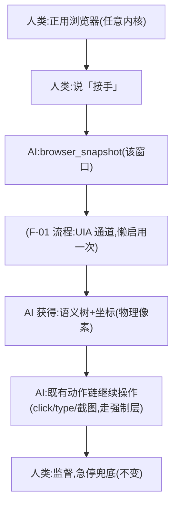

# REQ-005 浏览器翻译层 —— 功能设计说明书

| 项 | 内容 |
|----|------|
| 文档编号 | DP-FDS-REQ-005 |
| 版本 | v0.1 |
| 日期 | 2026-09-24 |
| 状态 | **待 sdfang 审核** |
| 上游文档 | [REQ-005 软件需求规格说明书](REQ-005-浏览器翻译层.md) v0.2(DP-SRS-REQ-005)、[决策记录](REQ-005-浏览器翻译层-决策记录.md)(随本设计同步修订) |
| 证据基座 | 三轮穿刺报告 + Firefox 实测(docs/需求/REQ-005-浏览器翻译层/侦察/) |

> **文档约定**:本文不含任何代码与伪代码。所有算法与流程逻辑一律以
> Mermaid 图 + 文字规则表表达;工具名、错误码等标识符沿用 DeskPilot 既有
> 契约,仅作引用。**本设计新增错误码:零。**

---

## 1. 引言

### 1.1 编写目的

将 REQ-005 需求规格(感知路由、双原语、既有行动链)展开为可实现、可测试、
可验收的功能规格:模块怎么拆、流程怎么走、接口什么形状、出错返回什么、
怎么算验收通过。

### 1.2 背景

需求规格确立了「老花镜」形态:浏览器=普通软件,新增的只是感知能力
(browser_snapshot/browser_get_rect),行动复用 DeskPilot 既有 MCP 工具链。
三轮穿刺已证明三条感知通道(CDP/AXTree、UIA 懒启用、OCR/CV)的可行性与
精度边界。本文回答:这三条通道如何以**一个统一接口、零厂商判断**的方式
落进 daemon,并与既有强制层无缝共轨。

### 1.3 术语与缩略语

| 术语 | 含义 |
|------|------|
| 感知路由 | 按目标归属选择感知通道的机制(归属判定,非厂商判定) |
| 归属注册表 | daemon 内记录「共管实例」的登记表(拉起时写入,回收时注销) |
| 渲染窗 | Chromium 的 `Chrome_RenderWidgetHostHWND`(网页内容宿主窗口) |
| 懒启用 | Chromium UIA 可访问性惰性自激活:渲染窗收 UIA 查询后 ≤3s 点亮 |
| 内容根 | 非 Chromium 浏览器的网页内容宿主(UIA `DocumentControl`) |
| L0/L2/L3 | 操作分级:只读 / 写入 / 受控(沿用既有定义) |

---

## 2. 总体设计

### 2.1 设计概念

```mermaid
graph TD
    subgraph 调用方
        AI["AI 伙伴(MCP 客户端)"]
    end
    subgraph DeskPilot daemon
        S["browser_snapshot<br/>(统一语义快照,L0)"]
        R["browser_get_rect<br/>(元素坐标服务,L0)"]
        RT["感知路由器<br/>(归属判定)"]
        REG["归属注册表"]
        CDP["CDP 通道<br/>(共管 Chromium)"]
        UIA["UIA 通道<br/>(用户自拉/壳层)"]
        OCR["OCR/CV 兜底通道"]
        MGR["共管浏览器管理器<br/>(拉起/回收/登录态持久)"]
    end
    subgraph 既有链(零改动复用)
        ENF["强制层 enforcement<br/>(分级/审批/急停/安全桌面)"]
        ACT["动作工具链<br/>(click / type_text / screenshot / ocr / key)"]
    end
    AI --> S --> RT
    AI --> R --> RT
    RT -- "共管实例(注册表命中)" --> CDP
    RT -- "其余浏览器窗口" --> UIA
    RT -- "前两层不可用" --> OCR
    MGR --> REG
    AI --> ENF --> ACT
    R -. "坐标输出(虚拟桌面)" .-> AI
    S -. "语义树输出(role/name/state/rect)" .-> AI
```

**设计要点(规则表)**:

| # | 规则 |
|---|------|
| P-01 | 新增 MCP 工具仅两个,均为 L0 只读;行动面零新增工具 |
| P-02 | 路由判据=归属(注册表命中/窗口特征),**禁止**按浏览器厂商/进程名分支 |
| P-03 | 快照只读现取,禁止缓存(真实站文本 3s 即变) |
| P-04 | 坐标输出一律为虚拟桌面物理像素,与 screenshot/get_ui_tree 同坐标系 |
| P-05 | 所有感知调用与动作调用同经 daemon 审计;写动作同经强制层四道闸 |
| P-06 | 共管浏览器是唯一启用 CDP 的形态(硬约束 C-1);用户自拉浏览器永不触达调试端口 |

### 2.2 结构(模块与职责)

| 模块 | 职责 | 复用/新增 |
|------|------|-----------|
| 感知路由器 | 按归属选择通道;输出统一 schema(附 source 出处) | 新增 |
| browser_snapshot | 语义快照工具入口(L0) | 新增 |
| browser_get_rect | 元素定位→坐标输出+遮挡自检(L0) | 新增 |
| 共管浏览器管理器 | 拉起(持久 profile)/回收(按 user-data-dir 清理)/归属注册 | 新增 |
| CDP 通道 | AXTree 快照、getBoxModel 坐标、实例状态 | 新增(路线 A 最小子集) |
| UIA 通道 | 渲染窗/内容根直查、懒启用等待、壳层信息 | 复用 executor 感知面 |
| OCR/CV 兜底 | 像素层定位(语义失明面) | 复用既有 |
| enforcement/动作链 | 审批/急停/动作执行 | **零改动** |

### 2.3 处理流程

#### F-01 统一语义快照流程(browser_snapshot)



规则表:

| # | 规则 |
|---|------|
| F-01-1 | 输出 schema 与 get_ui_tree 元素集同构,增 `source`(cdp/uia/ocr)与页面元信息(标题/URL/活动标签) |
| F-01-2 | 懒启用只允许「等待+复走」一次;禁止反复轮询 |
| F-01-3 | 渲染窗以「当前有效」为准——每次调用现查,不得使用历史 hwnd(标签切换会使其失效) |
| F-01-4 | 共管实例死亡=明确报错并指引重新拉起,禁止自动降级到壳 UIA(空树装成功) |

#### F-02 元素坐标服务流程(browser_get_rect)



规则表:

| # | 规则 |
|---|------|
| F-02-1 | 换算三因子(内容区矩形/dpr/盒模型中心)每次现取,禁止缓存 |
| F-02-2 | 遮挡自检不阻断输出——输出坐标并**附**遮挡真相,判断归 AI |
| F-02-3 | 零命中/歧义必须附候选清单(AI 自愈指引) |
| F-02-4 | 缩放/滚动/DPI 变化由「现取」天然覆盖,无需特例分支 |

#### F-03 共管浏览器生命周期



规则表:

| # | 规则 |
|---|------|
| F-03-1 | profile 位置固定于用户数据区,持久保存(登录态资产);**禁止**临时目录形态进入产品 |
| F-03-2 | 登录/验证码/支付类动作永远人类执行(身份类铁律,与桌面域一致) |
| F-03-3 | 用户日常浏览器(默认 profile)永不连接;拉起面与连接面分离 |
| F-03-4 | 回收清理以 profile 路径为判据(壳进程不级联的实测坑) |

#### F-04 用户自拉浏览器接管流程



### 2.4 功能需求与程序的关系

| SRS 需求 | 承载模块/流程 |
|----------|---------------|
| R-01 感知路由 | 感知路由器 + 归属注册表(F-01) |
| R-02 统一语义快照 | browser_snapshot(F-01) |
| R-03 元素坐标 | browser_get_rect(F-02) |
| R-04 行动链 | 既有 MCP 工具(零改动) |
| R-05 共管生命周期 | 共管浏览器管理器(F-03) |
| R-06 壳层信息 | UIA 通道(壳层查询) |
| R-07 失明面兜底 | OCR/CV 通道 + 语义参照系(F-01 末支) |

### 2.5 尚未解决的问题(留详细设计/实测消化)

| # | 问题 | 处置建议 |
|---|------|----------|
| U-1 | Firefox 页面缩放对 UIA rect 的影响(等价 dpr 行为未测) | 详设阶段补一次缩放实测再定换算规则 |
| U-2 | 国产 Chromium 壳(360/QQ/搜狗)渲染窗类名与 CDP 同构性 | 按同族假定;实测环境到位后补 |
| U-3 | UIA 通道在千节点级重页的时延/截断表现 | 详设性能节实测定阈值 |
| U-4 | 渲染窗频繁失效(标签快切)下的归属跟踪成本 | 以「每次现查」为基线,不引入跟踪缓存 |

---

## 3. 接口设计

### 3.1 MCP 工具接口(用户接口)

| 项 | browser_snapshot | browser_get_rect |
|----|------------------|------------------|
| 级别 | L0(只读) | L0(只读) |
| 入参 | 窗口(句柄;共管实例可省略=默认当前实例) | 窗口 + 定位条件(名称/角色/序号) |
| 返回-成功 | 页面元信息(标题/URL/活动标签)+ 元素集(role/name/state/rect/interactable)+ `source` + 截断标志 | 坐标 [l,t,r,b](虚拟桌面)+ 命中元素摘要 |
| 返回-特殊 | 页面暂不可读(懒启用两次仍空,如实) | 遮挡提示(坐标照给+顶层元素名);零命中/歧义(候选清单) |
| 描述面义务 | 明示「快照为瞬时值,不缓存;失明面(无申报图形)走像素兜底」 | 明示「坐标=虚拟桌面像素,可直接喂 click;遮挡由 AI 自核」 |

### 3.2 内部接口(通道契约)

| 契约 | CDP 通道 | UIA 通道 | OCR/CV 通道 |
|------|----------|----------|-------------|
| 快照(窗口→统一元素集) | AXTree | 渲染窗/内容根直查 | 图像文字/轮廓 |
| 坐标(元素→虚拟桌面 rect) | 盒模型×换算公式 | rect 直用 | 像素位置 |
| 适用 | 共管实例 | 任意浏览器窗口 | 前两者失明面 |
| 新增依赖 | websocket-client | 无 | 无 |

### 3.3 外部接口

| 接口 | 形态 | 边界 |
|------|------|------|
| CDP | WebSocket @127.0.0.1 | 仅共管实例;随实例回收 |
| 浏览器拉起 | 进程拉起(持久 profile+调试端口+`--force-renderer-accessibility`) | 拉起参数固化(穿刺 3 优选形态) |
| UIA | Windows UI Automation | 懒启用仅「等待+复走」一次 |

---

## 4. 运行设计

### 4.1 运行模块组合

浏览器域感知模块内嵌于 DeskPilot daemon(非独立进程);共管浏览器为
daemon 拉起的子进程,生命周期由管理器登记与回收;感知调用与动作调用共
用 daemon 审计与强制层,无第二服务面。

### 4.2 运行控制

| 控制点 | 规则 |
|--------|------|
| 共管实例拉起 | 按需拉起(首次 CDP 路由命中且注册表为空);幂等(已有实例不重复拉起) |
| 共管实例回收 | daemon 停止/实例退出时注销注册表+按 profile 清理 |
| 冻结/安全桌面 | 感知(L0)沿用冻结期只读现状;写动作由强制层拦截(零新增分支) |

### 4.3 运行时间(预算,实测依据)

| 操作 | 预算 | 实测值 |
|------|------|--------|
| 语义快照(百节点页) | <50ms | 5.5~11.6ms(CDP)/0.8s(UIA 重页) |
| 元素坐标 | <5ms | 0.41~0.63ms(CDP) |
| 懒启用(仅首查) | ≤3s 一次 | 实测成立 |
| 共管实例拉起 | 秒级(一次性) | 穿刺实测成立 |

---

## 5. 系统数据结构设计

### 5.1 逻辑结构

| 数据 | 结构要点 | 生命周期 |
|------|----------|----------|
| 统一元素集 | 与 get_ui_tree 元素同构 + source 出处 | 单次调用,现取现弃 |
| 归属注册表 | 实例 → 窗口/端口/profile 路径 | 拉起写入,回收注销,内存态 |
| 共管 profile | 用户数据区固定路径(登录态资产) | 持久,用户数据不出本机 |
| 坐标换算因子 | 内容区矩形/dpr/盒模型中心 | 每次现取,不落地 |

### 5.2 物理结构

除共管 profile(目录)与既有审计(JSONL)外,**零新增持久化文件**;
无缓存、无状态文件、无第二配置源。

---

## 6. 系统出错处理设计

### 6.1 出错信息(全部复用既有错误码,零新增)

| 场景 | 码 | 消息形态 |
|------|----|----------|
| 共管实例死亡/未拉起 | WINDOW_GONE | 如实+「请重新拉起共管浏览器」指引 |
| 懒启用两次仍空 | ELEMENT_NOT_FOUND | 「页面暂不可读(初始化未完成),请稍后重试」 |
| 元素零命中 | ELEMENT_NOT_FOUND | 附相似候选名清单 |
| 多命中未给序号 | INVALID_PARAMS | 附候选清单(与 click_text 同形态) |
| 渲染窗失效 | WINDOW_GONE | 引导重走快照(每次现查自愈) |
| 参数非法 | INVALID_PARAMS | 回显实收值 |

### 6.2 补救措施

| 故障 | 补救 |
|------|------|
| 懒启用未亮 | 等待+复走一次(禁止轮询) |
| 实例断连(CDP) | 存活校验+一次重连;失败按实例死亡处理 |
| 遮挡 | 输出坐标+顶层元素,归 AI 决策(滚动/换路径) |
| 失明面 | 语义参照系+像素兜底(F-01 末支) |

---

## 7. 验收基准映射(SRS AB → 功能点)

| SRS 验收基准 | 本设计承载 |
|--------------|-----------|
| AB-01 共管全链+回收零残留 | F-03(拉起/注册/回收/清理) |
| AB-02 语义角色样例 | F-01 输出 schema |
| AB-03 点击读回变化 | F-02 坐标 + 既有 click + AI 组合验证 |
| AB-04 中文输入 | 既有 type_text(零改动) |
| AB-05 锁屏/冻结语义 | 强制层零改动复用 |
| AB-06 eval 审批 | v2 候选(本版不含) |
| AB-07 日常浏览器零触达 | F-03-3 + 审计可证 |

---

## 8. 变更记录

| 版本 | 日期 | 内容 |
|------|------|------|
| v0.1 | 2026-09-24 | 功能设计落档:设计概念/四流程(F-01~F-04)/双工具接口/通道契约/运行与数据设计/零新增错误码/验收映射。**待 sdfang 审核** |
