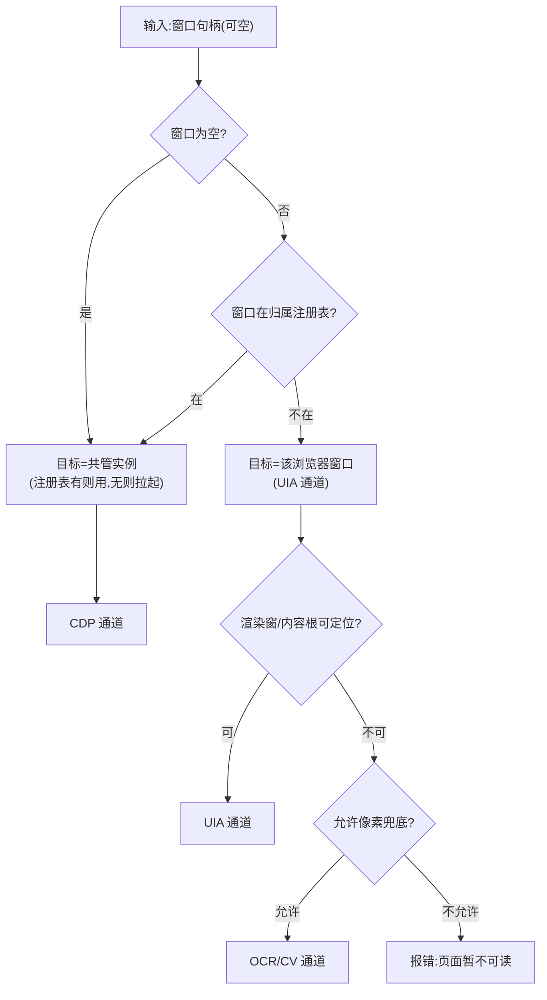

# REQ-005 浏览器翻译层 —— 详细设计说明书

| 项 | 内容 |
|----|------|
| 文档编号 | DP-DDS-REQ-005 |
| 版本 | v0.1 |
| 日期 | 2026-09-24 |
| 状态 | **待 sdfang 审核** |
| 上游文档 | [REQ-005 软件需求规格说明书](REQ-005-浏览器翻译层.md) v0.2、[功能设计说明书](REQ-005-浏览器翻译层-功能设计.md) v0.1、[决策记录](REQ-005-浏览器翻译层-决策记录.md) v0.2 |
| 证据基座 | docs/需求/REQ-005-浏览器翻译层/侦察/(三轮穿刺+Firefox 实测) |

> **文档约定**:本文不含任何代码与伪代码;算法与流程一律 Mermaid 图+规则表。
> 标识符(模块名/工具名/参数名/错误码)为实现期契约,测试设计以本文为准。

---

## 1. 引言

### 1.1 编写目的

把功能设计展开为**模块级可实现规格**:每个模块的职责、输入输出、处理
流程、接口形状、限制条件与测试要点。读者:实现者(AI 伙伴)、测试者、
评审者(sdfang)。

### 1.2 范围

本详细设计覆盖:感知路由器、browser_snapshot、browser_get_rect、共管
浏览器管理器、CDP 通道、UIA 通道六个模块,及其与既有
enforcement/executor/mcp_server 的接线路径。**不覆盖**:CDP 注入式动作
(v2)、OOPIF/多 tab(v2)、browser_eval(v2 候选,L3)。

### 1.3 术语

沿用上游文档术语(感知路由/归属注册表/渲染窗/懒启用/内容根/共管浏览器)。
新增实现级术语:

| 术语 | 定义 |
|------|------|
| 默认目标 | browser_snapshot 省略窗口参数时的解析目标=共管实例(不存在则拉起) |
| 统一元素 | 三通道归一后的元素形态(见 §3.1 数据结构) |

---

## 2. 程序系统结构

```mermaid
graph TD
    subgraph MCP 面
        T1["browser_snapshot(L0)"]
        T2["browser_get_rect(L0)"]
    end
    subgraph 新增包 deskpilot/browser
        RT["M1 感知路由器"]
        MGR["M4 共管浏览器管理器"]
        CDP["M5 CDP 通道"]
        UIA["M6 UIA 通道"]
    end
    subgraph 既有(零改动)
        SCH["TOOL_SCHEMAS 注册面"]
        EXE["executor 感知面(get_ui_tree/ocr/CV)"]
        ENF["enforcement(L0 直放面)"]
    end
    T1 --> RT
    T2 --> RT
    RT --> MGR
    RT --> CDP
    RT --> UIA
    UIA --> EXE
    T1 -. 注册 .-> SCH
    T2 -. 注册 .-> SCH
```

**装配规则表**:

| # | 规则 |
|---|------|
| S-01 | 两个新工具注册进 TOOL_SCHEMAS(总数 30→32),级别 L0,走 L0 直放路径(不进 enforcement.submit,与 screenshot 同路) |
| S-02 | 新包只读依赖:websocket-client(仅 M5);不动 pyproject 运行时依赖之外任何组件 |
| S-03 | M6 复用 executor 的 UIA/截图/OCR 感知面,不另起 UIA 封装 |
| S-04 | 冻结期/安全桌面语义由既有 L0 闸门覆盖,新包零分支(沿用现状) |

---

## 3. 模块设计说明

### 3.1 数据结构设计(全模块共用)

**统一元素(输出元素集的元素)**:

| 字段 | 来源-CDP | 来源-UIA | 来源-OCR/CV |
|------|----------|----------|-------------|
| name | AX name | UIA Name | OCR 文本/空 |
| control_type | AX role 映射表(§3.5 R-MAP) | UIA ControlTypeName 直用 | "Text"/"Graphic" |
| rect | 换算公式(§3.4) | UIA rect 直用 | 像素 rect |
| interactable | AX focusable 等属性推导 | UIA 既有推导 | false(标注不可点) |
| state | AX 属性集(checked/expanded 等) | UIA 既有状态 | 空 |

**页面元信息**:标题、URL(壳地址栏读取;CDP 路由可取真值)、活动标签、
source(cdp/uia/ocr)、truncated(元素集超 800 截断,与 get_ui_tree 同规)。

**归属注册表项**:实例 → {窗口 hwnd、CDP 端口、profile 路径、拉起时间、
浏览器二进制路径}。内存态,拉起写入、回收注销。

### 3.2 M1 感知路由器

| 项 | 内容 |
|----|------|
| 功能 | 按归属选择通道并归一输出;承担 F-01/F-02 的通道间流程 |
| 输入 | 窗口句柄(可空)、是否允许像素兜底(默认允许) |
| 输出 | 通道选择结果 + 归一数据(元素集/坐标) |

**路由判定流程**:



| # | 规则 |
|---|------|
| M1-01 | 「窗口为空」与「命中注册表」是仅有的两条 CDP 路由;其余一律 UIA,永不按进程名判定 |
| M1-02 | 注册表命中但实例已死(端口/进程探活失败)→ 按实例死亡处理(WINDOW_GONE+重新拉起指引),不降级 |
| M1-03 | 渲染窗定位(Chromium)与内容根定位(非 Chromium)是 UIA 通道职责,路由器只问结果 |

### 3.3 browser_snapshot(MCP 工具,L0)

| 项 | 内容 |
|----|------|
| 功能 | 统一语义快照(F-01 流程的对外面) |
| 入参 | `window`(int,可选;省略=默认目标) |
| 返回-成功 | `{title, url, active_tab, source, truncated, elements: [统一元素…]}` |
| 返回-失败 | 按 §6 错误表 |

**处理流程**(=功能设计 F-01,此处钉实现级阈值):

| # | 规则 |
|---|------|
| T1-01 | 元素集截断上限 800(与 get_ui_tree 同),truncated 如实标记 |
| T1-02 | UIA 路由懒启用:首查为空 → 等待 3s → 复走一次;仍空 → 转像素兜底(允许时)或报错 |
| T1-03 | `url`:CDP 路由取页面真值;UIA 路由读壳地址栏文本(取不到置空串,不报错) |
| T1-04 | 快照不落盘、不缓存;审计记 source/元素数/耗时 |
| T1-05 | 描述面必须写明:①语义失明面存在(无申报图形),可换像素兜底;②UIA 不足时可省略 window 走共管实例(CDP 完整能力)——备选路径可达(ISS-0115) |

### 3.4 browser_get_rect(MCP 工具,L0)

| 项 | 内容 |
|----|------|
| 功能 | 元素定位 → 虚拟桌面坐标 + 遮挡真相(F-02 对外面) |
| 入参 | `window`(int,可选)+ 定位条件:`name`(子串,可选)、`control_type`(可选)、`index`(多命中序号,可选) |
| 返回-成功 | `{rect: [l,t,r,b], element: {name, control_type}, occluded: bool, top_element: string}` |
| 返回-失败 | 零命中(附相似候选)/歧义未给 index(附候选)/页面暂不可读 |

**坐标换算(CDP 路由)**:

| # | 规则 |
|---|------|
| T2-01 | 公式:`屏幕点 = 渲染窗物理矩形原点 + 盒模型中心(viewport CSS) × devicePixelRatio`,三因子每次现取 |
| T2-02 | 取整误差上界 0.71px(穿刺 1 实测),超界元素(越出渲染窗)fail-closed 报错 |
| T2-03 | 遮挡自检=坐标点顶层元素判定;`occluded=true` 时坐标照给并附顶层元素名,判断归 AI |
| T2-04 | UIA 路由:rect 直用零换算;遮挡自检同 T2-03 |

### 3.5 M5 CDP 通道

| 项 | 内容 |
|----|------|
| 功能 | 共管实例的 AXTree 快照、盒模型坐标、实例探活 |
| 依赖 | websocket-client(唯一新增依赖) |
| 命令面 | Target.getTargets/attachToTarget(flatten)、Accessibility.enable/getFullAXTree、DOM.getDocument/querySelector/getBoxModel、Runtime.evaluate(仅 dpr/URL 读取,v1 不开放注入)、Page.captureScreenshot(不用,走既有 screenshot) |

**AX role → control_type 映射(R-MAP)**:button→ButtonControl、
link→HyperlinkControl、textbox/searchbox→EditControl、checkbox→
CheckBoxControl、combobox→ComboBoxControl、StaticText→TextControl、
image→ImageControl、list→ListControl、listitem→ListItemControl、
heading→TextControl(标注 heading)、dialog→WindowControl;
未映射 role 原样透传并标注 `raw_role`(不丢信息)。

| # | 规则 |
|---|------|
| T5-01 | 连接参数必须 `suppress_origin=True`(穿刺坑 1) |
| T5-02 | 每命令带 sessionId(flatten attach);实例探活=端口+进程双查 |
| T5-03 | evaluate 仅用于 `window.devicePixelRatio` 与 `location.href` 读取,v1 不开放任意脚本 |
| T5-04 | 快照超时预算 5s(百节点实测 <50ms,千节点按 10 倍外推);超时按通道故障处理 |

### 3.6 M6 UIA 通道

| 项 | 内容 |
|----|------|
| 功能 | 渲染窗/内容根定位、懒启用复走、壳层信息(标签/地址栏/活动标签) |
| 定位规则 | Chromium:窗口内类名 `Chrome_RenderWidgetHostHWND`;非 Chromium:窗口内首个 DocumentControl(Firefox 实测普世) |

| # | 规则 |
|---|------|
| T6-01 | 渲染窗/内容根每次现查,禁用历史句柄(标签切换失效实测) |
| T6-02 | 懒启用:首查空 → 等 3s → 复走一次,仅此一次 |
| T6-03 | 壳层:标签清单+活动标签+地址栏(Chromium/非 Chromium 通用 UIA 走查) |
| T6-04 | 深度/节点上限沿用 executor 既有(get_ui_tree 同规) |

### 3.7 M4 共管浏览器管理器

| 项 | 内容 |
|----|------|
| 功能 | 拉起(幂等)/注册/回收/探活 |
| 拉起参数 | `--remote-debugging-port=0`、`--force-renderer-accessibility`、`--user-data-dir=%LOCALAPPDATA%\DeskPilot\browser-profile` |
| 二进制选择 | 序:Edge → Chrome(注册表/常见路径探测;均无则报错含安装指引) |

| # | 规则 |
|---|------|
| T4-01 | 幂等:注册表已有存活实例则直接用,不重复拉起 |
| T4-02 | DevToolsActivePort 读首行端口+次行 ws 路径;读不到=拉起失败(带日志指引) |
| T4-03 | 回收触发:daemon 停止、实例退出;清理按 profile 路径匹配进程命令行补刀(壳不级联实测坑) |
| T4-04 | 拉起/回收/死亡全程审计;身份类登录提示文案(i18n 双键,REQ-007 规) |

---

## 4. 接口设计汇总(实现期契约)

| 接口 | 形状 |
|------|------|
| browser_snapshot(window?) → 快照 | §3.3 表 |
| browser_get_rect(window?, name?, control_type?, index?) → 坐标包 | §3.4 表 |
| 路由器:route(window?) → 通道 | §3.2 流程 |
| 通道:snapshot(hwnd) / rect(element) | §3.1 统一元素 |

## 5. 限制条件

| # | 限制 |
|---|------|
| L-01 | v1 不做 CDP 注入动作/eval 任意脚本/OOPIF/多 tab;不做浏览器类型适配器 |
| L-02 | 共管实例仅一个(单例);多实例需求 v2 |
| L-03 | 快照元素 800 截断;CDP 快照 5s 预算 |
| L-04 | 冻结期/安全桌面下行为完全沿用既有 L0 现状,不新增例外 |

## 6. 出错处理(零新增错误码)

| 场景 | 码 | 消息要点 |
|------|----|----------|
| 共管实例死亡/未拉起且拉起失败 | WINDOW_GONE | 实例状态+重新拉起指引(附二进制探测结果) |
| 懒启用两次仍空 | ELEMENT_NOT_FOUND | 「页面暂不可读(初始化未完成),请稍后重试或省略 window 走共管浏览器」 |
| 元素零命中 | ELEMENT_NOT_FOUND | 附相似候选名清单(≤5) |
| 多命中未给 index | INVALID_PARAMS | 附候选清单(与 click_text 同形态) |
| 窗口非浏览器/无内容根 | ELEMENT_NOT_FOUND | 「未找到网页内容区(若非浏览器窗口请用 get_ui_tree)」 |
| 参数非法 | INVALID_PARAMS | 回显实收值 |

## 7. 测试计划要点(测试设计的输入)

| 面 | 要点 |
|----|------|
| 路由 | 空 window→共管;注册表命中→CDP;其余→UIA;禁进程名分支(形态钉) |
| 懒启用 | 替身验证「等 3s 复走一次」时序与只此一次 |
| 换算 | 公式三因子现取(替身钉);超界 fail-closed |
| 遮挡 | occluded/top_element 输出形态 |
| 管理器 | 幂等拉起/回收清理/注册表生命周期 |
| 注册面 | TOOL_SCHEMAS 32、L0、描述含备选路径措辞(ISS-0115) |
| 实盘 | 用户自拉 Edge/Firefox 快照+坐标+点击(手工测试) |

## 8. 变更记录

| 版本 | 日期 | 内容 |
|------|------|------|
| v0.1 | 2026-09-24 | 详细设计落档:六模块(路由器/两工具/CDP/UIA/管理器)+数据结构+接口契约+限制+零新增错误码+测试要点。**待 sdfang 审核** |
